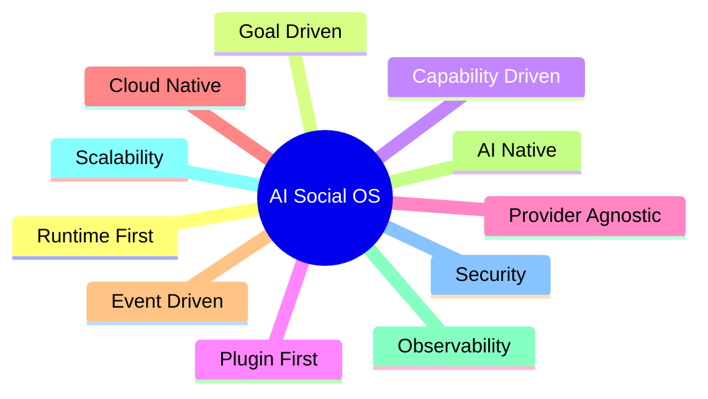
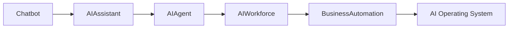
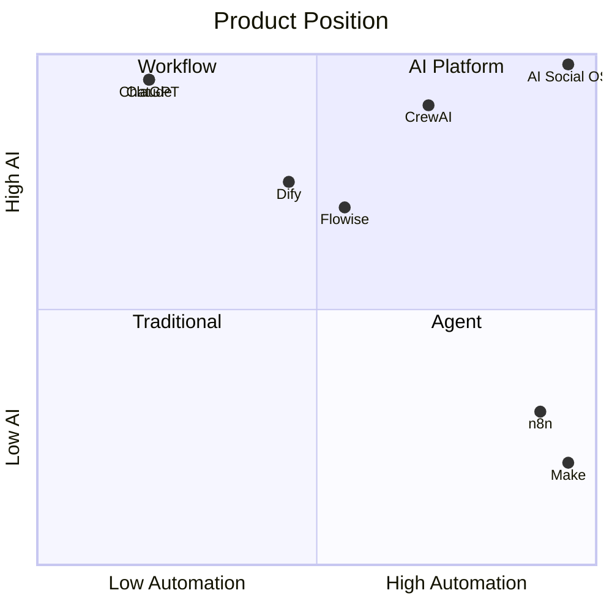
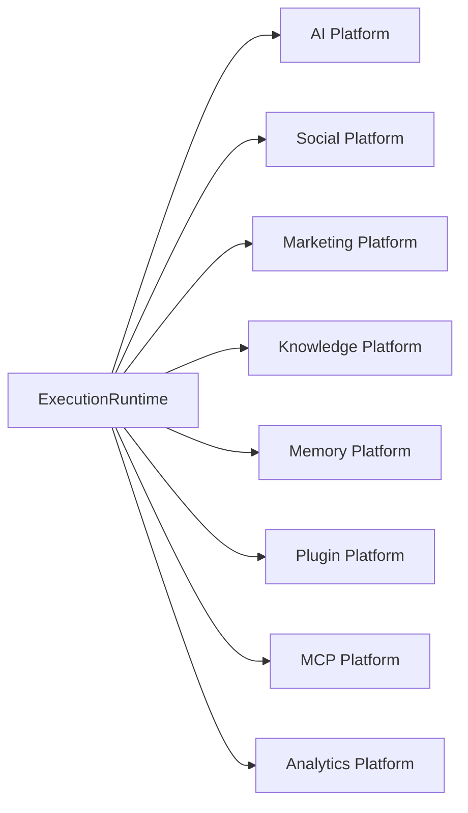

# Vision

> AI Social OS — The AI Operating System for Digital Workforce

Version: 2.0.0

Status: Draft

Last Updated: 2026-07-25

---

# Table of Contents

- Vision
- Mission
- Why AI Social OS
- Product Philosophy
- Design Principles
- Product Positioning
- Long-term Strategy
- Strategic Objectives
- Core Values
- Product Boundaries
- Future Ecosystem

---

# Vision

Xây dựng nền tảng AI Operating System cho phép AI trở thành một Digital Workforce có khả năng:

- hiểu mục tiêu
- lập kế hoạch
- cộng tác
- sử dụng công cụ
- tương tác với con người
- thực thi công việc
- tự cải thiện

AI Social OS không phải là một chatbot.

AI Social OS cũng không phải là một Workflow Builder.

AI Social OS là một Runtime dành cho AI.

---

# Mission

Giúp cá nhân, doanh nghiệp và đội Marketing có thể triển khai AI Workforce mà không cần xây dựng hạ tầng AI phức tạp.

Người dùng chỉ cần mô tả Goal.

Runtime sẽ thực hiện phần còn lại.

---

# Why AI Social OS

Hiện nay thị trường có rất nhiều công cụ.

Ví dụ:

- ChatGPT
- Claude
- Dify
- Flowise
- n8n
- Make
- Zapier
- CrewAI
- LangGraph

Mỗi nền tảng chỉ giải quyết một phần bài toán.

Ví dụ

| Product | Strong Point | Limitation |
|------------|----------------|----------------|
| ChatGPT | Chat | Không Automation |
| Claude | Coding | Không Social Platform |
| Dify | Chatbot | Runtime hạn chế |
| Flowise | Workflow | Không Enterprise |
| n8n | Automation | AI chỉ là Node |
| CrewAI | Multi-Agent | Thiếu Platform |
| LangGraph | Agent Runtime | Không phải Product |

Không có nền tảng nào kết hợp:

- Runtime
- AI
- Marketing
- Social
- Plugin
- MCP
- Knowledge
- Memory

thành một hệ thống thống nhất.

Đó là khoảng trống mà AI Social OS hướng tới.

---

# Product Philosophy

## Runtime First

Runtime là trung tâm.

Không phải Workflow.

Không phải AI.

Không phải Chat.

---

## Goal Driven

Người dùng chỉ mô tả Goal.

Runtime quyết định:

- cần làm gì
- thực hiện như thế nào
- sử dụng AI nào
- sử dụng Tool nào
- lưu Memory gì

---

## AI Native

AI là thành phần cốt lõi.

Không phải Plugin.

Không phải Feature.

---

## Capability Driven

Capability mô tả hệ thống **có thể làm gì**.

Worker mô tả **làm như thế nào**.

---

## Provider Agnostic

Không phụ thuộc:

- Claude
- OpenAI
- Gemini
- Ollama

Provider chỉ là Adapter.

---

## Event Driven

Mọi thành phần giao tiếp thông qua Event.

---

## Plugin First

Mọi khả năng mở rộng đều thông qua:

- Plugin
- MCP
- SDK

---

# Design Principles

---

# Long-term Vision

---

# Product Positioning

---

# Strategic Objectives

## Objective 1

Xây dựng Runtime thống nhất cho AI.

---

## Objective 2

Không phụ thuộc AI Provider.

---

## Objective 3

Quản lý nhiều Social Platform.

---

## Objective 4

Cho phép AI tự phối hợp nhiều Capability.

---

## Objective 5

Mở rộng thông qua Plugin và MCP.

---

## Objective 6

Triển khai AI Workforce cho doanh nghiệp.

---

# Core Values

## Simplicity

Người dùng chỉ mô tả Goal.

---

## Extensibility

Không sửa Core khi thêm tính năng.

---

## Transparency

Người dùng luôn biết:

- AI đang làm gì
- AI đang dùng Provider nào
- AI tiêu tốn bao nhiêu Token
- AI đang thực hiện bước nào

---

## Reliability

Mọi Task đều:

- Retry
- Audit
- Recover
- Monitor

---

## Security

Mọi dữ liệu đều:

- phân quyền
- mã hóa
- ghi Audit
- cách ly theo Workspace

---

# Product Scope

## AI Platform

- Chat
- Completion
- Embedding
- Image
- Video
- Audio

---

## Knowledge Platform

- Document
- Search
- Embedding
- RAG

---

## Marketing Platform

- Campaign
- Content
- Trend Discovery
- Publishing
- Analytics

---

## Social Platform

> Đây là phạm vi kết nối / đăng bài ra nền tảng bên ngoài (Integration Layer), khác với mạng xã hội nội bộ (native) mô tả tại `docs/social_network/` — hạng mục tầm nhìn dài hạn, chưa nằm trong roadmap hiện tại.

- Facebook
- Messenger
- Instagram
- Threads
- TikTok
- YouTube
- Telegram
- WhatsApp
- Zalo
- Lark

---

## Automation Platform

- Scheduler
- Queue
- Retry
- Approval
- Notification

---

## Plugin Platform

- Plugin
- Marketplace
- SDK
- MCP

---

# Product Boundaries

AI Social OS **không** xây dựng:

- CRM
- ERP
- HRM
- Accounting
- POS

Các hệ thống này sẽ được tích hợp thông qua:

- Connector
- Plugin
- MCP

---

# Product Ecosystem

---

# Future Evolution

```mermaid
flowchart LR
    SocialAutomation[Social Automation]
    MarketingAutomation[Marketing Automation]
    SalesAutomation[Sales Automation]
    CustomerSupport[Customer Support]
    InternalOperations[Internal Operations]
    BusinessAutomation[Business Automation]
    AIWorkforce[AI Workforce]
    AIOS[AI Operating System]
    SocialAutomation --> MarketingAutomation
    MarketingAutomation["MarketingAutomation"] --> SalesAutomation
    SalesAutomation["SalesAutomation"] --> CustomerSupport
    CustomerSupport["CustomerSupport"] --> InternalOperations
    InternalOperations["InternalOperations"] --> BusinessAutomation
    BusinessAutomation["BusinessAutomation"] --> AIWorkforce
    AIWorkforce["AIWorkforce"] --> AIOS
```

---

# Success Definition

AI Social OS được coi là thành công khi:

- Người dùng không cần xây dựng Workflow bằng tay.
- AI có thể tự lập kế hoạch từ Goal.
- Runtime tự điều phối Worker và Capability.
- Có thể thay đổi AI Provider mà không sửa Business Logic.
- Có thể mở rộng bằng Plugin hoặc MCP.
- Một đội Marketing có thể vận hành phần lớn quy trình với AI và chỉ tham gia ở các bước cần phê duyệt.

---

# Final Statement

AI Social OS không được xây dựng để trở thành một chatbot tốt hơn.

Không được xây dựng để thay thế n8n.

Không được xây dựng để cạnh tranh trực tiếp với Dify hay Flowise.

AI Social OS được xây dựng để trở thành **Execution Runtime** dành cho AI, nơi mọi Agent, Capability, Worker, Connector và Plugin đều hoạt động trên cùng một nền tảng thống nhất.

Đây là nền tảng để phát triển từ AI Assistant thành một AI Operating System hoàn chỉnh.