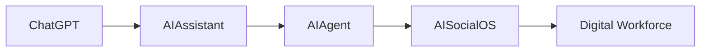
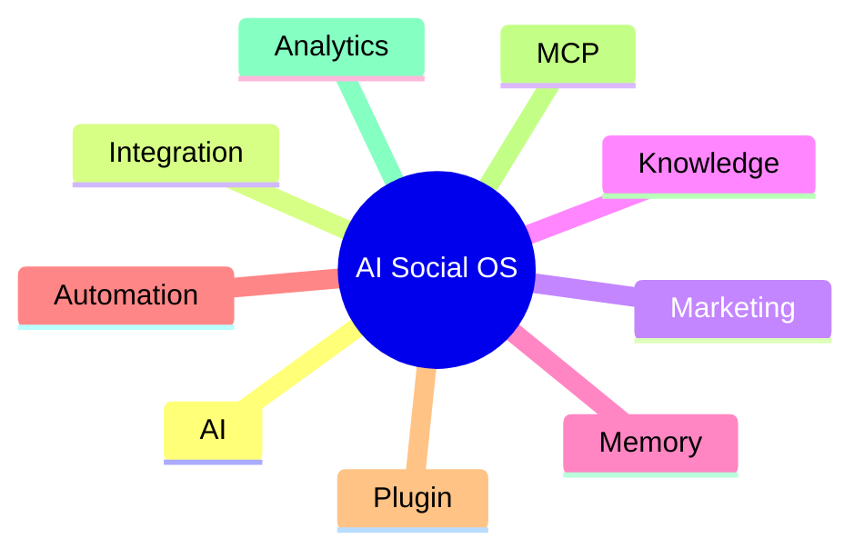

# Product Requirements Document

> AI Social OS - Product Requirements

Version: 2.0.0

Status: Draft

Last Updated: 2026-07-25

---

# Table of Contents

- Product Overview
- Product Goals
- Target Users
- User Personas
- Problem Statement
- Product Scope
- Functional Requirements
- Non-functional Requirements
- User Journey
- MVP Scope
- Out of Scope
- Success Metrics

---

# Product Overview

AI Social OS là nền tảng AI Runtime giúp cá nhân và doanh nghiệp xây dựng AI Workforce cho Marketing và Social Media.

Người dùng không cần tạo workflow bằng node như n8n.

Người dùng chỉ cần mô tả mục tiêu.

Ví dụ:

> Hằng ngày lúc 8 giờ sáng tìm xu hướng AI mới, viết 5 bài Facebook, tạo hình ảnh, gửi Leader duyệt trên Lark, sau khi duyệt thì đăng lên Facebook, Instagram và Telegram.

Runtime sẽ tự lập kế hoạch và thực thi.

---

# Product Goals

## Goal 1

Đơn giản hóa việc xây dựng AI Automation.

---

## Goal 2

Quản lý tập trung toàn bộ AI Provider.

---

## Goal 3

Quản lý toàn bộ Social Platform trong một Workspace.

---

## Goal 4

Cho phép AI Agent tự phối hợp nhiều Capability.

---

## Goal 5

Cho phép mở rộng thông qua Plugin và MCP.

---

# Product Position

---

# Target Users

## Individual Creator

Người làm nội dung.

Ví dụ

- YouTuber
- TikToker
- Blogger
- Freelancer

---

## Marketing Team

Đội Marketing trong doanh nghiệp.

Ví dụ

- Content
- Designer
- Leader
- SEO

---

## SME

Doanh nghiệp nhỏ.

Muốn tự động hóa Marketing.

---

## Enterprise

Doanh nghiệp lớn.

Muốn triển khai AI Workforce.

---

# User Personas

## Creator

### Needs

- Viết Content
- Lên lịch đăng bài
- AI hỗ trợ
- Quản lý nhiều nền tảng

---

## Marketing Leader

### Needs

- Approval
- Dashboard
- KPI
- Analytics

---

## AI Engineer

### Needs

- Plugin
- MCP
- API
- Runtime

---

## Business Owner

### Needs

- Theo dõi chi phí
- Hiệu quả Marketing
- ROI
- AI Cost

---

# Problem Statement

Hiện nay người dùng phải sử dụng rất nhiều công cụ.

Ví dụ:

| Công việc | Công cụ |
|------------|----------|
| Chat | ChatGPT |
| Code | Claude |
| Workflow | n8n |
| Design | Midjourney |
| Video | Runway |
| Social | Meta Business |
| Team | Lark |
| Analytics | GA4 |

Các công cụ hoạt động độc lập.

Không chia sẻ:

- Context
- Memory
- Knowledge
- Runtime
- Permission

---

# Product Scope

---

# Functional Requirements

# Workspace

## FR-001

Tạo Workspace.

---

## FR-002

Mời thành viên.

---

## FR-003

Quản lý Role.

---

## FR-004

Quản lý Permission.

---

## FR-005

Workspace Settings.

---

# Authentication

## FR-010

Đăng nhập.

---

## FR-011

OAuth.

---

## FR-012

API Key.

---

## FR-013

SSO (Enterprise).

---

# AI Chat

## FR-020

Multi Conversation.

---

## FR-021

Streaming Response.

---

## FR-022

Conversation History.

---

## FR-023

Tool Calling.

---

## FR-024

Conversation Memory.

---

# AI Provider

## FR-030

Quản lý nhiều AI Provider.

Hỗ trợ

- Claude
- GPT
- Gemini
- OpenRouter
- Ollama

---

## FR-031

Thêm Provider bằng API Key.

---

## FR-032

Provider Routing.

---

## FR-033

Fallback Provider.

---

## FR-034

Quota Management.

---

# Prompt

## FR-040

Prompt Library.

---

## FR-041

Prompt Versioning.

---

## FR-042

Prompt Variables.

---

## FR-043

Prompt Testing.

---

# Knowledge

## FR-050

Upload tài liệu.

---

## FR-051

Chunking.

---

## FR-052

Embedding.

---

## FR-053

Semantic Search.

---

## FR-054

Knowledge Collection.

---

# Memory

## FR-060

Conversation Memory.

---

## FR-061

Workspace Memory.

---

## FR-062

Brand Memory.

---

## FR-063

Customer Memory.

---

# Content

## FR-070

AI Writer.

---

## FR-071

Rewrite.

---

## FR-072

SEO Optimization.

---

## FR-073

Translation.

---

## FR-074

Content Versioning.

---

# Image

## FR-080

Generate Image.

---

## FR-081

Edit Image.

---

## FR-082

Brand Template.

---

# Video

## FR-090

Generate Video.

---

## FR-091

Subtitle.

---

## FR-092

Thumbnail.

---

# Trend Discovery

## FR-100

Google Trends.

---

## FR-101

Facebook Trend.

---

## FR-102

TikTok Trend.

---

## FR-103

YouTube Trend.

---

## FR-104

Website Crawling.

---

## FR-105

Competitor Analysis.

---

# Campaign

## FR-110

Campaign Management.

---

## FR-111

Content Calendar.

---

## FR-112

Approval Workflow.

---

## FR-113

Publishing Workflow.

---

# Scheduler

## FR-120

Cron Job.

---

## FR-121

Retry.

---

## FR-122

Queue.

---

## FR-123

Recurring Task.

---

# Social Platform

> Nhóm yêu cầu này thuộc Integration Layer (kết nối / đăng bài ra nền tảng bên ngoài) — khác với mạng xã hội nội bộ (native) mô tả tại `docs/social_network/`, hiện là hạng mục tầm nhìn dài hạn, chưa thuộc MVP.

## FR-130

Facebook.

---

## FR-131

Messenger.

---

## FR-132

Instagram.

---

## FR-133

Threads.

---

## FR-134

TikTok.

---

## FR-135

YouTube.

---

## FR-136

Telegram.

---

## FR-137

WhatsApp.

---

## FR-138

Zalo OA.

---

## FR-139

Lark.

---

# Publishing

## FR-140

Publish.

---

## FR-141

Draft.

---

## FR-142

Approval Required.

---

## FR-143

Schedule Publish.

---

## FR-144

Auto Retry.

---

# Analytics

## FR-150

Dashboard.

---

## FR-151

Content Performance.

---

## FR-152

Campaign Performance.

---

## FR-153

AI Usage.

---

## FR-154

Provider Cost.

---

# Plugin

## FR-160

Plugin Marketplace.

---

## FR-161

Plugin Installation.

---

## FR-162

Plugin Permission.

---

## FR-163

Plugin Update.

---

# MCP

## FR-170

Add MCP Server.

---

## FR-171

Tool Discovery.

---

## FR-172

Permission Management.

---

## FR-173

Runtime Tool Invocation.

---

# Non-functional Requirements

| Requirement | Target |
|-------------|--------|
| API Response | < 300 ms (không tính AI inference) |
| AI Streaming | < 2 s để nhận token đầu tiên |
| Runtime Availability | 99.9% |
| Horizontal Scaling | Có |
| Multi Workspace | Có |
| Plugin Support | Có |
| MCP Support | Có |
| Audit Log | Có |
| Event Replay | Có |

---

# User Journey

```mermaid
flowchart LR
    Login[Login]
    Workspace[Workspace]
    ConnectAI[Connect AI]
    ConnectSocial[Connect Social]
    CreateGoal[Create Goal]
    RuntimePlanning[Runtime Planning]
    Approval[Approval]
    Publishing[Publishing]
    Analytics[Analytics]
    Login --> Workspace
    Workspace["Workspace"] --> ConnectAI
    ConnectAI["ConnectAI"] --> ConnectSocial
    ConnectSocial["ConnectSocial"] --> CreateGoal
    CreateGoal["CreateGoal"] --> RuntimePlanning
    RuntimePlanning["RuntimePlanning"] --> Approval
    Approval["Approval"] --> Publishing
    Publishing["Publishing"] --> Analytics
```

---

# MVP Scope

## Included

- Authentication
- Workspace
- AI Chat
- Claude / GPT / Gemini
- Facebook
- Instagram
- Telegram
- Lark
- AI Writer
- Image Generation
- Scheduler
- Campaign
- Knowledge
- Memory
- Plugin
- MCP

---

## Excluded

- Marketplace
- Billing
- Enterprise SSO
- Multi Region
- Kubernetes Operator
- Mobile Application

---

# Out of Scope

Không phát triển trực tiếp:

- CRM
- ERP
- POS
- Accounting
- HRM
- CMS

Các hệ thống này sẽ được tích hợp thông qua Connector hoặc Plugin.

---

# Success Metrics

## Product

- 90% tác vụ Marketing được tự động hóa.
- Thời gian tạo một Campaign dưới 10 phút.
- Thời gian từ ý tưởng đến đăng bài dưới 5 phút.

---

## Runtime

- Task Success Rate ≥ 99%.
- Retry Success Rate ≥ 95%.
- Không mất dữ liệu khi Worker lỗi.

---

## AI

- Hỗ trợ ít nhất 5 AI Provider.
- Có khả năng chuyển Provider khi lỗi.
- Theo dõi chi phí theo Workspace và Campaign.

---

## Business

- Hỗ trợ cá nhân, đội nhóm và doanh nghiệp.
- Có thể mở rộng bằng Plugin mà không cần sửa Core.
- Có khả năng phát triển thành AI Operating System.