# System Overview

> High-Level Overview of AI Social OS

Version: 2.0.0

Status: Draft

Last Updated: 2026-07-25

---

# Table of Contents

- Overview
- System Goals
- Design Principles
- System Architecture
- Core Components
- Runtime Lifecycle
- Execution Flow
- Data Flow
- External Systems
- Storage
- Communication
- Security
- Scalability
- Deployment

---

# Overview

AI Social OS được thiết kế như một **AI Runtime Platform**.

Thay vì xây dựng Workflow bằng Node như n8n, Runtime sẽ tiếp nhận Goal và tự điều phối toàn bộ quá trình thực thi.

Runtime là trung tâm của hệ thống.

Mọi Module đều hoạt động thông qua Runtime.

---

# System Goals

Hệ thống được thiết kế để đáp ứng các mục tiêu sau.

- AI Native
- Runtime First
- Event Driven
- Modular
- Extensible
- Cloud Native
- Provider Agnostic
- Connector Agnostic
- Plugin First
- Enterprise Ready

---

# Design Principles

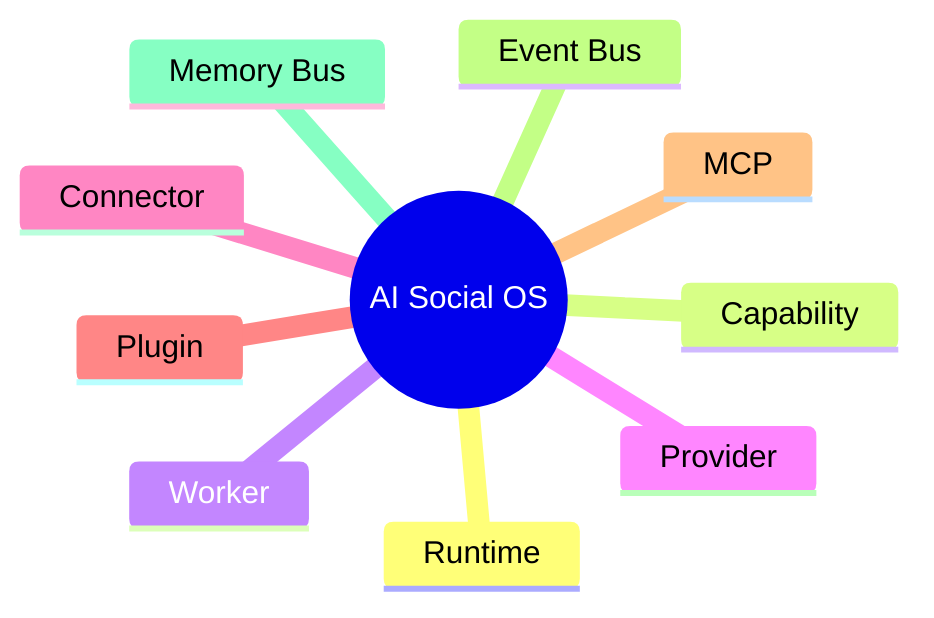

---

# System Architecture

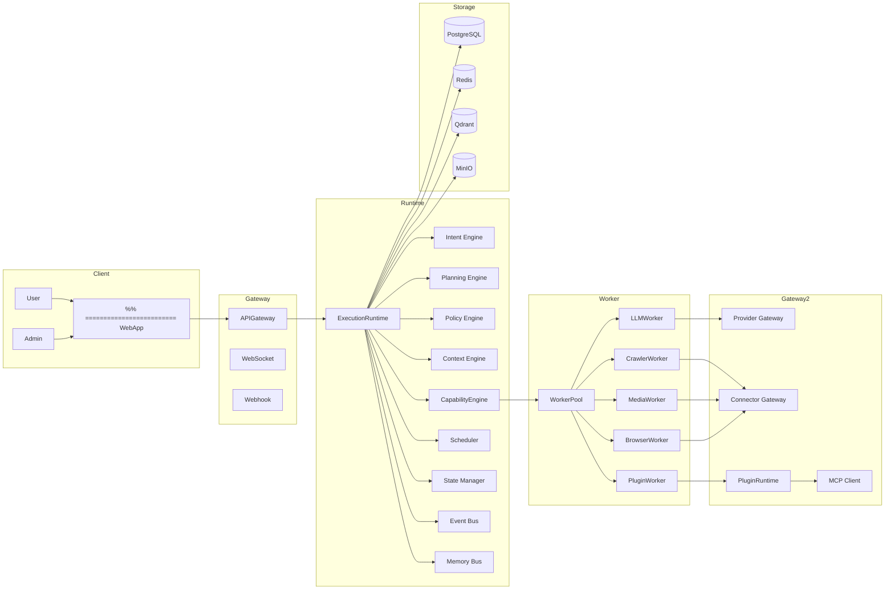

---

# Runtime Responsibilities

Execution Runtime là Kernel của AI Social OS.

Runtime chịu trách nhiệm:

- tiếp nhận Goal
- phân tích Intent
- lập kế hoạch
- xây dựng Context
- kiểm tra Permission
- lựa chọn Capability
- điều phối Worker
- quản lý State
- Retry
- Timeout
- Audit
- Logging
- Event
- Memory

Runtime **không trực tiếp gọi AI Provider**.

---

# Runtime Lifecycle

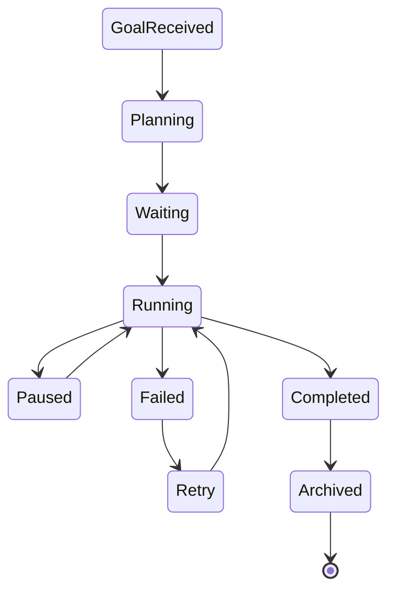

---

# Execution Flow

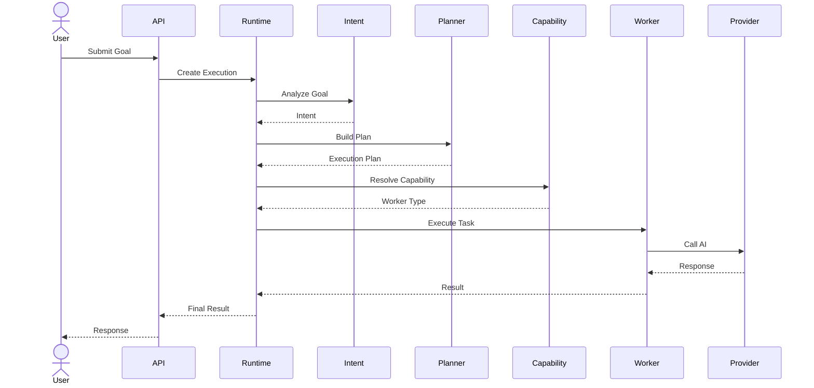

---

# Execution Pipeline

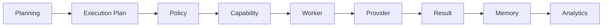

---

# Event Flow

Mọi thay đổi trong Runtime đều được phát thành Event.

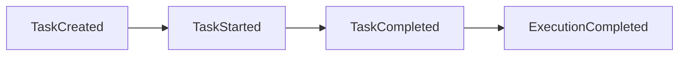

Ví dụ Event:

- ConversationCreated
- ContentGenerated
- ImageGenerated
- VideoGenerated
- CampaignCreated
- PublishStarted
- PublishCompleted
- ApprovalRequested

---

# Memory Flow

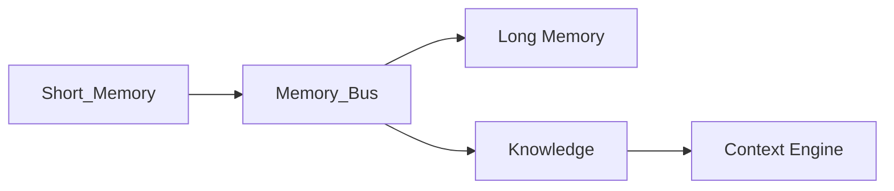

Memory không được truy cập trực tiếp bởi Worker.

Mọi truy cập đều thông qua Memory Bus.

---

# Capability Flow

Capability mô tả **hệ thống có thể làm gì**.

Ví dụ:

- Generate Content
- Generate Image
- Generate Video
- Publish Facebook
- Crawl Website
- Research Trend
- Send Lark Message

Capability không chứa Business Logic.

---

# Worker Flow

Worker thực thi Capability.

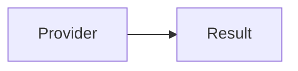

Ví dụ:

- LLM Worker
- Browser Worker
- Python Worker
- Media Worker
- Connector Worker

---

# Provider Gateway

Provider Gateway chuẩn hóa toàn bộ AI Provider.

Runtime không biết:

- Claude
- GPT
- Gemini

Runtime chỉ biết Provider Gateway.

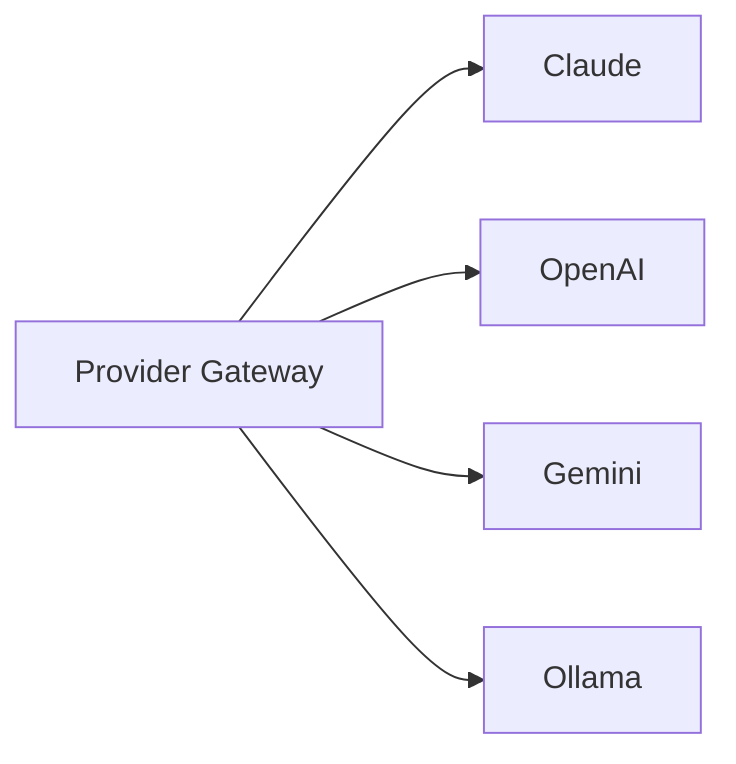

---

# Connector Gateway

Connector Gateway chuẩn hóa toàn bộ Social Platform.

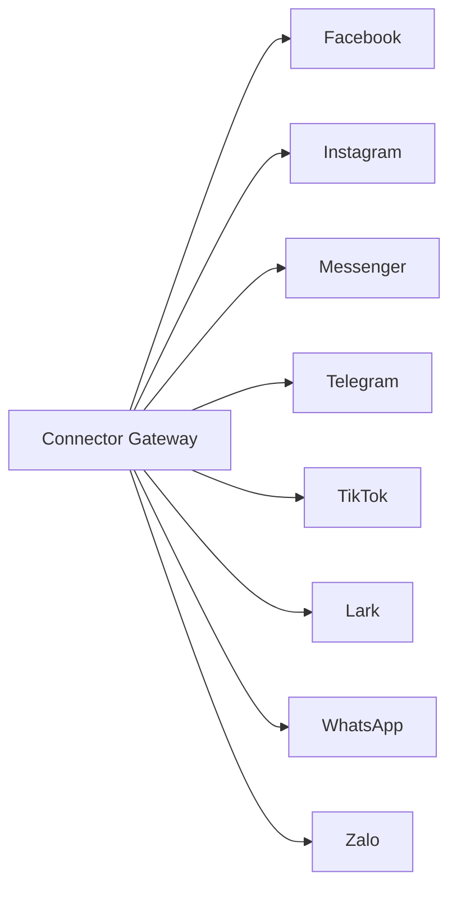

---

# Plugin Runtime

Plugin Runtime cho phép mở rộng hệ thống mà không sửa Core.

Plugin có thể đăng ký:

- Capability
- Worker
- Provider
- Connector
- API
- UI
- Prompt

---

# MCP

MCP Runtime tương thích với Model Context Protocol.

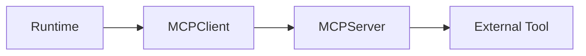

Ví dụ:

- GitHub
- Notion
- PostgreSQL
- Google Drive
- Slack
- Browser

---

# Storage Architecture

| Storage | Purpose |
|----------|----------|
| PostgreSQL | Business Data |
| Redis | Cache & Queue |
| Qdrant | Vector Database |
| MinIO | Object Storage |

---

# External Systems

## AI Providers

- Claude
- OpenAI
- Gemini
- Ollama
- OpenRouter

---

## Social Platforms

> Đây là các nền tảng bên ngoài được kết nối qua Integration Layer / Connector Gateway, khác với mạng xã hội nội bộ (native) mô tả tại `docs/social_network/` (hạng mục tầm nhìn dài hạn, chưa thuộc roadmap hiện tại).

- Facebook
- Messenger
- Instagram
- Threads
- TikTok
- YouTube
- Telegram
- WhatsApp
- Zalo
- Lark

---

## AI Services

- Image Generation
- Video Generation
- Speech To Text
- Text To Speech
- OCR

---

# Communication

| Component | Protocol |
|------------|----------|
| Browser --> API | HTTPS |
| API --> Runtime | Internal API |
| Runtime --> Worker | NATS |
| Worker --> Provider | HTTPS |
| Worker --> Connector | HTTPS |
| Runtime --> Browser | WebSocket |
| Social --> Runtime | Webhook |

---

# Security Model

Runtime áp dụng nhiều lớp bảo mật.

- Authentication
- Authorization
- RBAC
- Workspace Isolation
- Secret Vault
- Audit Log
- API Key Encryption

---

# Scalability

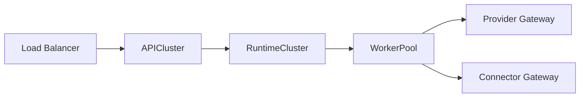

Các thành phần có thể scale độc lập.

- API
- Runtime
- Worker
- Queue
- Connector

---

# Deployment Overview

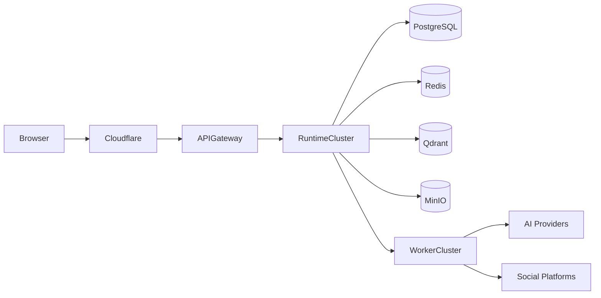

---

# Summary

AI Social OS được xây dựng theo mô hình **Runtime-Centric Architecture**.

Execution Runtime đóng vai trò Kernel, điều phối toàn bộ hệ thống.

Các thành phần như Capability Engine, Worker, Provider Gateway, Connector Gateway, Plugin Runtime và MCP Client đều hoạt động thông qua Runtime.

Nhờ kiến trúc này, hệ thống có thể:

- hỗ trợ nhiều AI Provider
- kết nối nhiều nền tảng Social
- mở rộng bằng Plugin hoặc MCP
- scale từng thành phần độc lập
- phát triển từ Marketing Automation thành AI Operating System mà không cần thay đổi kiến trúc cốt lõi.