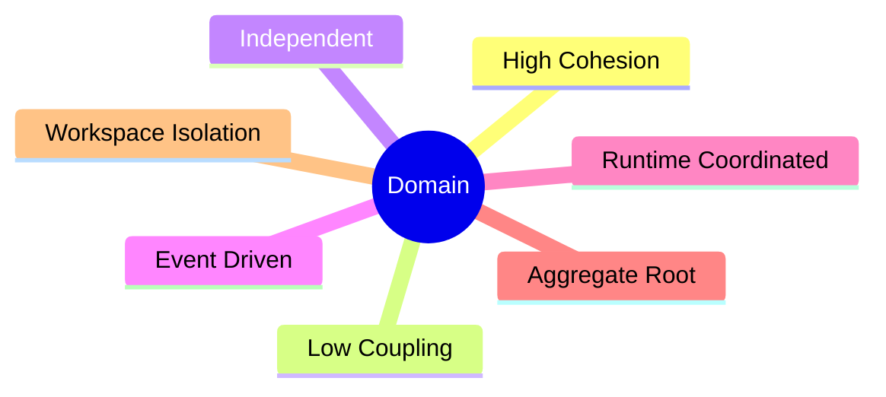
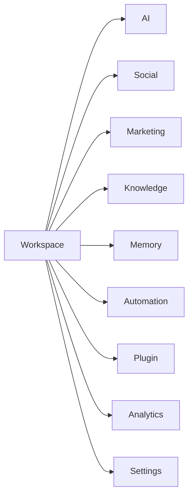
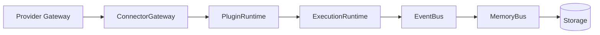
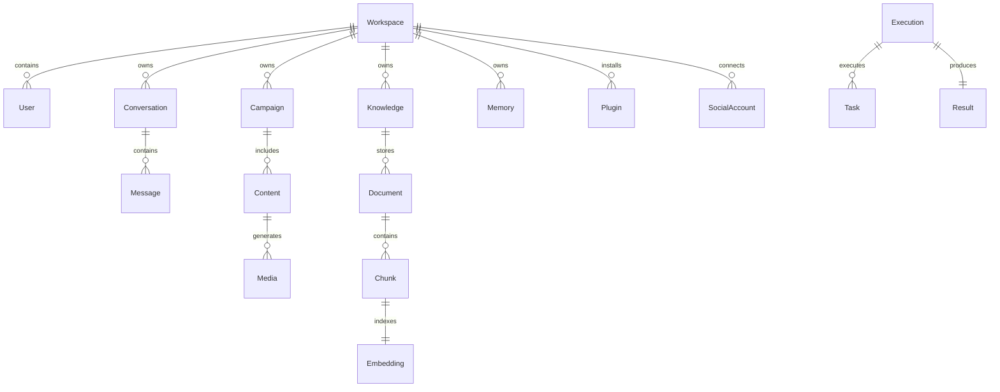
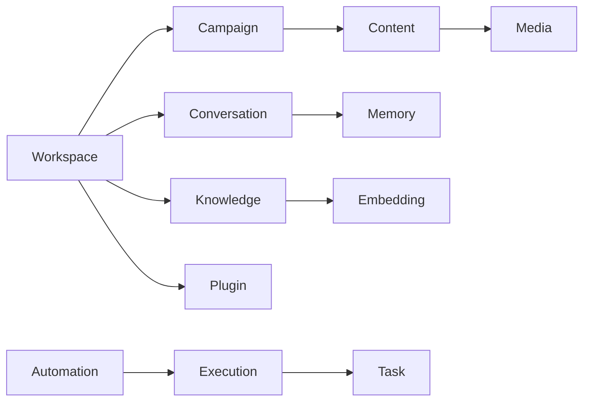
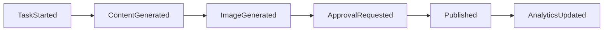
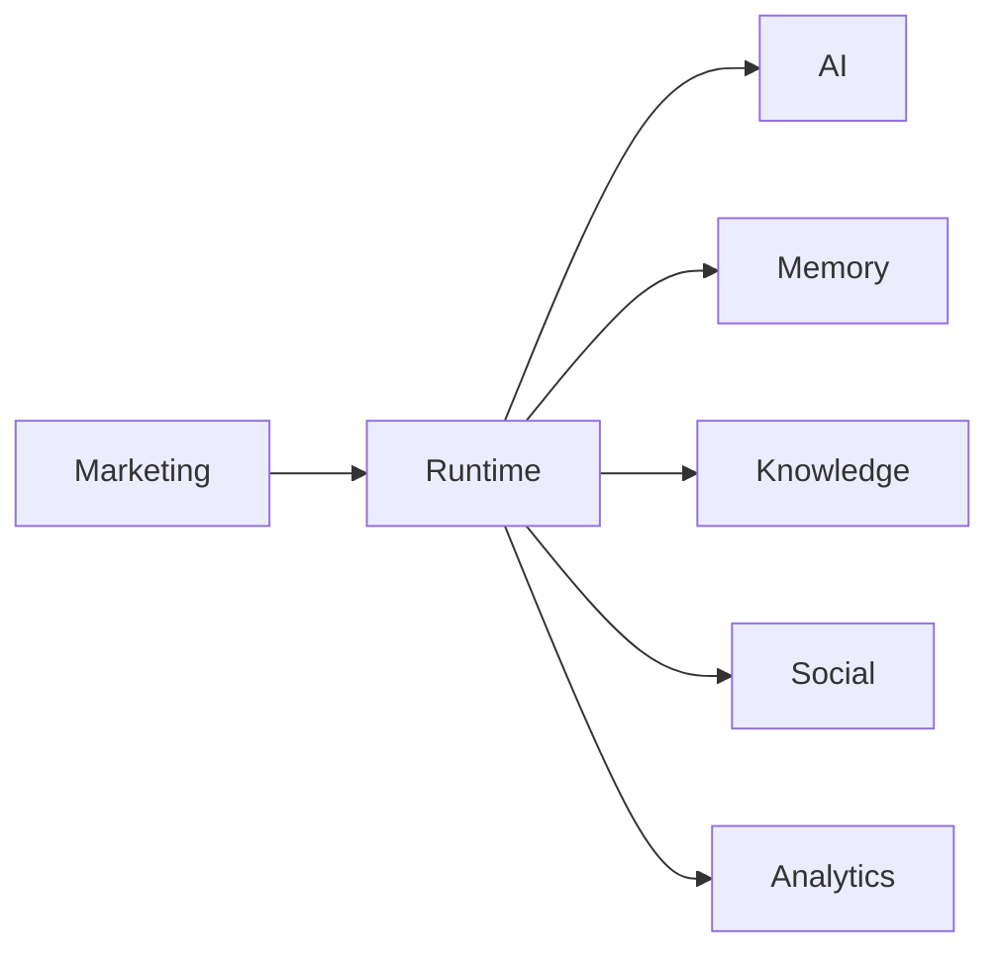
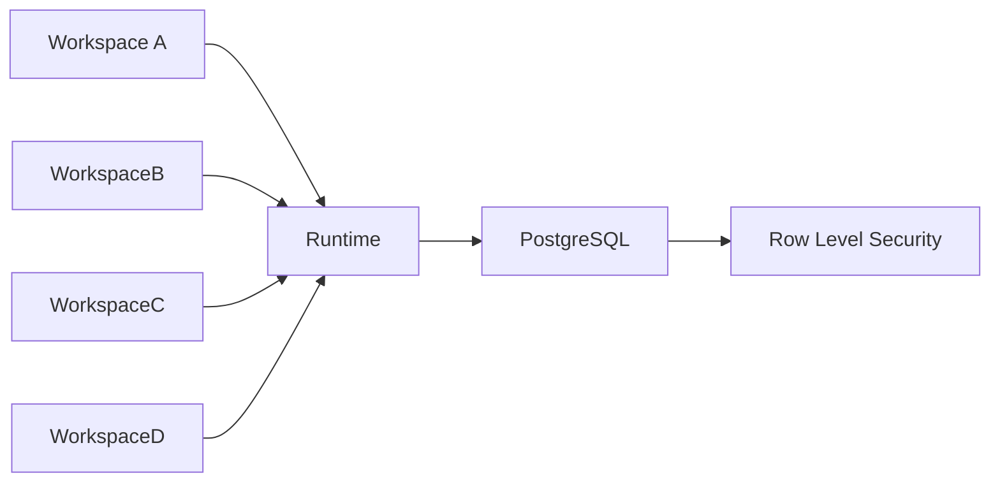

# Domain Model

> Business Domain Model of AI Social OS

Version: 2.0.0

Status: Draft

Last Updated: 2026-07-25

---

# Table of Contents

- Overview
- Design Principles
- Domain Hierarchy
- Core Domains
- Supporting Domains
- Infrastructure Domains
- Aggregate Design
- Entity Relationship
- Domain Events
- Domain Interaction
- Domain Ownership
- Design Decisions

---

# Overview

AI Social OS được thiết kế theo **Domain-Driven Design (DDD)**.

Mỗi Domain đại diện cho một nhóm nghiệp vụ độc lập.

Mỗi Domain:

- có Entity riêng
- có Aggregate riêng
- có Service riêng
- có Event riêng
- không truy cập trực tiếp dữ liệu của Domain khác

Mọi giao tiếp đều thông qua:

- Runtime
- Domain Event
- Public Service

---

# Design Principles



---

# Domain Hierarchy



---

# Core Domains

## Workspace Domain

Workspace là Aggregate Root lớn nhất.

Mọi dữ liệu đều thuộc về một Workspace.

### Responsibilities

- Workspace
- Member
- Team
- Role
- Permission
- Invitation
- Billing
- Workspace Settings

### Aggregate

```
Workspace
├── Member
├── Team
├── Role
├── Permission
├── Secret
└── Setting
```

---

## AI Domain

Quản lý toàn bộ AI.

### Responsibilities

- Chat
- Completion
- Prompt
- Context
- AI Provider
- AI Cost
- AI Usage

### Aggregate

```
Conversation
├── Message
├── Attachment
├── Prompt
└── Tool Call
```

---

## Knowledge Domain

Quản lý tri thức.

### Responsibilities

- Documents
- Collections
- Embeddings
- Search
- RAG

### Aggregate

```
Knowledge

├── Collection

├── Document

├── Chunk

└── Embedding
```

---

## Memory Domain

Quản lý Memory.

### Responsibilities

- Short Memory
- Long Memory
- Brand Memory
- Customer Memory

### Aggregate

```
Memory

├── Session

├── Record

└── Profile
```

---

## Marketing Domain

Quản lý toàn bộ Marketing.

### Responsibilities

- Campaign
- Calendar
- Approval
- Publishing
- Analytics

### Aggregate

```
Campaign

├── Content

├── Schedule

├── Approval

└── Publisher
```

---

## Content Domain

Quản lý nội dung.

### Responsibilities

- AI Writer
- Version
- SEO
- Translation
- Prompt

### Aggregate

```
Content

├── Version

├── Prompt

├── Metadata

└── Review
```

---

## Media Domain

Quản lý tài nguyên AI.

### Responsibilities

- Image
- Video
- Audio
- Thumbnail

### Aggregate

```
Media

├── Image

├── Video

├── Audio

└── Asset
```

---

## Social Domain

Quản lý kết nối Social.

### Responsibilities

- Account
- Page
- OAuth
- Inbox
- Comment
- Publishing

### Aggregate

```
Social Account

├── Channel

├── Credential

├── Webhook

└── Publisher
```

---

## Automation Domain

Quản lý Automation.

### Responsibilities

- Goal
- Execution
- Schedule
- Workflow
- Approval

### Aggregate

```
Execution

├── Plan

├── Task

├── State

└── Result
```

---

## Plugin Domain

Quản lý Plugin.

### Responsibilities

- Plugin
- Installation
- Marketplace
- SDK

### Aggregate

```
Plugin

├── Manifest

├── Version

├── Permission

└── Configuration
```

---

## MCP Domain

Quản lý MCP.

### Responsibilities

- MCP Server
- MCP Client
- Tool
- Session

### Aggregate

```
MCP

├── Server

├── Tool

├── Session

└── Permission
```

---

## Analytics Domain

Quản lý dữ liệu thống kê.

### Responsibilities

- Dashboard
- KPI
- AI Cost
- Campaign
- Social

### Aggregate

```
Analytics

├── Report

├── Metric

├── Dashboard

└── Widget
```

---

# Supporting Domains

## Notification

- Email
- Telegram
- Lark
- Push Notification

---

## Audit

- Audit Log
- Security Log
- Activity Log

---

## Settings

- Workspace
- User
- Theme
- Provider
- Plugin

---

## Secret Vault

- API Key
- OAuth Token
- Credential
- Secret Rotation

---

# Infrastructure Domains



Đây là các Domain kỹ thuật, không chứa Business Logic.

---

# Entity Relationship



---

# Aggregate Relationship



---

# Domain Events

Các Domain chỉ giao tiếp thông qua Event.



Ví dụ Event

- WorkspaceCreated
- UserInvited
- ProviderConnected
- ConversationStarted
- MessageReceived
- KnowledgeIndexed
- ContentGenerated
- ImageGenerated
- VideoGenerated
- CampaignPublished
- PluginInstalled

---

# Domain Interaction



Các Domain không gọi trực tiếp lẫn nhau.

Runtime chịu trách nhiệm điều phối.

---

# Workspace Isolation



Mỗi Workspace có:

- Users
- AI Providers
- Social Accounts
- Memory
- Knowledge
- Plugin
- API Keys
- Analytics

riêng biệt.

---

# Domain Ownership

| Domain | Owner |
|----------|-------|
| Workspace | Platform |
| AI | AI Team |
| Knowledge | AI Team |
| Memory | Runtime |
| Marketing | Product |
| Social | Integration |
| Automation | Runtime |
| Plugin | Platform |
| MCP | Platform |
| Analytics | Data |
| Settings | Platform |

---

# Design Decisions

| Decision | Reason |
|----------|--------|
| Workspace là Aggregate Root | Multi-tenant |
| Runtime điều phối Domain | Giảm coupling |
| Event là giao tiếp chính | Dễ mở rộng |
| Provider không thuộc AI Domain | Có thể thay thế |
| Social tách khỏi Marketing | Tái sử dụng |
| Memory độc lập | Phục vụ mọi Capability |
| Plugin là Domain riêng | Marketplace & SDK |

---

# Summary

AI Social OS được tổ chức thành các Business Domain độc lập theo Domain-Driven Design.

Execution Runtime đóng vai trò điều phối, trong khi mỗi Domain chỉ tập trung vào một nhóm nghiệp vụ cụ thể.

Kiến trúc này giúp:

- dễ mở rộng
- dễ bảo trì
- dễ triển khai Microservices trong tương lai
- hỗ trợ Plugin và MCP
- đảm bảo Workspace Isolation
- giảm sự phụ thuộc giữa các Module