# Architecture

> AI Social OS System Architecture

Version: 2.0.0

Status: Draft

Last Updated: 2026-07-25

---

# Table of Contents

- Architecture Philosophy
- Design Principles
- High-Level Architecture
- Runtime Architecture
- Core Components
- Execution Flow
- AI Layer
- Social Layer
- Plugin Layer
- MCP Layer
- Data Layer
- Infrastructure Layer
- Security Layer
- Deployment Architecture

---

# Architecture Philosophy

AI Social OS được xây dựng theo kiến trúc **Runtime-Centric Architecture**.

Khác với n8n, Make hay Zapier, hệ thống không lấy Workflow làm trung tâm.

Thay vào đó, **Execution Runtime** là trái tim của toàn bộ nền tảng.

Mọi tác vụ đều đi qua Runtime.

Runtime quyết định:

- phân tích Goal
- lập kế hoạch
- lựa chọn AI
- lựa chọn Tool
- điều phối Worker
- quản lý Memory
- theo dõi State
- Retry
- Audit

---

# Design Principles

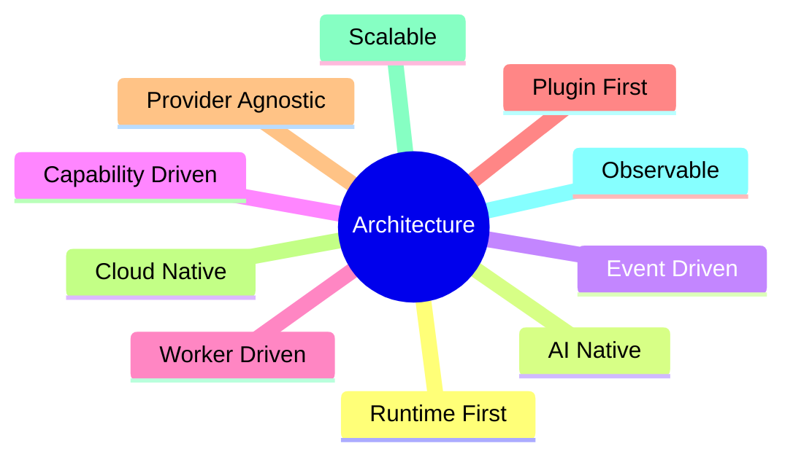

---

# Overall Architecture

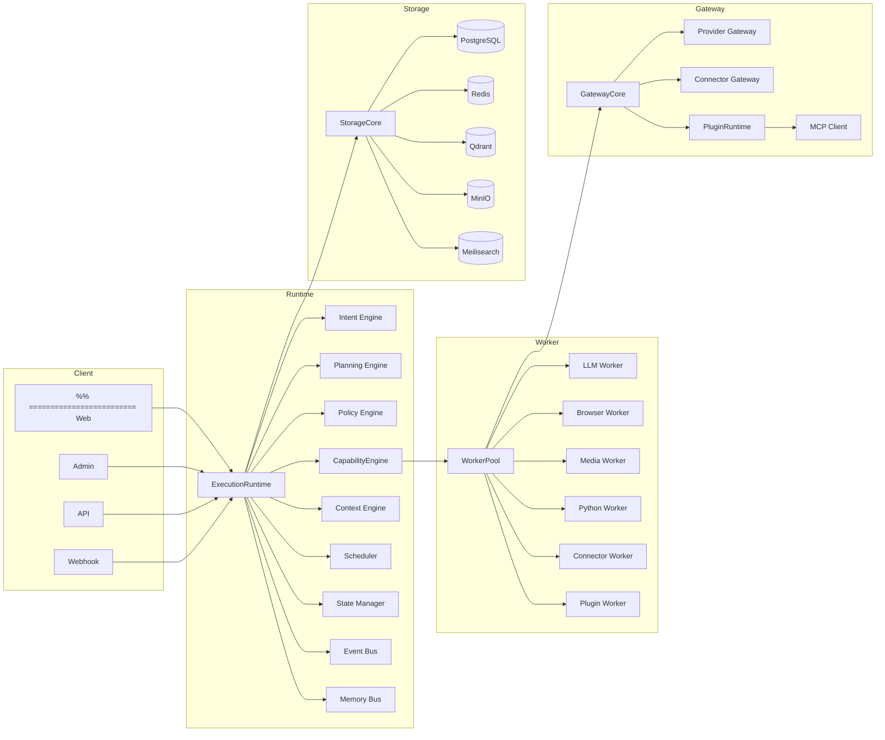

---

# Architecture Layers

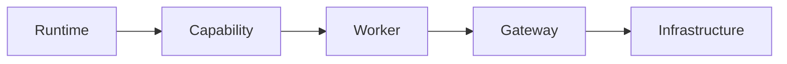

---

# Layer Responsibilities

| Layer | Responsibility |
|---------|----------------|
| Presentation | Dashboard, Chat, Marketing UI |
| Application | API, Authentication, Permission |
| Runtime | Goal Execution |
| Capability | What the system can do |
| Worker | Execute the capability |
| Gateway | Connect external services |
| Infrastructure | Storage, Queue, Monitoring |

---

# Runtime Architecture

Execution Runtime là Kernel của toàn bộ hệ thống.

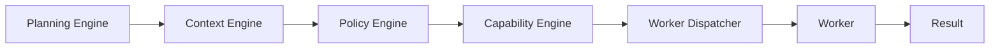

---

# Runtime Components

## Execution Runtime

Điều phối toàn bộ vòng đời của một Execution.

---

## Intent Engine

Phân tích Goal.

Ví dụ

```
Viết bài Facebook về AI
```

```mermaid
flowchart LR
```

```
GenerateContent
```

---

## Planning Engine

Sinh Execution Plan.

Ví dụ

```mermaid
flowchart LR
```

---

## Context Engine

Thu thập Context.

Nguồn Context

- Conversation
- Memory
- Knowledge
- Prompt
- Workspace
- Brand

---

## Policy Engine

Áp dụng Policy.

Ví dụ

- Approval
- Permission
- Retry
- Timeout
- Budget

---

## Capability Engine

Tìm Capability phù hợp.

Ví dụ

```mermaid
flowchart LR
```

---

## Worker Dispatcher

Lựa chọn Worker.

Ví dụ

```mermaid
flowchart LR
```

---

# Runtime Lifecycle

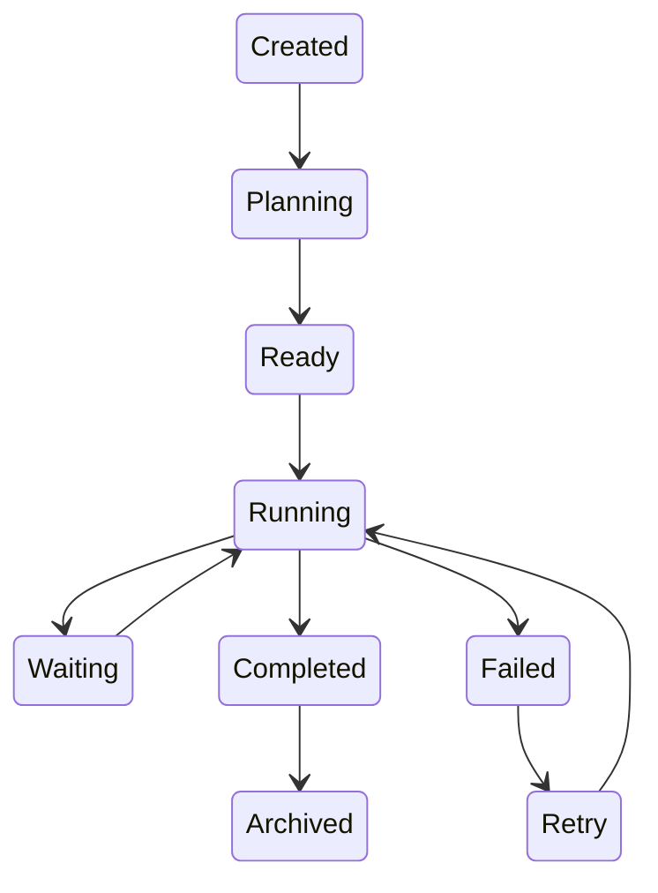

---

# Execution Flow

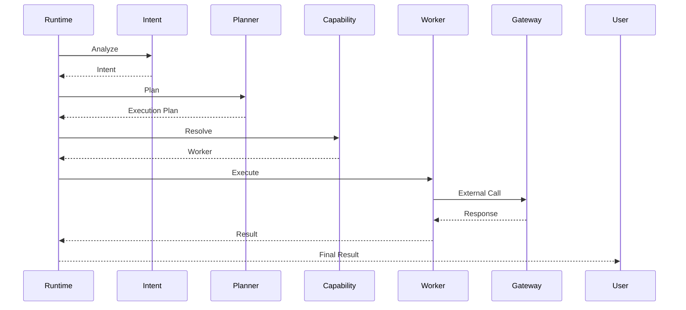

---

# Capability Layer

Capability mô tả **khả năng của hệ thống**.

Ví dụ

```
GenerateContent

GenerateImage

PublishFacebook

SendLark

SearchKnowledge

ResearchTrend

CreateVideo
```

Capability không chứa Business Logic.

---

# Worker Layer

Worker chịu trách nhiệm thực thi.

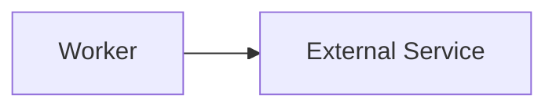

Ví dụ

| Worker | Responsibility |
|---------|----------------|
| LLM Worker | Chat, Completion |
| Browser Worker | Crawl Website |
| Media Worker | Image, Video |
| Connector Worker | Social API |
| Plugin Worker | Plugin Execution |
| Python Worker | AI Script |

---

# AI Layer

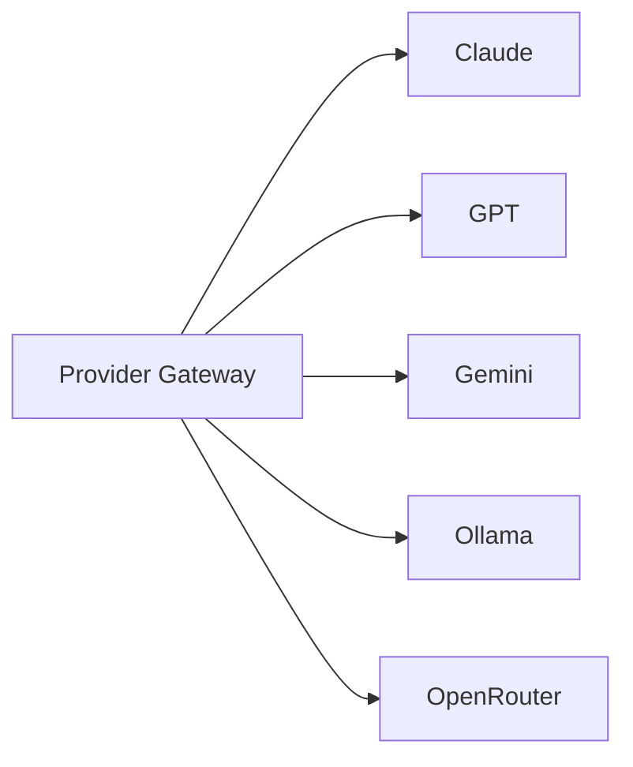

Provider Gateway chuẩn hóa API của tất cả AI Provider.

---

# Social Layer

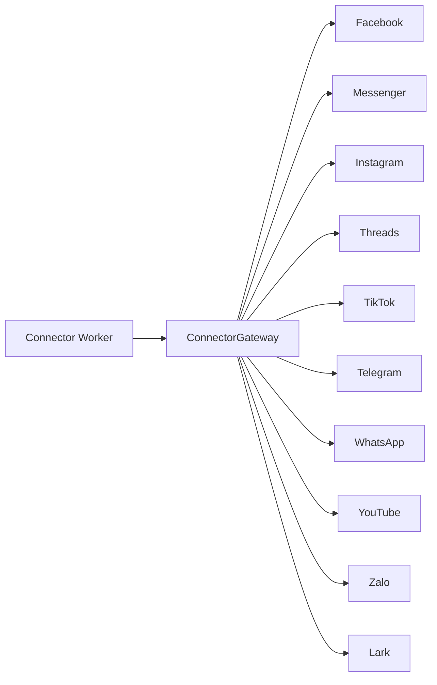

---

# Plugin Layer

Plugin Runtime cho phép cài đặt Plugin tương tự Claude Desktop.

Plugin có thể mở rộng:

- Capability
- Worker
- Connector
- Provider
- Prompt
- Dashboard Widget
- API
- UI Component

---

# MCP Layer

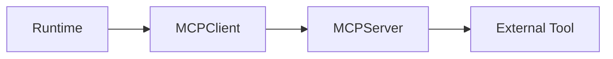

Ví dụ

- GitHub
- PostgreSQL
- Notion
- Slack
- Browser
- Filesystem

---

# Event Bus

Mọi thành phần giao tiếp bằng Event.

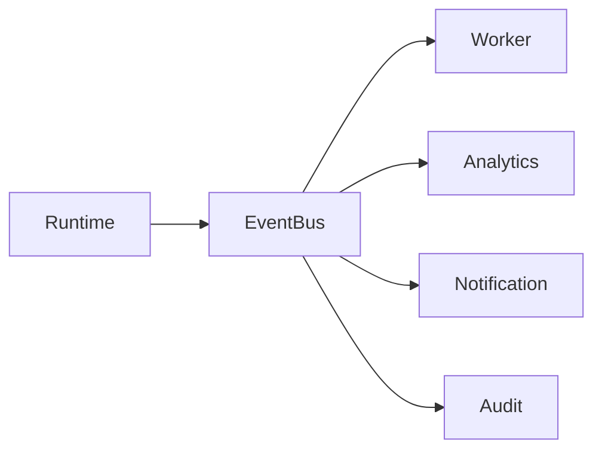

---

# Memory Bus

Memory không được truy cập trực tiếp.

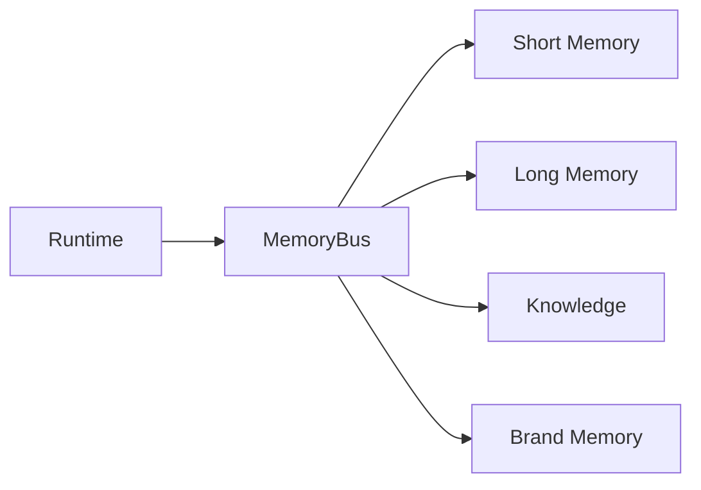

---

# Storage Architecture

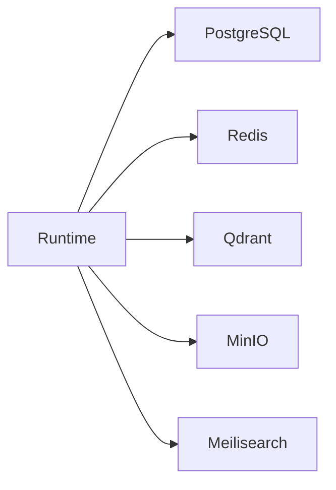

---

# Security Architecture

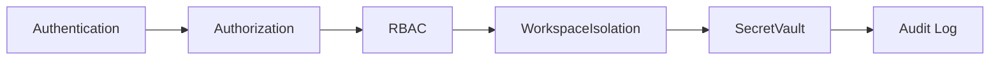

---

# Deployment Architecture

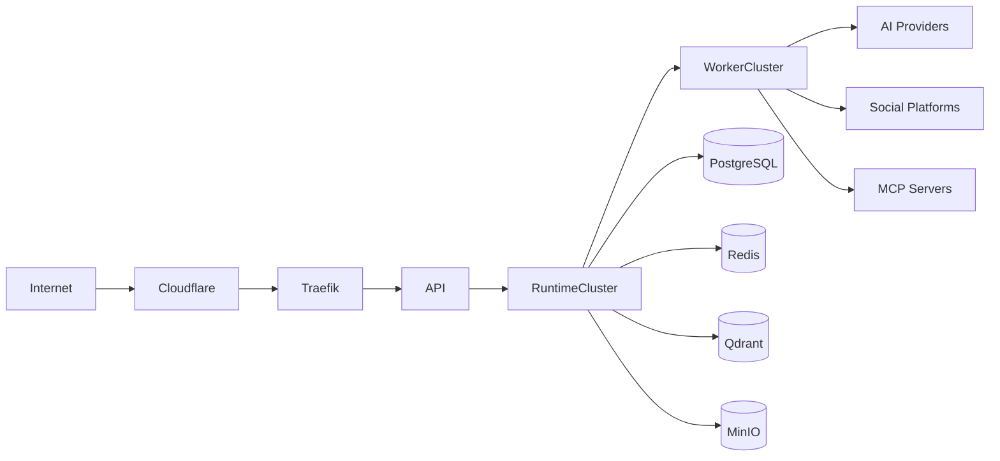

---

# Scalability

Tất cả Service đều có thể scale độc lập.

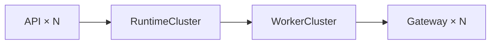

Ví dụ:

- Runtime scale theo số lượng Execution.
- Worker scale theo loại tác vụ.
- Gateway scale theo số lượng Provider hoặc Connector.

---

# Fault Tolerance

Runtime hỗ trợ:

- Retry
- Timeout
- Dead Letter Queue
- Event Replay
- Circuit Breaker
- Provider Failover

---

# Observability

Toàn bộ hệ thống được theo dõi thông qua:

- Metrics
- Logs
- Distributed Tracing
- Audit Log
- AI Usage
- Token Usage
- Cost Tracking

---

# Architecture Summary

AI Social OS được xây dựng dựa trên **Execution Runtime** thay vì Workflow Engine.

Execution Runtime điều phối toàn bộ Capability, Worker, Gateway và Storage, tạo nên một nền tảng AI thống nhất có khả năng:

- hỗ trợ nhiều AI Provider
- tích hợp nhiều nền tảng Social
- mở rộng bằng Plugin và MCP
- quản lý Memory và Knowledge tập trung
- mở rộng theo chiều ngang
- phát triển thành AI Operating System trong tương lai mà không cần thay đổi kiến trúc cốt lõi.