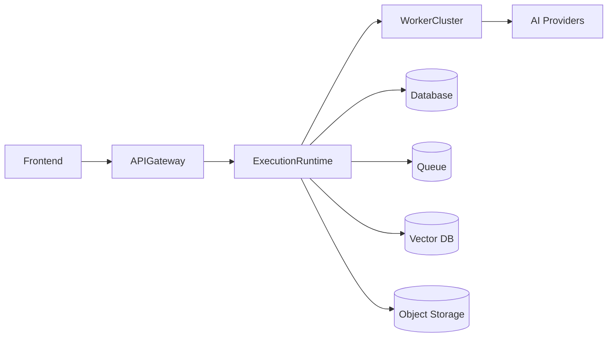
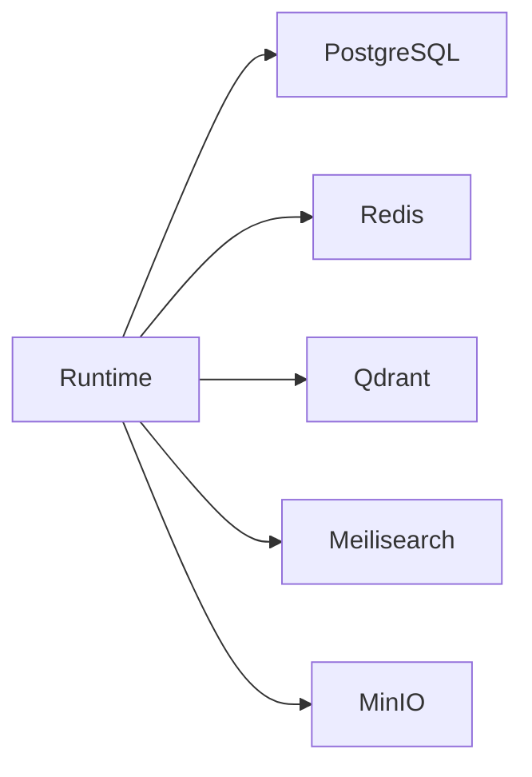
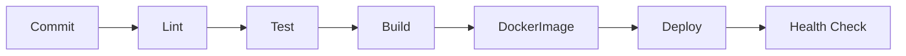

# Technology Stack

> AI Social OS Technology Stack

Version: 2.0.0

Status: Draft

Last Updated: 2026-07-25

---

# Table of Contents

- Technology Principles
- Architecture Overview
- Backend
- Frontend
- Runtime
- AI Stack
- Data Layer
- Infrastructure
- Messaging
- Storage
- Authentication
- Observability
- Development Tools
- Deployment
- Technology Decisions

---

# Technology Principles

Toàn bộ công nghệ được lựa chọn dựa trên các nguyên tắc sau.

- Open Source First
- Cloud Native
- AI Native
- Provider Agnostic
- High Performance
- Event Driven
- Horizontally Scalable
- Long-term Maintainability

---

# High-Level Stack



---

# Programming Languages

| Language | Purpose |
|-----------|----------|
| TypeScript | Backend + Frontend |
| SQL | Database |
| Python | AI Worker |
| Bash | DevOps |
| YAML | Deployment |

---

# Backend

## Runtime

- Node.js 24+
- TypeScript
- NestJS

### Responsibilities

- API
- Runtime
- Scheduler
- Authentication
- Event Bus
- Plugin Runtime

---

## Why NestJS

- Modular
- Dependency Injection
- Enterprise Ready
- Excellent TypeScript Support
- Large Ecosystem

---

# Frontend

## Framework

- Next.js
- React
- TypeScript

---

## UI

- Tailwind CSS
- shadcn/ui
- Radix UI

---

## State Management

- TanStack Query
- Zustand

---

## Forms

- React Hook Form
- Zod

---

## Charts

- Apache ECharts

---

# Runtime Stack

Execution Runtime được xây dựng bằng NestJS.

Core Components

```text
Execution Runtime

├── Intent Engine

├── Planning Engine

├── Policy Engine

├── Context Engine

├── Capability Engine

├── Scheduler

├── Event Bus

├── Memory Bus

├── State Manager

└── Resource Manager
```

---

# AI Stack

## AI SDK

- Vercel AI SDK

Lý do:

- Multi Provider
- Streaming
- Tool Calling
- Structured Output

---

## Supported Providers

- Claude
- OpenAI
- Gemini
- OpenRouter
- Ollama
- Azure OpenAI

---

## Embedding

- OpenAI
- Voyage AI
- BGE
- Nomic
- Jina

---

## Reranker

- BGE Reranker
- Cohere

---

# Agent Framework

Không sử dụng CrewAI hoặc LangChain làm nền tảng Runtime.

Chỉ sử dụng các thư viện AI ở mức SDK.

Runtime được phát triển nội bộ.

---

# Queue

## Primary

NATS JetStream

### Purpose

- Event
- Queue
- Retry
- Streaming

---

## Why NATS

- Lightweight
- High Performance
- Event Streaming
- Horizontal Scaling

---

# Database

## PostgreSQL

Purpose

- User
- Workspace
- Campaign
- Content
- Metadata

---

## ORM

Drizzle ORM

Lý do

- Type-safe
- Lightweight
- Excellent TypeScript Support

---

# Cache

Redis

Purpose

- Cache
- Session
- Rate Limit
- Temporary State

---

# Vector Database

Qdrant

Purpose

- Embedding
- Semantic Search
- Knowledge Base
- Memory

---

# Object Storage

MinIO

Purpose

- Images
- Videos
- Documents
- Audio
- Assets

Có thể thay bằng:

- Amazon S3
- Cloudflare R2
- Google Cloud Storage

---

# Search

Meilisearch

Purpose

- Full-text Search
- Content Search
- Campaign Search

---

# Authentication

## Identity

- Better Auth

---

## Authorization

- RBAC
- Workspace Permission

---

## Future

- SAML
- OIDC
- Enterprise SSO

---

# API

## REST API

External API

---

## WebSocket

Realtime

---

## Webhook

Social Callback

---

## OpenAPI

Swagger

---

# Plugin

Plugin SDK

- TypeScript SDK
- React SDK

Plugin Runtime

- Dynamic Loading
- Sandboxed Execution
- Permission System

---

# MCP

Support

- MCP Client
- MCP Tool Discovery
- MCP Session
- MCP Permission

---

# Storage Architecture



---

# Observability

## Metrics

Prometheus

---

## Dashboard

Grafana

---

## Logs

Loki

---

## Tracing

OpenTelemetry

Jaeger

---

# Monitoring

Health Check

Runtime Metrics

Worker Metrics

Queue Metrics

Provider Metrics

Connector Metrics

---

# Development

## Package Manager

pnpm

---

## Monorepo

Turborepo

---

## Linter

ESLint

---

## Formatter

Prettier

---

## Git Hooks

Husky

lint-staged

---

# Testing

## Unit Test

Vitest

---

## Integration Test

Vitest

---

## E2E

Playwright

---

## API Test

Bruno

---

# Infrastructure

## Container

Docker

---

## Orchestration

Docker Compose

Production:

Kubernetes

---

## Reverse Proxy

Traefik

---

## CDN

Cloudflare

---

# CI/CD

GitHub Actions

Pipeline


---

# Secrets

- Doppler (recommended)
- Infisical
- Vault (Enterprise)

---

# Deployment Targets

Development

- Local Docker

---

Staging

- Docker Compose

---

Production

- Kubernetes

---

# Technology Decisions

| Component | Technology | Reason |
|-----------|------------|--------|
| Backend | NestJS | Modular Architecture |
| Frontend | Next.js | Fullstack React |
| Runtime | Custom Runtime | Full Control |
| AI SDK | Vercel AI SDK | Provider Agnostic |
| ORM | Drizzle | Type-safe |
| Database | PostgreSQL | Mature & Reliable |
| Queue | NATS JetStream | Event Driven |
| Cache | Redis | Performance |
| Vector DB | Qdrant | AI Native |
| Search | Meilisearch | Fast Search |
| Storage | MinIO | S3 Compatible |
| Auth | Better Auth | Modern Auth |
| Monitoring | Prometheus + Grafana | Industry Standard |
| Logs | Loki | Cloud Native |
| Tracing | OpenTelemetry | Distributed Tracing |
| Deployment | Kubernetes | Scalability |

---

# Future Technologies

Có thể bổ sung trong tương lai:

- Temporal (Long-running Workflow)
- Apache Kafka (Large-scale Event Streaming)
- ClickHouse (Analytics)
- Ray (Distributed AI Execution)
- vLLM (Self-hosted LLM)
- Triton Inference Server
- WASM Plugin Runtime

---

# Summary

AI Social OS sử dụng kiến trúc **TypeScript-first** với NestJS, Next.js và một **Execution Runtime** được phát triển riêng.

Các lựa chọn công nghệ ưu tiên:

- hiệu năng cao
- khả năng mở rộng
- AI Native
- Event Driven
- Cloud Native
- không phụ thuộc vào bất kỳ AI Provider hoặc Cloud Provider nào.

Điều này giúp hệ thống có thể phát triển từ một nền tảng Marketing Automation thành một AI Operating System hoàn chỉnh.