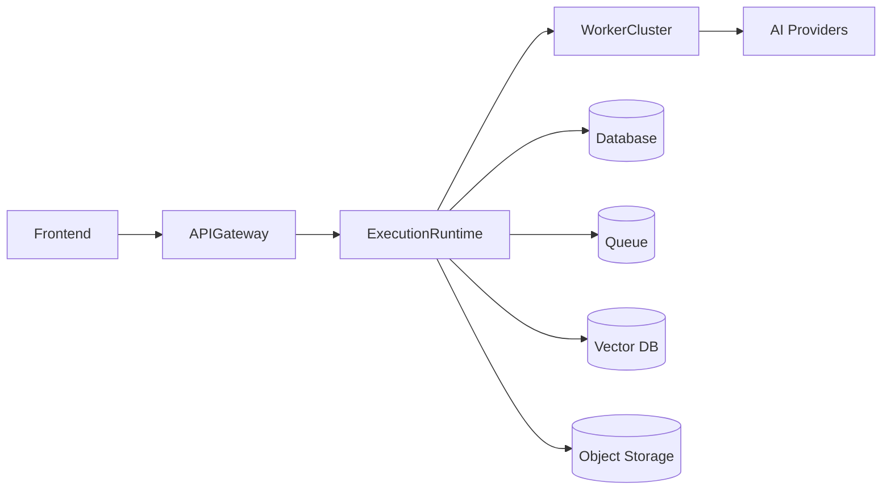
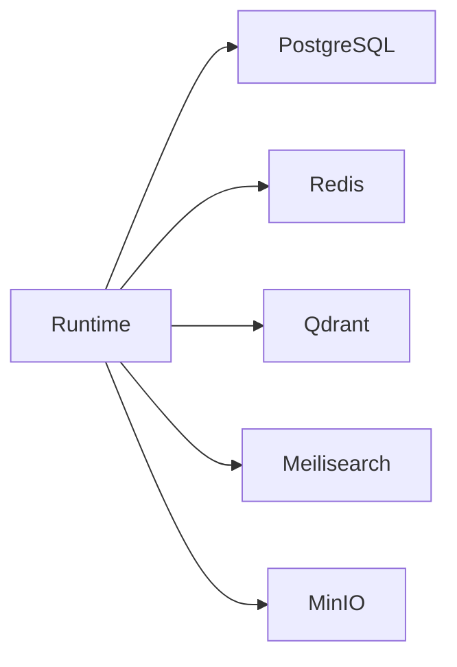
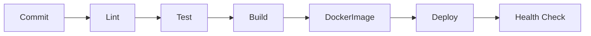

# Technology Stack

> AI Social OS Technology Stack

Version: 2.0.0

Status: Draft

Last Updated: 2026-07-25

---

# Table of Contents

- Technology Principles
- Architecture Overview
- MVP Stack (Phase 0-2)
- Future / Scale-out Stack (Phase 3+)
- Backend
- Frontend
- Runtime
- AI Stack
- Data Layer
- Infrastructure
- Messaging
- Storage
- Authentication
- Observability
- Development Tools
- Deployment
- Technology Decisions

---

# Technology Principles

Toàn bộ công nghệ được lựa chọn dựa trên các nguyên tắc sau.

- Open Source First
- Cloud Native
- AI Native
- Provider Agnostic
- High Performance
- Event Driven
- Horizontally Scalable
- Long-term Maintainability

---

# High-Level Stack



---

# MVP Stack (Phase 0-2)

Đây là tập công nghệ Data/Infrastructure tối thiểu để triển khai Foundation (Phase 0) → AI Runtime (Phase 1) → AI Platform (Phase 2) theo docs/ROADMAP.md. Không cần dựng thêm hạ tầng nào khác ngoài danh sách này để bắt đầu.

| Layer              | Technology       | Ghi chú                                                       |
| ------------------ | ---------------- | ------------------------------------------------------------- |
| Database (OLTP)    | PostgreSQL       | Xem mục Database                                              |
| Cache              | Redis            | Xem mục Cache                                                 |
| Object Storage     | MinIO / S3       | Xem mục Object Storage                                        |
| Vector Database    | Qdrant           | Cần sớm cho RAG/Knowledge (Phase 2) — Xem mục Vector Database |
| Backend Framework  | Node.js + NestJS | Giữ nguyên — xem mục Backend                                  |
| Frontend Framework | Next.js + React  | Giữ nguyên — xem mục Frontend                                 |

Chi tiết phasing từng công nghệ Data Layer: docs/data/03_DATABASE_STRATEGY.md, docs/data/07_CACHE_LAYER.md, docs/data/06_OBJECT_STORAGE.md, docs/data/08_VECTOR_DATABASE.md.

---

# Future / Scale-out Stack (Phase 3+)

Các công nghệ dưới đây mô tả kiến trúc mục tiêu dài hạn của AI Social OS. Không triển khai ở MVP — chỉ cân nhắc khi có nhu cầu scale thực tế (từ Phase 3 — Social Platform trở đi, hoặc Phase 6 — Enterprise). Không công nghệ nào bị loại bỏ khỏi tầm nhìn dài hạn, chỉ hoãn triển khai.

| Layer                                           | Technology                                  | Khi nào cần                                                                                                | Chi tiết                                          |
| ----------------------------------------------- | ------------------------------------------- | ---------------------------------------------------------------------------------------------------------- | ------------------------------------------------- |
| Graph Database (Social Graph + Knowledge Graph) | Neo4j / Memgraph                            | Khi cần suy luận đa bước, Explainable AI trên quan hệ phức tạp                                             | docs/data/09_KNOWLEDGE_GRAPH.md                   |
| Dedicated Event Store                           | Kafka / EventStoreDB                        | Khi khối lượng Event và yêu cầu Replay/Streaming vượt quá PostgreSQL Event Table                           | docs/data/05_EVENT_STORE.md                       |
| Data Lakehouse                                  | Apache Iceberg / Delta Lake + Spark / Trino | Khi cần AI Training và Analytics ở quy mô lớn                                                              | docs/data/12_DATA_LAKEHOUSE.md                    |
| Dedicated Search Engine                         | OpenSearch / Elasticsearch                  | Khi cần Hybrid Search, Faceted Search ở quy mô lớn (nâng cấp từ Meilisearch / PostgreSQL Full-text Search) | docs/data/10_SEARCH_ENGINE.md                     |
| Service Mesh                                    | Istio / Linkerd                             | Khi số lượng Microservices và yêu cầu mTLS/Traffic Management tăng cao                                     | docs/infrastructure/06_SERVICE_MESH.md            |
| Multi-cloud / Multi-region                      | —                                           | Khi mở rộng sang nhiều thị trường hoặc cần Disaster Recovery toàn cầu (Phase 6 — Enterprise)               | docs/infrastructure/02_CLOUD_ARCHITECTURE.md      |
| Kubernetes (Production Orchestration)           | Kubernetes                                  | Khi cần Auto Scaling / Self Healing ở quy mô nhiều Service (Docker Compose đủ cho Phase 0-1)               | docs/infrastructure/05_KUBERNETES_ARCHITECTURE.md |

---

# Programming Languages

| Language   | Purpose            |
| ---------- | ------------------ |
| TypeScript | Backend + Frontend |
| SQL        | Database           |
| Python     | AI Worker          |
| Bash       | DevOps             |
| YAML       | Deployment         |

---

# Backend

## Runtime

- Node.js 24+
- TypeScript
- NestJS

### Responsibilities

- API
- Runtime
- Scheduler
- Authentication
- Event Bus
- Plugin Runtime

---

## Why NestJS

- Modular
- Dependency Injection
- Enterprise Ready
- Excellent TypeScript Support
- Large Ecosystem

---

# Frontend

## Framework

- Next.js
- React
- TypeScript

---

## UI

- Tailwind CSS
- shadcn/ui
- Radix UI

---

## State Management

- TanStack Query
- Zustand

---

## Forms

- React Hook Form
- Zod

---

## Charts

- Apache ECharts

---

# Runtime Stack

Execution Runtime được xây dựng bằng NestJS.

Core Components

```text
Execution Runtime

├── Intent Engine

├── Planning Engine

├── Policy Engine

├── Context Engine

├── Capability Engine

├── Scheduler

├── Event Bus

├── Memory Bus

├── State Manager

└── Resource Manager
```

---

# AI Stack

## AI SDK

- Vercel AI SDK

Lý do:

- Multi Provider
- Streaming
- Tool Calling
- Structured Output

---

## Supported Providers

- Claude
- OpenAI
- Gemini
- OpenRouter
- Ollama
- Azure OpenAI

---

## Embedding

- OpenAI
- Voyage AI
- BGE
- Nomic
- Jina

---

## Reranker

- BGE Reranker
- Cohere

---

# Agent Framework

Không sử dụng CrewAI hoặc LangChain làm nền tảng Runtime.

Chỉ sử dụng các thư viện AI ở mức SDK.

Runtime được phát triển nội bộ.

---

# Queue

## Primary

NATS JetStream

### Purpose

- Event
- Queue
- Retry
- Streaming

---

## Why NATS

- Lightweight
- High Performance
- Event Streaming
- Horizontal Scaling

---

# Database (MVP — Phase 0-2)

## PostgreSQL

Purpose

- User
- Workspace
- Campaign
- Content
- Metadata

---

## ORM

Drizzle ORM

Lý do

- Type-safe
- Lightweight
- Excellent TypeScript Support

---

# Cache (MVP — Phase 0-2)

Redis

Purpose

- Cache
- Session
- Rate Limit
- Temporary State

---

# Vector Database (MVP — Phase 0-2)

Qdrant

Purpose

- Embedding
- Semantic Search
- Knowledge Base
- Memory

---

# Object Storage (MVP — Phase 0-2)

MinIO

Purpose

- Images
- Videos
- Documents
- Audio
- Assets

Có thể thay bằng:

- Amazon S3
- Cloudflare R2
- Google Cloud Storage

---

# Search (MVP hiện tại: Meilisearch · Future Phase 3+: OpenSearch/Elasticsearch)

Meilisearch

Purpose

- Full-text Search
- Content Search
- Campaign Search

> Meilisearch là lựa chọn nhẹ dùng được ở MVP. Nếu quy mô tăng cao và cần Hybrid Search/Faceted Search nâng cao, nâng cấp sang OpenSearch/Elasticsearch (Future / Scale-out Stack, Phase 3+) — xem docs/data/10_SEARCH_ENGINE.md.

---

# Authentication

## Identity

- Passport (`@nestjs/passport`) + JWT (`@nestjs/jwt`)
- argon2id để hash password

> Trước đây tài liệu ghi "Better Auth". Đã đổi sang Passport + JWT vì backend là NestJS — Passport là idiom chuẩn của NestJS, đồng thời cho phép schema User/Profile/Identity/Session khớp đúng `docs/platform/04_USER_MANAGEMENT.md` và `docs/platform/06_AUTHENTICATION.md` thay vì phải dung hòa với bộ bảng riêng của Better Auth. OAuth/MFA/SSO bổ sung sau (xem mục Future).

---

## Authorization

- RBAC
- Workspace Permission
- Permission string dạng `<scope>.<resource>.<action>` — xem `docs/platform/08_PERMISSION_MODEL.md`

---

## Future

- SAML
- OIDC
- Enterprise SSO

---

# API

## REST API

External API

---

## WebSocket

Realtime

---

## Webhook

Social Callback

---

## OpenAPI

Swagger

---

# Plugin

Plugin SDK

- TypeScript SDK
- React SDK

Plugin Runtime

- Dynamic Loading
- Sandboxed Execution
- Permission System

---

# MCP

Support

- MCP Client
- MCP Tool Discovery
- MCP Session
- MCP Permission

---

# Storage Architecture



---

# Observability

## Metrics

Prometheus

---

## Dashboard

Grafana

---

## Logs

Loki

---

## Tracing

OpenTelemetry

Jaeger

---

# Monitoring

Health Check

Runtime Metrics

Worker Metrics

Queue Metrics

Provider Metrics

Connector Metrics

---

# Development

## Package Manager

pnpm

---

## Monorepo

Turborepo

---

## Linter

ESLint

---

## Formatter

Prettier

---

## Git Hooks

Husky

lint-staged

---

# Testing

## Unit Test

Vitest

---

## Integration Test

Vitest

---

## E2E

Playwright

---

## API Test

Bruno

---

# Infrastructure

## Container

Docker

---

## Orchestration

Docker Compose

Production:

Kubernetes

> Docker Compose: MVP — dùng cho Phase 0-2 (đúng với Phase 0 Deliverables của docs/ROADMAP.md). Kubernetes (Production): Future / Scale-out Stack — cân nhắc từ Phase 3+ khi cần Auto Scaling/Self Healing ở quy mô lớn — xem docs/infrastructure/05_KUBERNETES_ARCHITECTURE.md.

---

## Reverse Proxy

Traefik

---

## CDN

Cloudflare

---

# CI/CD

GitHub Actions

Pipeline



---

# Secrets

- Doppler (recommended)
- Infisical
- Vault (Enterprise)

---

# Deployment Targets

Development

- Local Docker

---

Staging

- Docker Compose

---

Production

- Kubernetes

> Kubernetes ở Production thuộc Future / Scale-out Stack (Phase 3+); Phase 0-2 vận hành bằng Docker Compose là đủ.

---

# Technology Decisions

PostgreSQL, Redis, Qdrant, MinIO thuộc **MVP Stack (Phase 0-2)**; Kubernetes thuộc **Future / Scale-out Stack (Phase 3+)** — xem chi tiết ở hai bảng nhóm đầu tài liệu.

| Component  | Technology                | Reason                                          |
| ---------- | ------------------------- | ----------------------------------------------- |
| Backend    | NestJS                    | Modular Architecture                            |
| Frontend   | Next.js                   | Fullstack React                                 |
| Runtime    | Custom Runtime            | Full Control                                    |
| AI SDK     | Vercel AI SDK             | Provider Agnostic                               |
| ORM        | Drizzle                   | Type-safe                                       |
| Database   | PostgreSQL                | Mature & Reliable                               |
| Queue      | NATS JetStream            | Event Driven                                    |
| Cache      | Redis                     | Performance                                     |
| Vector DB  | Qdrant                    | AI Native                                       |
| Search     | Meilisearch               | Fast Search                                     |
| Storage    | MinIO                     | S3 Compatible                                   |
| Auth       | Passport + JWT + argon2id | Idiom chuẩn NestJS, toàn quyền kiểm soát schema |
| Monitoring | Prometheus + Grafana      | Industry Standard                               |
| Logs       | Loki                      | Cloud Native                                    |
| Tracing    | OpenTelemetry             | Distributed Tracing                             |
| Deployment | Kubernetes                | Scalability                                     |

---

# Future Technologies

Đây là các công nghệ AI/Execution bổ sung trong tương lai. Với các quyết định Future / Scale-out cho Data Layer & Infrastructure (Graph DB, Event Store, Data Lakehouse, Search Engine, Service Mesh, Multi-cloud/Multi-region, Kubernetes), xem mục "Future / Scale-out Stack (Phase 3+)" ở đầu tài liệu.

Có thể bổ sung trong tương lai:

- Temporal (Long-running Workflow)
- Apache Kafka (Large-scale Event Streaming)
- ClickHouse (Analytics)
- Ray (Distributed AI Execution)
- vLLM (Self-hosted LLM)
- Triton Inference Server
- WASM Plugin Runtime

---

# Summary

AI Social OS sử dụng kiến trúc **TypeScript-first** với NestJS, Next.js và một **Execution Runtime** được phát triển riêng.

Các lựa chọn công nghệ ưu tiên:

- hiệu năng cao
- khả năng mở rộng
- AI Native
- Event Driven
- Cloud Native
- không phụ thuộc vào bất kỳ AI Provider hoặc Cloud Provider nào.

Điều này giúp hệ thống có thể phát triển từ một nền tảng Marketing Automation thành một AI Operating System hoàn chỉnh.
