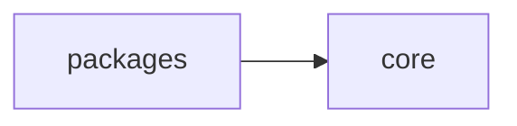
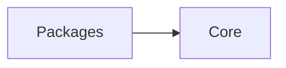
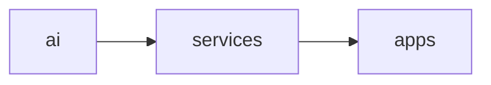
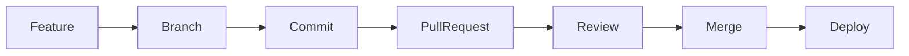

# Monorepo Structure

> AI Social OS Monorepo Architecture

Version: 2.0.0

Status: Draft

Last Updated: 2026-07-25

---

# Table of Contents

- Overview
- Design Principles
- Repository Layout
- Applications
- Packages
- Internal Modules
- Dependency Rules
- Import Rules
- Naming Convention
- Build Strategy
- Development Workflow

---

# Overview

AI Social OS được tổ chức theo mô hình **Monorepo**.

Mục tiêu:

- Một source code duy nhất
- Chia sẻ package
- Build độc lập
- Deploy độc lập
- Type-safe toàn bộ hệ thống

---

# Design Principles

- Domain-first
- Package-first
- Feature isolation
- Shared core
- No circular dependency
- Independent deployment
- Clear ownership

---

# Repository Layout

```text
ai-social-os/

├── apps/
│
├── packages/
│
├── services/
│
├── tooling/
│
├── infrastructure/
│
├── scripts/
│
├── docs/
│
├── plan/
│
├── docker/
│
├── .github/
│
├── package.json
├── pnpm-workspace.yaml
├── turbo.json
├── tsconfig.base.json
└── README.md
```

---

# Applications

```text
apps/

├── web/
│   ├── dashboard
│   ├── marketing
│   ├── chat
│   ├── analytics
│   └── settings
│
├── admin/
│
├── docs/
│
├── playground/
│
└── landing/
```

## web

Ứng dụng chính.

Bao gồm

- Dashboard
- AI Chat
- Marketing Studio
- Campaign
- Analytics
- Plugin Marketplace

---

## admin

Quản trị hệ thống.

---

## playground

Thử nghiệm Prompt, Capability và Plugin.

---

## docs

Documentation website.

---

# Services

```text
services/

├── api/
│
├── runtime/
│
├── worker/
│
├── scheduler/
│
├── gateway-provider/
│
├── gateway-connector/
│
├── gateway-plugin/
│
├── gateway-mcp/
│
└── webhook/
```

---

## api

REST API.

---

## runtime

Execution Runtime.

Là Kernel của hệ thống.

---

## worker

Worker Cluster.

Bao gồm:

- LLM Worker
- Browser Worker
- Python Worker
- Media Worker
- Connector Worker

---

## scheduler

Cron Job và Queue Scheduler.

---

## gateway-provider

Điều phối AI Provider.

---

## gateway-connector

Điều phối Social Platform.

---

## gateway-plugin

Plugin Runtime.

---

## gateway-mcp

MCP Client Runtime.

---

## webhook

Nhận Webhook từ Social Platform.

---

# Packages

```text
packages/

├── core/
├── runtime/
├── domain/
├── database/
├── auth/
├── ai/
├── integration/
├── plugin/
├── sdk/
├── ui/
├── config/
├── logger/
├── event/
├── queue/
├── storage/
├── shared/
└── testing/
```

---

# Package Responsibilities

## core

Các kiểu dữ liệu và interface dùng chung.

Ví dụ

- Result
- Error
- Entity
- Value Object
- Base Classes

---

## runtime

Runtime SDK.

Ví dụ

- Task
- Execution
- Capability
- Policy
- Scheduler

---

## domain

Business Domain.

Ví dụ

- Workspace
- Campaign
- Content
- Memory

---

## database

Drizzle ORM.

Migration.

Schema.

---

## auth

Authentication.

Authorization.

---

## ai

AI SDK.

Provider Interface.

Prompt.

Embedding.

---

## integration

> Đổi tên từ `social` để khớp **Integration Domain** (`docs/03_DOMAIN_MODEL.md`) — tách bạch với `docs/social_network/` (mạng xã hội nội bộ, future-vision, không thuộc package nào ở đây).

Connector SDK.

Social API.

Webhook.

---

## plugin

Plugin SDK.

Manifest.

Sandbox.

---

## sdk

External SDK.

Ví dụ

- TypeScript SDK
- JavaScript SDK

---

## ui

Shared UI Components.

---

## config

Configuration.

Environment.

---

## logger

Logging.

---

## event

Event SDK.

---

## queue

Queue SDK.

---

## storage

Storage SDK.

---

## shared

Utility.

Helper.

Common Function.

---

## testing

Mock.

Fixture.

Test Utility.

---

# Internal Architecture



---

# Dependency Rules



Không được phép:

```mermaid
flowchart LR
```

Không được phép:

```mermaid
flowchart LR
```

Không được tạo Circular Dependency.

---

# Import Rules

Được phép

```mermaid
flowchart LR
```

Được phép

```mermaid
flowchart LR
```

Không được phép

```mermaid
flowchart LR
```

Không được phép

```mermaid
flowchart LR
```

---

# Module Naming

Ví dụ

```text
workspace.module.ts

campaign.module.ts

runtime.module.ts

plugin.module.ts
```

---

# Folder Naming

Sử dụng

```text
kebab-case
```

Ví dụ

```text
gateway-provider

event-bus

memory-store
```

---

# File Naming

```text
execution.service.ts

planner.service.ts

worker.controller.ts

provider.interface.ts

memory.repository.ts
```

---

# Build Strategy

Turborepo sẽ build theo dependency graph.



---

# Environment

```text
.env

.env.local

.env.development

.env.production
```

Không commit:

- Secret
- API Key
- OAuth Token

---

# Shared Configuration

```text
packages/config

├── eslint

├── prettier

├── tsconfig

├── tailwind

└── env
```

---

# Development Workflow



---

# Ownership

| Directory            | Owner            |
| -------------------- | ---------------- |
| apps                 | Frontend Team    |
| services             | Backend Team     |
| packages/runtime     | Runtime Team     |
| packages/ai          | AI Team          |
| packages/integration | Integration Team |
| packages/plugin      | Platform Team    |
| packages/database    | Backend Team     |
| packages/ui          | Frontend Team    |

---

# Monorepo Goals

- Chia sẻ code giữa các ứng dụng
- Một nguồn dữ liệu duy nhất
- Type-safe toàn hệ thống
- Build nhanh với Turborepo
- Dễ mở rộng package
- Dễ tách thành microservices trong tương lai

---

# Future Structure

Khi hệ thống phát triển, có thể bổ sung:

```text
apps/mobile/

apps/desktop/

services/analytics/

services/search/

services/billing/

packages/workflow/

packages/cost/

packages/observability/

packages/approval/

packages/notification/

packages/media/
```

---

# Summary

```mermaid
flowchart LR
```

- **Apps** chịu trách nhiệm giao diện người dùng.
- **Services** triển khai các tiến trình chạy độc lập như Runtime, Worker, Scheduler và Gateway.
- **Packages** chứa toàn bộ business logic, SDK và thư viện dùng chung.
- **Core** là nền tảng chung với các kiểu dữ liệu, interface và abstraction.

Cấu trúc này giúp AI Social OS dễ bảo trì, dễ mở rộng và sẵn sàng chuyển từ Modular Monolith sang Microservices mà không phải thay đổi kiến trúc tổng thể.
