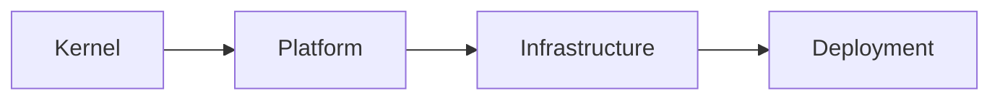

# Documentation Index

> AI Social OS Documentation

Version: 1.0.0

Status: Draft

Last Updated: 2026-07-25

---

# Documentation Structure

```
plan/
│
├── README.md
├── INDEX.md
├── ROADMAP.md
│
├── 00_VISION.md
├── 01_PRODUCT_REQUIREMENTS.md
├── 02_SYSTEM_OVERVIEW.md
├── 03_DOMAIN_MODEL.md
├── 04_ARCHITECTURE.md
├── 05_TECH_STACK.md
├── 06_MONOREPO_STRUCTURE.md
│
├── kernel/
├── runtime/
├── platform/
├── ai/
├── social_network/
├── plugin/
├── data/
├── infrastructure/
├── deployment/
├── security/
├── api/
├── frontend/
└── development/
```

---

# Reading Order

To understand the project architecture correctly, documents should be read in the following order.

```mermaid
flowchart LR
    README[README]
    VISION[Vision]
    PRD[PRD]
    SYSTEM[System Design]
    DOMAIN[Domain Model]
    ARCHITECTURE[Architecture]
    TECHSTACK[Tech Stack]
    MONOREPO[Monorepo]
    KERNEL[Kernel]
    RUNTIME[Runtime]
    PLATFORM[Platform]
    API[API]
    DEPLOYMENT[Deployment]
    README --> VISION
    VISION["VISION"] --> PRD
    PRD["PRD"] --> SYSTEM
    SYSTEM["SYSTEM"] --> DOMAIN
    DOMAIN["DOMAIN"] --> ARCHITECTURE
    ARCHITECTURE["ARCHITECTURE"] --> TECHSTACK
    TECHSTACK["TECHSTACK"] --> MONOREPO
    MONOREPO["MONOREPO"] --> KERNEL
    KERNEL["KERNEL"] --> RUNTIME
    RUNTIME["RUNTIME"] --> PLATFORM
    PLATFORM["PLATFORM"] --> API
    API["API"] --> DEPLOYMENT
```



---

# Foundation Documents

## README.md

Project introduction.

Contents

- Overview
- Vision
- Architecture
- Runtime Flow
- Core Components
- Project Structure

---

## INDEX.md

Documentation index.

Purpose

- Navigation
- Reading order
- Folder reference

---

## ROADMAP.md

Development roadmap.

Contents

- Product milestones
- Release phases
- Success metrics
- Timeline

---

# Product Documents

## 00_VISION.md

Defines the long-term vision.

Topics

- Vision
- Mission
- Philosophy
- Design Principles
- Product Positioning

---

## 01_PRODUCT_REQUIREMENTS.md

Defines business requirements.

Topics

- User Personas
- Use Cases
- Functional Requirements
- Non-functional Requirements
- MVP Scope

---

## 02_SYSTEM_OVERVIEW.md

System overview.

Topics

- Components
- Runtime
- External Services
- Deployment
- Data Flow

---

## 03_DOMAIN_MODEL.md

Business domain model.

Topics

- Workspace
- Campaign
- Content
- Memory
- Knowledge
- Automation

---

## 04_ARCHITECTURE.md

Complete architecture specification.

Topics

- Runtime
- Capability Engine
- Worker
- Provider
- Connector
- Plugin
- MCP
- Event Bus

---

## 05_TECH_STACK.md

Technology selection.

Topics

- Backend
- Frontend
- Database
- Queue
- AI
- Infrastructure

---

## 06_MONOREPO_STRUCTURE.md

Monorepo organization.

Topics

- Folder Structure
- Package Design
- Dependency Rules
- Naming Convention

---

# Runtime Layer

```
kernel/
```

Defines the Kernel of AI Social OS.

Includes

- Runtime Model
- Execution Model
- Goal Model
- Planning
- Scheduler
- Policy
- State Machine

---

```
runtime/
```

Defines execution runtime.

Includes

- Task
- Queue
- Worker
- Event
- Memory
- Resource

---

# AI Layer

```
ai/
```

Defines AI subsystem.

Includes

- Provider Gateway
- Prompt Engine
- Context Engine
- Embedding
- Memory
- Knowledge
- Cost Engine

---

# Platform Layer

```
platform/
```

Defines shared platform services.

Includes

- Authentication
- Authorization
- Workspace
- User
- Secret
- Notification
- Analytics

---

# Integration Layer

External-platform integration (OAuth, Inbox, Comment, Publishing to Facebook, Messenger, Instagram, Threads, TikTok, YouTube, Telegram, WhatsApp, Zalo, Lark) does not live in its own top-level folder. It is documented across:

- `03_DOMAIN_MODEL.md` — Integration Domain (Account, Page, OAuth, Inbox, Comment, Publishing)
- `04_ARCHITECTURE.md` — Integration Layer (Connector Worker, Connector Gateway)
- `runtime/06_CONNECTOR_GATEWAY.md` — Connector Gateway implementation detail

---

# Social Network (Future Vision)

```
social_network/
```

Describes a native, internal social network — own Social Graph, Feed Engine, Recommendation Engine, Community System, Creator Economy — comparable to building a proprietary Facebook/TikTok-style network inside the product.

This is a long-term / future-vision concept, explored independently of the Integration Layer above.

**Not part of the current MVP or the 6-phase roadmap in `ROADMAP.md`.**

---

# Plugin Layer

```
plugin/
```

Plugin architecture.

Includes

- Plugin SDK
- Plugin Runtime
- Plugin Registry
- Plugin Marketplace

---

# Data Layer

```
data/
```

Storage architecture.

Includes

- PostgreSQL
- Redis
- Qdrant
- MinIO
- Object Storage
- Backup

---

# API Layer

```
api/
```

Defines public APIs.

Includes

- REST API
- WebSocket
- Webhook
- SDK
- Authentication

---

# Frontend Layer

```
frontend/
```

Defines UI architecture.

Includes

- Dashboard
- Chat
- Campaign
- Marketing Studio
- Settings
- Plugin Marketplace

---

# Security Layer

```
security/
```

Security architecture.

Includes

- RBAC
- Secret Vault
- Encryption
- Audit
- API Key Management

---

# Infrastructure Layer

```
infrastructure/
```

Infrastructure architecture.

Includes

- Docker
- Kubernetes
- CI/CD
- Monitoring
- Logging
- Service Discovery

---

# Deployment Layer

```
deployment/
```

Deployment strategy.

Includes

- Local Development
- Staging
- Production
- Multi Region
- Disaster Recovery

---

# Development Layer

```
development/
```

Development guide.

Includes

- Coding Standards
- Git Workflow
- Testing Strategy
- Contribution Guide
- Release Process

---

# Documentation Dependency

```mermaid
flowchart LR
    README --> _00_VISION["00_VISION"]
    _00_VISION["00_VISION"] --> _01_PRODUCT_REQUIREMENTS["01_PRODUCT_REQUIREMENTS"]
    _01_PRODUCT_REQUIREMENTS["01_PRODUCT_REQUIREMENTS"] --> _02_SYSTEM_OVERVIEW["02_SYSTEM_OVERVIEW"]
    _02_SYSTEM_OVERVIEW["02_SYSTEM_OVERVIEW"] --> _03_DOMAIN_MODEL["03_DOMAIN_MODEL"]
    _03_DOMAIN_MODEL["03_DOMAIN_MODEL"] --> _04_ARCHITECTURE["04_ARCHITECTURE"]
    _04_ARCHITECTURE["04_ARCHITECTURE"] --> _05_TECH_STACK["05_TECH_STACK"]
    _05_TECH_STACK["05_TECH_STACK"] --> _06_MONOREPO_STRUCTURE["06_MONOREPO_STRUCTURE"]
    _06_MONOREPO_STRUCTURE["06_MONOREPO_STRUCTURE"] --> kernel
    kernel["kernel"] --> runtime
    runtime["runtime"] --> ai
    runtime["runtime"] --> platform
    platform["platform"] --> social_network
    platform["platform"] --> plugin
    platform["platform"] --> api
    api["api"] --> frontend
    frontend["frontend"] --> deployment
```



---

# Documentation Levels



---

# Naming Convention

| Prefix | Description |
|---------|-------------|
| 00 | Vision |
| 01 | Product Requirements |
| 02 | System Overview |
| 03 | Domain Model |
| 04 | Architecture |
| 05 | Technology |
| 06 | Repository Structure |

Module documents không đánh số, được nhóm theo thư mục tương ứng.

---

# Documentation Principles

- Mỗi tài liệu chỉ chịu trách nhiệm cho một chủ đề.
- Không lặp lại nội dung giữa các tài liệu.
- Kiến trúc được mô tả từ tổng quan đến chi tiết.
- Mọi sơ đồ sử dụng Mermaid.
- Mọi quyết định kiến trúc phải có lý do rõ ràng.
- Thiết kế ưu tiên khả năng mở rộng, không phụ thuộc vào AI Provider hay Social Platform.

---

# Next Reading

Sau khi hoàn thành các tài liệu Foundation, tiếp tục theo thứ tự:

1. `ROADMAP.md`
2. `00_VISION.md`
3. `01_PRODUCT_REQUIREMENTS.md`
4. `02_SYSTEM_OVERVIEW.md`
5. `03_DOMAIN_MODEL.md`
6. `04_ARCHITECTURE.md`
7. `05_TECH_STACK.md`
8. `06_MONOREPO_STRUCTURE.md`

Sau đó mới chuyển sang các thư mục:

- `kernel/`
- `runtime/`
- `platform/`
- `ai/`
- `social_network/` (native social network — future vision, not part of the current roadmap)
- `plugin/`
- `deployment/`