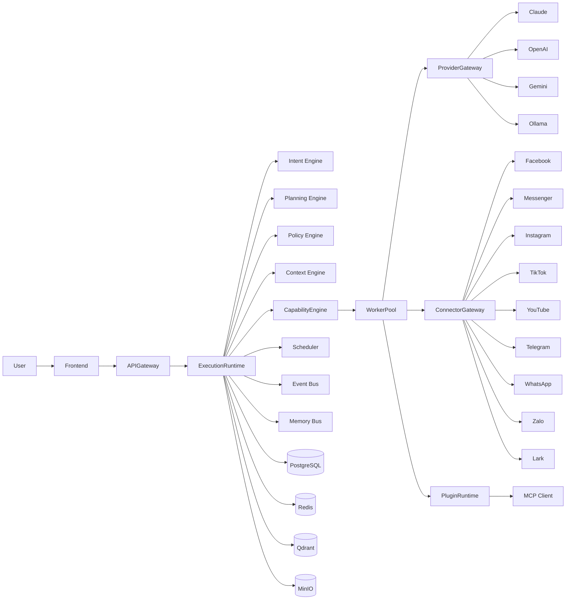

# AI Social OS

> AI-Native Runtime Platform for Social Media, Marketing Automation and Digital Workforce

---

## Overview

AI Social OS là một nền tảng **AI Runtime** được thiết kế để xây dựng Digital Workforce thay vì chỉ tạo Chatbot hoặc Workflow.

Khác với các nền tảng như:

- n8n
- Make
- Zapier
- Flowise
- Dify
- CrewAI

AI Social OS xem **Runtime** là thành phần trung tâm của toàn bộ hệ thống.

Người dùng không cần xây dựng Workflow bằng Node.

Người dùng chỉ cần mô tả mục tiêu bằng ngôn ngữ tự nhiên.

Ví dụ:

> "Mỗi sáng lúc 8 giờ tìm các xu hướng AI mới, viết 5 bài Facebook, tạo hình ảnh minh họa, gửi Leader duyệt trên Lark, sau khi được duyệt thì đăng lên Facebook, Instagram và Telegram."

Runtime sẽ tự:

- hiểu yêu cầu
- lập kế hoạch
- chọn AI phù hợp
- lựa chọn Tool
- điều phối Worker
- gọi Social API
- theo dõi tiến trình
- lưu Memory
- cập nhật Knowledge
- ghi nhận Analytics

---

# Vision

Xây dựng AI Operating System dành cho Marketing Team, Creator và Doanh nghiệp.

Runtime là trái tim của hệ thống.

AI chỉ là một trong nhiều Capability.

---

# Core Principles

## Runtime First

Mọi yêu cầu đều được thực thi thông qua Runtime.

---

## AI Native

AI là thành phần cốt lõi của toàn bộ hệ thống.

---

## Capability Driven

Runtime không biết Worker.

Runtime chỉ biết Capability.

---

## Provider Agnostic

Không phụ thuộc:

- Claude
- OpenAI
- Gemini
- Ollama
- OpenRouter

Provider chỉ là Adapter.

---

## Plugin First

Mọi thành phần đều có thể mở rộng.

- Capability
- Worker
- Connector
- Provider
- UI
- API

---

## Event Driven

Các Module giao tiếp thông qua Event.

---

## Cloud Native

Thiết kế hướng tới khả năng mở rộng.

---

# High-Level Architecture



---

# Runtime Execution Flow


---

# Core Components

| Component | Responsibility |
|------------|----------------|
| Execution Runtime | Kernel điều phối toàn bộ hệ thống |
| Intent Engine | Phân tích yêu cầu người dùng |
| Planning Engine | Sinh Execution Plan |
| Policy Engine | Kiểm tra Permission, Cost, Approval |
| Context Engine | Xây dựng Context cho AI |
| Capability Engine | Resolve Capability sang Worker |
| Scheduler | Điều phối Job |
| Worker Pool | Thực thi Task |
| Provider Gateway | Điều phối AI Provider |
| Connector Gateway | Điều phối Social Connector |
| Plugin Runtime | Load Plugin |
| MCP Client | Kết nối MCP Server |
| Event Bus | Event Streaming |
| Memory Bus | Điều phối Memory |
| Analytics Engine | Thu thập Metrics |

---

# Supported AI Providers

- Claude
- OpenAI
- Gemini
- OpenRouter
- Ollama
- Azure OpenAI
- Local LLM

---

# Supported Social Platforms

> Đây là các nền tảng bên ngoài được kết nối qua Integration Layer / Connector Gateway (xem `03_DOMAIN_MODEL.md`, `04_ARCHITECTURE.md`), khác với mạng xã hội nội bộ (native) mô tả tại `social_network/` — hạng mục tầm nhìn dài hạn, chưa thuộc roadmap hiện tại.

- Facebook
- Messenger
- Instagram
- Threads
- TikTok
- YouTube
- Telegram
- WhatsApp
- Zalo OA
- Lark

---

# AI Capabilities

- AI Chat
- AI Agent
- AI Content
- AI Image
- AI Video
- AI Voice
- AI Translation
- AI SEO
- AI OCR
- AI Research
- AI Trend Discovery
- AI Data Analysis

---

# Marketing Capabilities

- Content Calendar
- Campaign Management
- Approval Workflow
- Auto Publishing
- Trend Discovery
- Competitor Analysis
- Social Listening
- Performance Analytics

---

# Plugin System

Plugin có thể mở rộng:

- Capability
- Worker
- Provider
- Connector
- UI
- API
- Prompt
- Workflow

---

# MCP Support

AI Social OS hỗ trợ:

- MCP Client
- Multiple MCP Servers
- Dynamic Tool Discovery
- Tool Permission
- Tool Sandbox

Tương tự cách Claude Desktop hoạt động nhưng tích hợp trực tiếp trong nền tảng.

---

# Project Structure

```
plan/

├── README.md
├── INDEX.md
├── ROADMAP.md
│
├── 00_VISION.md
├── 01_PRODUCT_REQUIREMENTS.md
├── 02_SYSTEM_OVERVIEW.md
├── 03_DOMAIN_MODEL.md
├── 04_ARCHITECTURE.md
├── 05_TECH_STACK.md
├── 06_MONOREPO_STRUCTURE.md
│
├── kernel/
├── runtime/
├── platform/
├── ai/
├── social_network/
├── plugin/
├── data/
├── infrastructure/
├── deployment/
├── security/
├── api/
├── frontend/
└── development/
```

---

# Development Roadmap

Phase 1

- Foundation
- Runtime
- Authentication

Phase 2

- AI Platform
- Memory
- Knowledge

Phase 3

- Social Platform
- Publishing
- Analytics

Phase 4

- Marketing Studio
- Campaign
- Scheduler

Phase 5

- Plugin Platform
- MCP
- Marketplace

Phase 6

- Enterprise
- Multi Tenant
- High Availability

---

# Technology Goals

- Provider Agnostic
- Event Driven
- Modular
- Extensible
- AI Native
- Cloud Native
- Enterprise Ready

---

# License

Private

Copyright © AI Social OS