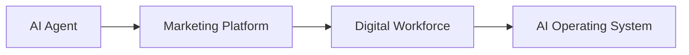
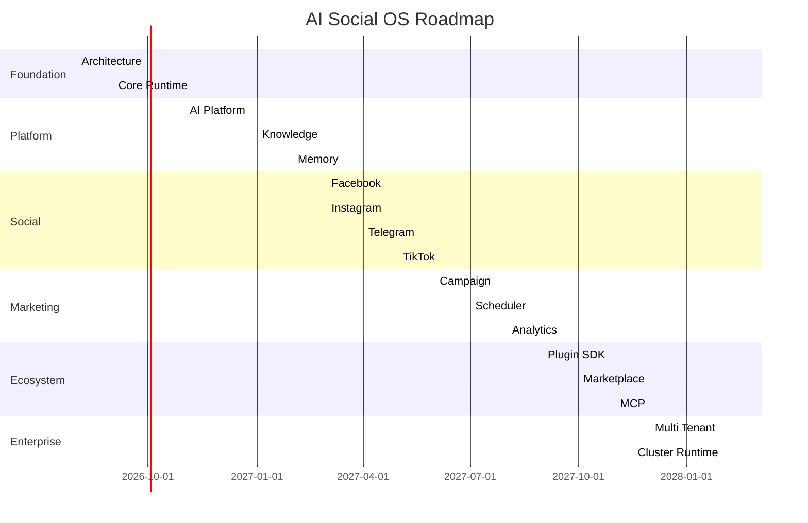
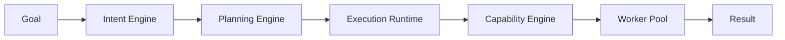
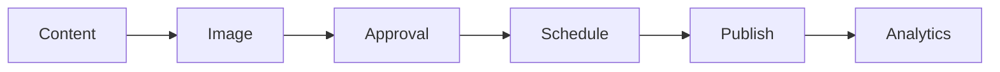
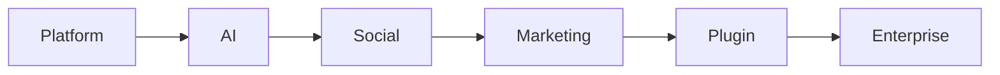
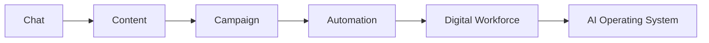
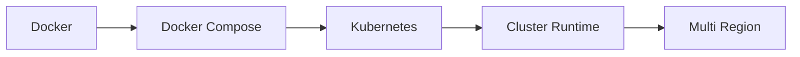

# AI Social OS Roadmap

> Product Evolution & Development Strategy

Version: 2.0.0

Status: Draft

Last Updated: 2026-07-25

---

# Table of Contents

- Vision
- Development Strategy
- Product Evolution
- Release Principles
- Development Phases
- Technical Roadmap
- Product Roadmap
- Infrastructure Roadmap
- Success Metrics
- Risks

---

# Vision

AI Social OS sẽ phát triển từ một AI Chat Platform thành một AI Operating System.

Mục tiêu cuối cùng không phải là xây dựng thêm một chatbot.

Mục tiêu là xây dựng một Runtime có khả năng điều phối AI Workforce.

---

# Product Evolution

---

# Development Strategy

Toàn bộ dự án được phát triển theo 3 nguyên tắc.

## 1. Runtime First

Runtime luôn được xây dựng trước.

Mọi module đều chạy trên Runtime.

---

## 2. Platform First

Không viết Business Logic riêng cho từng tính năng.

Mọi chức năng đều xây dựng thành Platform Capability.

---

## 3. Extensible

Không hard-code.

Mọi thành phần đều có thể mở rộng bằng:

- Plugin
- MCP
- SDK
- Connector
- Provider

---

# Development Timeline

---

# Phase 0 — Foundation

## Objective

Xây dựng nền tảng kỹ thuật.

---

## Deliverables

- Monorepo
- Docker
- CI/CD
- PostgreSQL
- Redis
- MinIO
- Qdrant
- Authentication
- RBAC
- API Gateway

---

## Success Criteria

- Local Development hoàn chỉnh
- CI hoạt động
- Authentication hoạt động
- API hoạt động

---

# Phase 1 — AI Runtime

Đây là phase quan trọng nhất.

Không phát triển Feature trước khi Runtime hoàn chỉnh.

---

## Deliverables

### Runtime

- Execution Runtime
- Goal Manager
- Planning Engine
- Scheduler
- Event Bus
- State Machine

---

### Context

- Context Builder
- Prompt Pipeline
- Memory Bus

---

### Capability

- Capability Engine
- Capability Resolver
- Capability Registry

---

### Policy

- Permission
- Approval
- Retry
- Timeout
- Cost Policy

---

### Worker

- Worker Pool
- Resource Manager

---

## Architecture

---

## Exit Criteria

- Runtime ổn định
- Event Bus hoàn chỉnh
- Retry hoạt động
- Scheduler hoạt động

---

# Phase 2 — AI Platform

## Objective

Xây dựng AI Platform.

---

## Deliverables

### AI

- Claude
- OpenAI
- Gemini
- Ollama
- OpenRouter

---

### Prompt

- Prompt Versioning
- Prompt Template
- Prompt Registry

---

### Knowledge

- Document Upload
- Chunking
- Embedding
- Search

---

### Memory

- Conversation Memory
- Workspace Memory
- Brand Memory

---

### Chat

- Streaming
- Tool Calling
- Multi Conversation

---

### Cost

- Token Usage
- Cost Tracking
- Budget

---

## Exit Criteria

- Multi Provider
- Streaming Chat
- RAG hoạt động
- Memory hoạt động

---

# Phase 3 — Social Platform

## Objective

Xây dựng Social Platform.

---

## Deliverables

### Connectors

- Facebook
- Messenger
- Instagram
- Threads
- TikTok
- YouTube
- Telegram
- WhatsApp
- Zalo
- Lark

---

### Features

- OAuth
- Publishing
- Comment
- Inbox
- Analytics
- Webhook

---

## Exit Criteria

- Đăng bài
- Nhận tin nhắn
- Đồng bộ dữ liệu

---

# Phase 4 — Marketing Platform

## Objective

Xây dựng Marketing Studio.

---

## Deliverables

### Content

- AI Writer
- SEO
- Rewrite
- Translation

---

### Trend Discovery

- Google Trend
- Facebook Trend
- TikTok Trend
- YouTube Trend
- Competitor Analysis

---

### Media

- Image Generation
- Video Generation
- Thumbnail
- Banner

---

### Campaign

- Campaign
- Approval
- Calendar

---

### Scheduler

- Cron
- Retry
- Queue
- Auto Publish

---

## Workflow

---

# Phase 5 — Plugin Platform

## Objective

Biến AI Social OS thành nền tảng mở.

---

## Deliverables

### Plugin SDK

- Backend Plugin
- Frontend Plugin

---

### Marketplace

- Install
- Update
- Version
- Permission

---

### MCP

- MCP Client
- MCP Server
- Tool Discovery

---

### Capability Extension

Plugin có thể mở rộng:

- Worker
- Capability
- Connector
- Provider
- Prompt
- UI

---

## Exit Criteria

- Plugin cài được
- Plugin chạy được
- MCP hoạt động

---

# Phase 6 — Enterprise

## Objective

Enterprise Ready.

---

## Deliverables

### Security

- Audit
- RBAC
- SSO
- Secret Vault

---

### Infrastructure

- Kubernetes
- HA
- Horizontal Scaling

---

### Monitoring

- Metrics
- Logs
- Tracing

---

### Billing

- Subscription
- Usage Tracking
- Cost Analytics

---

## Exit Criteria

- Multi Tenant
- HA Runtime
- Enterprise Security

---

# Technical Roadmap

---

# Product Roadmap

---

# Infrastructure Roadmap

---

# Release Policy

## Alpha

Mục tiêu:

- Runtime hoạt động
- AI Chat
- Claude
- GPT

---

## Beta

Mục tiêu:

- Social Platform
- Scheduler
- Campaign

---

## RC

Mục tiêu:

- Plugin
- MCP
- Analytics

---

## Stable

Mục tiêu:

- Enterprise
- Marketplace
- Multi Tenant

---

# Success Metrics

## Runtime

- Task Success Rate ≥ 99%
- Retry Success ≥ 95%
- Runtime Latency < 300ms

---

## AI

- AI Response < 5s
- Streaming Success ≥ 99%
- Provider Failover < 5s

---

## Social

- Publish Success ≥ 99%
- Webhook Availability ≥ 99.9%

---

## Platform

- Plugin Installation Success ≥ 99%
- MCP Connection Success ≥ 99%

---

# Risks

| Risk | Mitigation |
|------|------------|
| AI Provider Downtime | Provider Gateway + Failover |
| Social API Changes | Connector Abstraction |
| High AI Cost | Cost Engine + Routing |
| Plugin Security | Sandbox + Permission |
| Vendor Lock-in | Provider Agnostic |
| Runtime Failure | Event Replay + Retry |

---

# Long-term Goal

```mermaid
flowchart LR
    AIChat[AI Chat]
    AIAssistant[AI Assistant]
    AIAgent[AI Agent]
    MarketingAutomation[Marketing Automation]
    DigitalWorkforce[Digital Workforce]
    EnterprisePlatform[Enterprise Platform]
    AIOS[AI Operating System]
    AIChat --> AIAssistant
    AIAssistant --> AIAgent
    AIAgent --> MarketingAutomation
    MarketingAutomation --> DigitalWorkforce
    DigitalWorkforce --> EnterprisePlatform
    EnterprisePlatform --> AIOS
```

---

# Final Vision

AI Social OS sẽ phát triển theo hướng **Runtime-centric**, trong đó mọi tính năng đều được xây dựng trên cùng một Execution Runtime.

Khi Runtime đủ mạnh, hệ thống có thể mở rộng sang nhiều lĩnh vực khác ngoài Social Media như Customer Support, Sales Automation, Internal Knowledge, Business Operations và AI Workforce mà không cần thay đổi kiến trúc cốt lõi.