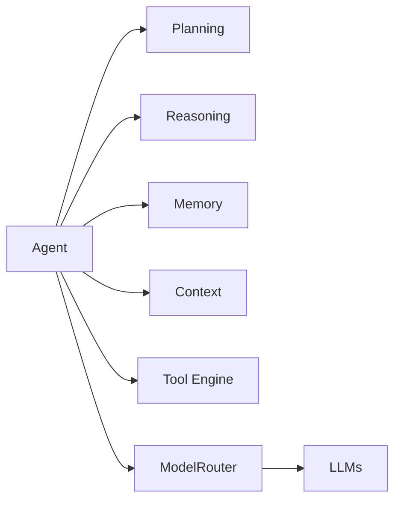
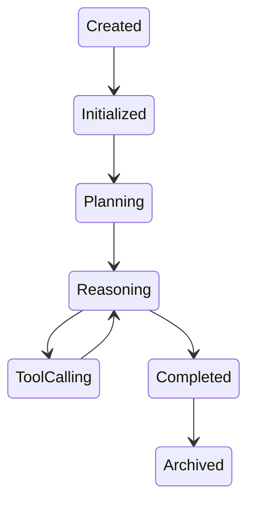
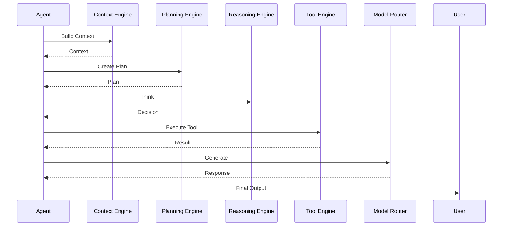

# AI Overview

> AI Social OS AI Layer

Version: 2.0.0

Status: Stable

Last Updated: 2026-07-25

---

# Table of Contents

- Overview
- Objectives
- Why AI Layer
- AI Philosophy
- AI Architecture
- Core Concepts
- AI Capabilities
- AI Components
- AI Lifecycle
- AI Execution Flow
- AI Characteristics
- Design Principles
- Design Decisions
- Summary

---

# Overview

AI Layer là tầng trí tuệ (Intelligence Layer) của AI Social OS.

Nếu.

- Platform Layer quản lý hạ tầng.
- Runtime Layer thực thi tác vụ.

thì AI Layer chịu trách nhiệm về khả năng tư duy, lập kế hoạch, ghi nhớ và ra quyết định của AI Agent.

AI Layer không phụ thuộc vào một mô hình AI cụ thể.

Nó định nghĩa cách AI hoạt động thay vì AI được xây dựng bằng mô hình nào.

---

# Objectives

AI Layer hướng tới.

- AI Native
- Agent Native
- Multi Model
- Multi Agent
- Extensible
- Explainable
- Observable
- Enterprise Ready

---

# Why AI Layer

Trong nhiều hệ thống.

```mermaid
flowchart LR
```

Logic của AI nằm rải rác trong Application.

Điều này gây ra.

- Khó mở rộng
- Khó thay đổi Model
- Không tái sử dụng
- Không hỗ trợ Multi-Agent
- Không có Memory thống nhất

AI Social OS đưa toàn bộ Intelligence vào AI Layer.

---

# AI Philosophy

AI Layer được xây dựng dựa trên các nguyên lý.

## AI là một hệ thống

AI không chỉ là LLM.

AI bao gồm.

```text
Reasoning

Planning

Memory

Context

Tool

Knowledge

Execution
```

---

## Model chỉ là một thành phần

LLM không phải Agent.

LLM chỉ là một Engine thực hiện suy luận.

Agent bao gồm nhiều thành phần khác.

---

## Context quyết định chất lượng AI

Model mạnh nhưng Context kém sẽ cho kết quả kém.

AI Layer ưu tiên.

- Context Quality
- Memory Quality
- Tool Quality

trước khi tối ưu Model.

---

## Tool giúp AI hành động

LLM chỉ sinh văn bản.

Tool giúp AI.

- đọc dữ liệu
- tìm kiếm
- gửi Email
- gọi API
- thực thi Code
- điều khiển hệ thống

---

## Memory giúp AI học liên tục

Không có Memory.

Mỗi Request đều bắt đầu từ đầu.

Memory giúp Agent.

- nhớ người dùng
- nhớ nhiệm vụ
- nhớ kinh nghiệm
- tái sử dụng tri thức

---

# AI Architecture



---

# Core Concepts

AI Layer xoay quanh các khái niệm.

## Agent

Thực thể AI tự trị có khả năng.

- nhận Goal
- lập kế hoạch
- suy luận
- gọi Tool
- ghi nhớ
- hoàn thành nhiệm vụ

---

## Goal

Mục tiêu mà Agent cần đạt.

Ví dụ.

```mermaid
flowchart LR
```

---

## Context

Toàn bộ dữ liệu cần thiết trước khi AI suy luận.

Bao gồm.

- Prompt
- Memory
- Knowledge
- User Input
- Session
- Tool Results

---

## Reasoning

Quá trình phân tích thông tin và lựa chọn hành động.

---

## Planning

Quá trình chia nhiệm vụ lớn thành nhiều bước nhỏ.

---

## Tool

Khả năng tương tác với thế giới bên ngoài.

---

## Memory

Lưu giữ tri thức và trạng thái.

---

## Knowledge

Nguồn dữ liệu để Agent tham khảo.

---

# AI Capabilities

AI Layer hỗ trợ.

- Single Agent
- Multi Agent
- Long-term Memory
- Tool Calling
- Function Calling
- Streaming
- Planning
- Reflection
- Self Correction
- Human in the Loop

---

# AI Components

Các thành phần chính.

```text
Agent

Reasoning Engine

Planning Engine

Memory Engine

Context Engine

Prompt Engine

Tool Engine

Inference Engine

Model Router

Session Engine

Streaming Engine
```

---

# AI Lifecycle



---

# AI Execution Flow



---

# AI Characteristics

AI Layer có các đặc điểm.

- Stateless Runtime
- Stateful Memory
- Event Driven
- Model Agnostic
- Distributed
- Extensible
- Explainable
- Observable

---

# Relationship with Other Layers

```mermaid
flowchart LR
```

AI Layer.

- sử dụng Runtime để thực thi
- sử dụng Platform để truy cập Service
- sử dụng Data Layer để lưu Memory
- sử dụng Plugin để mở rộng Tool

---

# Design Principles

AI Layer được xây dựng theo các nguyên tắc.

- Intelligence First
- Context Driven
- Memory Native
- Tool Native
- Model Independent
- Event Driven
- Observable
- Secure by Default

---

# Design Decisions

| Decision | Reason |
|-----------|--------|
| Tách AI khỏi Runtime | Phân tách Execution và Intelligence |
| Model Router độc lập | Hỗ trợ nhiều AI Provider |
| Memory Engine riêng | Dễ mở rộng Long-term Memory |
| Tool Engine riêng | Chuẩn hóa Tool Calling |
| Planning & Reasoning tách biệt | Dễ thay thế thuật toán |
| Event-driven AI | Hỗ trợ Multi-Agent |
| Context Engine riêng | Tối ưu chất lượng suy luận |

---

# Summary

AI Layer là tầng trí tuệ của AI Social OS, chịu trách nhiệm tổ chức toàn bộ quá trình lập kế hoạch, suy luận, ghi nhớ và phối hợp của AI Agents.

Thông qua Agent Architecture, Planning Engine, Reasoning Engine, Memory Engine, Context Engine và Model Router, AI Layer cung cấp một kiến trúc độc lập với mô hình AI, hỗ trợ nhiều AI Provider, nhiều Agent và nhiều loại tác vụ, tạo nền tảng cho việc xây dựng các hệ thống AI quy mô doanh nghiệp.