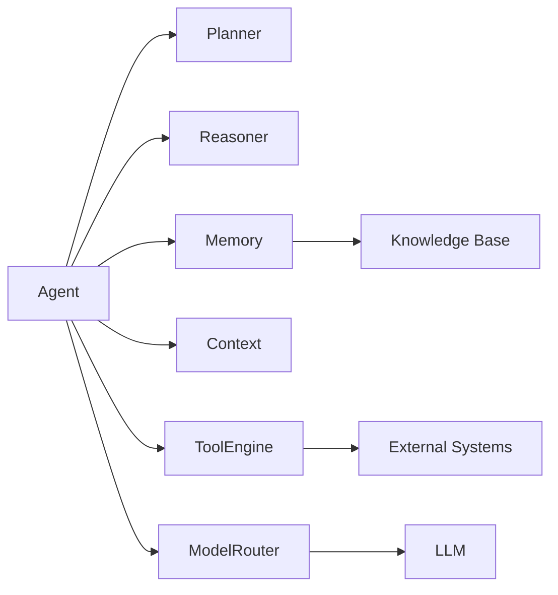
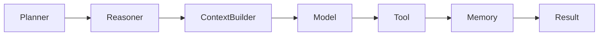
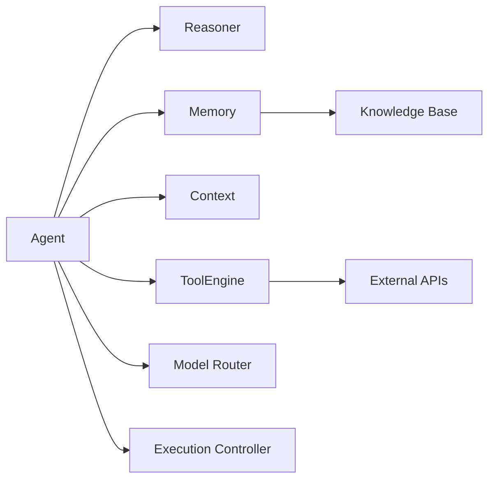

# Agent Architecture

> AI Social OS AI Layer

Version: 2.0.0

Status: Stable

Last Updated: 2026-07-25

---

# Table of Contents

- Overview
- Objectives
- What is an AI Agent
- Agent Principles
- High-Level Architecture
- Agent Components
- Agent Interfaces
- Agent Pipeline
- Agent Responsibilities
- Agent Types
- Agent Composition
- Agent Relationships
- Design Principles
- Design Decisions
- Summary

---

# Overview

Agent là đơn vị thực thi trí tuệ (Intelligent Execution Unit) trong AI Social OS.

Một Agent không chỉ là một lời gọi tới Large Language Model (LLM).

Agent là một hệ thống hoàn chỉnh có khả năng.

- hiểu mục tiêu
- lập kế hoạch
- suy luận
- ghi nhớ
- sử dụng công cụ
- học từ kết quả
- phối hợp với Agent khác

AI Layer xây dựng mọi Agent dựa trên một kiến trúc thống nhất nhằm đảm bảo khả năng mở rộng, tái sử dụng và thay thế độc lập.

---

# Objectives

Agent Architecture hướng tới.

- Modular
- Extensible
- Explainable
- Multi-Agent Ready
- Model Agnostic
- Tool Native
- Memory Native
- Enterprise Ready

---

# What is an AI Agent

Một Agent là một thực thể phần mềm có khả năng tự hoàn thành một mục tiêu.

Ví dụ.

```mermaid
flowchart LR
```

Khác với Chatbot truyền thống.

Agent có thể.

- tự quyết định
- tự chia nhỏ nhiệm vụ
- gọi nhiều Tool
- lưu Memory
- phối hợp với Agent khác
- thực hiện nhiều bước liên tiếp

---

# Agent Principles

Mọi Agent trong AI Social OS đều tuân theo.

- Goal Driven
- Context Aware
- Memory Enabled
- Tool Native
- Observable
- Stateless Execution
- Stateful Knowledge
- Event Driven

---

# High-Level Architecture



---

# Agent Components

## Goal Manager

Tiếp nhận mục tiêu.

Ví dụ.

```text
Write Technical Proposal

Research Product

Schedule Meeting

Analyze Dataset
```

Goal Manager chuẩn hóa mục tiêu trước khi chuyển cho Planner.

---

## Planner

Planner tạo Execution Plan.

Ví dụ.

```mermaid
flowchart LR
```

Planner không sinh nội dung.

Planner chỉ quyết định các bước cần thực hiện.

---

## Reasoner

Reasoner chịu trách nhiệm.

- phân tích
- đánh giá
- suy luận
- lựa chọn hành động tiếp theo

Reasoner quyết định.

```text
Continue

Retry

Use Tool

Ask User

Finish
```

---

## Context Manager

Context Manager tổng hợp.

- User Input
- Session
- Conversation
- Knowledge
- Memory
- Tool Output
- Runtime Metadata

thành một Context duy nhất.

---

## Memory Manager

Memory Manager quản lý.

- Working Memory
- Short-term Memory
- Long-term Memory
- Semantic Memory
- Episodic Memory

Memory không thuộc LLM.

Memory thuộc Agent.

---

## Tool Engine

Tool Engine cung cấp khả năng.

- Search
- Browser
- Database
- Email
- Calendar
- Files
- MCP
- HTTP APIs

Agent không gọi Tool trực tiếp.

Mọi Tool đều thông qua Tool Engine.

---

## Model Router

Model Router lựa chọn Model phù hợp.

Ví dụ.

```text
GPT

Claude

Gemini

DeepSeek

Qwen

Llama
```

Việc chọn Model phụ thuộc.

- Task
- Cost
- Latency
- Capability
- Policy

---

## Execution Controller

Execution Controller chịu trách nhiệm.

- điều phối
- Retry
- Timeout
- Checkpoint
- State Transition
- Error Recovery

---

# Agent Interfaces

Agent cung cấp các Interface.

```text
Execute()

Pause()

Resume()

Cancel()

Observe()

Checkpoint()

Restore()
```

Nhờ đó Runtime có thể quản lý Agent một cách thống nhất.

---

# Agent Pipeline



Pipeline có thể lặp lại nhiều lần cho đến khi Goal hoàn thành.

---

# Agent Responsibilities

Một Agent chịu trách nhiệm.

- Goal Management
- Task Planning
- Decision Making
- Tool Invocation
- Memory Management
- Context Assembly
- Response Generation
- Self Monitoring

Agent không chịu trách nhiệm.

- Authentication
- Infrastructure
- Worker Scheduling
- Deployment
- Storage

---

# Agent Types

AI Social OS hỗ trợ nhiều loại Agent.

```text
Assistant Agent

Research Agent

Coding Agent

Planning Agent

Reasoning Agent

Retrieval Agent

Supervisor Agent

Worker Agent

Coordinator Agent

Autonomous Agent
```

Mọi Agent đều kế thừa cùng một kiến trúc.

---

# Agent Composition

Một Agent có thể được xây dựng từ nhiều Agent nhỏ hơn.

Ví dụ.

```text
Research Agent

├── Search Agent

├── Summarization Agent

├── Citation Agent

└── Review Agent
```

Điều này cho phép tái sử dụng và mở rộng dễ dàng.

---

# Agent Relationships



---

# Interaction with Runtime

```mermaid
flowchart LR
```

Runtime quản lý vòng đời.

Agent quản lý trí tuệ.

---

# Design Principles

Agent Architecture được xây dựng theo các nguyên tắc.

- Goal Oriented
- Context Driven
- Memory Native
- Tool Native
- Model Independent
- Composable
- Observable
- Event Driven

---

# Design Decisions

| Decision | Reason |
|-----------|--------|
| Planner tách khỏi Reasoner | Dễ thay đổi thuật toán |
| Context Manager riêng | Chuẩn hóa đầu vào |
| Tool Engine độc lập | Tái sử dụng Tool |
| Model Router riêng | Hỗ trợ Multi-Model |
| Memory Manager riêng | Quản lý trạng thái lâu dài |
| Execution Controller | Kiểm soát vòng đời Agent |
| Composition Architecture | Hỗ trợ Multi-Agent |

---

# Summary

Agent Architecture định nghĩa cấu trúc chuẩn của mọi AI Agent trong AI Social OS.

Một Agent bao gồm Goal Manager, Planner, Reasoner, Context Manager, Memory Manager, Tool Engine, Model Router và Execution Controller. Kiến trúc này cho phép xây dựng các AI Agent có khả năng suy luận, lập kế hoạch, sử dụng công cụ, ghi nhớ và phối hợp với các Agent khác trong môi trường doanh nghiệp với khả năng mở rộng và thay thế linh hoạt.