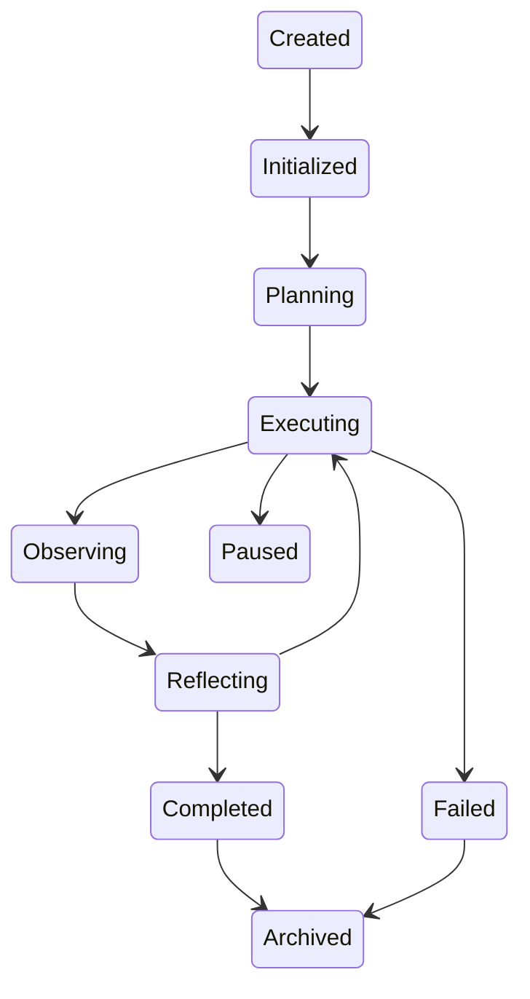
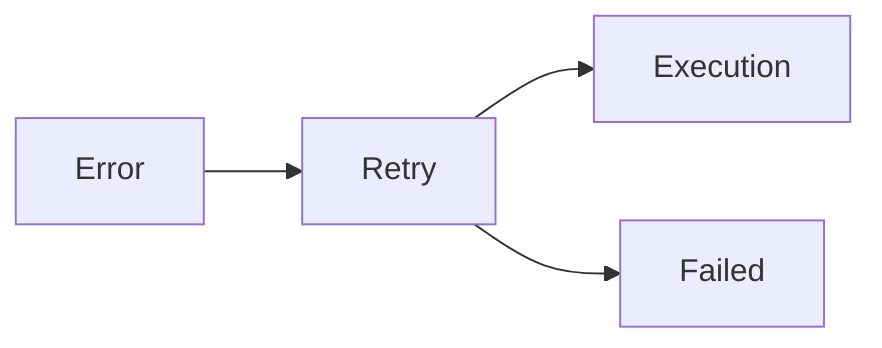
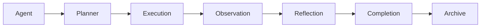

# Agent Lifecycle

> AI Social OS AI Layer

Version: 2.0.0

Status: Stable

Last Updated: 2026-07-25

---

# Table of Contents

- Overview
- Objectives
- Why Lifecycle Management
- Lifecycle Stages
- Lifecycle State Machine
- Agent Initialization
- Goal Processing
- Planning
- Execution
- Observation
- Reflection
- Completion
- Failure Handling
- Lifecycle Events
- Design Principles
- Design Decisions
- Summary

---

# Overview

Agent Lifecycle mô tả toàn bộ vòng đời của một AI Agent kể từ khi được tạo cho đến khi hoàn thành hoặc kết thúc.

Mỗi Agent trong AI Social OS đều tuân theo cùng một vòng đời nhằm đảm bảo.

- Predictable Behavior
- Fault Tolerance
- Observability
- Checkpoint Recovery
- Distributed Execution

Lifecycle được Runtime quản lý nhưng hành vi của từng giai đoạn được định nghĩa bởi AI Layer.

---

# Objectives

Agent Lifecycle hướng tới.

- Consistent Execution
- State Management
- Fault Recovery
- Event Driven
- Distributed Processing
- Observability
- Checkpoint Support
- Human Intervention Ready

---

# Why Lifecycle Management

Nếu Agent chỉ thực hiện.

```mermaid
flowchart LR
```

thì sẽ không thể.

- tạm dừng
- tiếp tục
- Retry
- ghi Checkpoint
- cộng tác
- theo dõi trạng thái

Lifecycle cung cấp khả năng quản lý toàn bộ quá trình hoạt động của Agent.

---

# Lifecycle Stages

```mermaid
flowchart LR
```

Ngoài luồng chính còn có.

- Paused
- Cancelled
- Failed
- Archived

---

# Lifecycle State Machine



---

# Stage 1 — Created

Agent vừa được Runtime khởi tạo.

Thông tin ban đầu.

```text
Agent ID

Session ID

Workspace

User

Goal

Metadata
```

Ở trạng thái này Agent chưa thực hiện bất kỳ hành động nào.

---

# Stage 2 — Initialized

Agent khởi tạo các thành phần.

- Memory
- Context
- Session
- Configuration
- Permissions

Sau khi hoàn tất.

Agent sẵn sàng lập kế hoạch.

---

# Stage 3 — Planning

Planner phân tích Goal.

Ví dụ.

```mermaid
flowchart LR
```

Planner tạo Execution Plan thay vì sinh nội dung.

---

# Stage 4 — Executing

Execution là giai đoạn chính.

Agent thực hiện.

- gọi Model
- gọi Tool
- đọc Memory
- ghi Memory
- truy vấn Knowledge
- xử lý Context

Một Goal có thể trải qua nhiều vòng Execution.

---

# Stage 5 — Observing

Sau mỗi bước.

Agent đánh giá.

- kết quả Tool
- phản hồi Model
- thay đổi Context
- thay đổi Environment

Observation giúp Agent quyết định bước tiếp theo.

---

# Stage 6 — Reflecting

Reflection là quá trình tự đánh giá.

Ví dụ.

```mermaid
flowchart LR
```

Reflection giúp Agent.

- sửa lỗi
- cải thiện câu trả lời
- thay đổi chiến lược

---

# Stage 7 — Completed

Goal đã hoàn thành.

Agent thực hiện.

- lưu Memory
- phát Event
- lưu Metrics
- đóng Session (nếu cần)

Sau đó chuyển sang Archived.

---

# Pause & Resume

Agent có thể tạm dừng.

```mermaid
flowchart LR
```

Các trường hợp.

- Human Approval
- Waiting Tool
- External Event
- Long-running Task

---

# Cancellation

Runtime hoặc User có thể hủy Agent.

```mermaid
flowchart LR
```

Agent phải giải phóng.

- Session
- Resource
- Locks
- Temporary Data

---

# Failure Handling

Nếu xảy ra lỗi.



Runtime áp dụng Retry Policy trước khi đánh dấu Failed.

---

# Checkpoint Recovery

Agent định kỳ tạo Checkpoint.

```mermaid
flowchart LR
```

Nếu Worker gặp lỗi.

Agent có thể tiếp tục từ Checkpoint gần nhất.

---

# Lifecycle Events

Trong quá trình hoạt động Agent phát sinh các Event.

```text
AgentCreated

AgentInitialized

PlanningStarted

PlanningCompleted

ExecutionStarted

ToolCalled

MemoryUpdated

ReflectionCompleted

AgentCompleted

AgentFailed

AgentPaused

AgentResumed
```

Các Event được gửi tới Event Bus để Monitoring và Analytics.

---

# Lifecycle Responsibilities

AI Layer chịu trách nhiệm.

- State Transition
- Planning
- Reflection
- Decision Logic
- Agent Behavior

Runtime chịu trách nhiệm.

- Scheduling
- Resource Allocation
- Worker Assignment
- Retry Execution
- Timeout

---

# Lifecycle Relationships



---

# Design Principles

Agent Lifecycle được xây dựng theo các nguyên tắc.

- State Driven
- Event Driven
- Observable
- Recoverable
- Distributed
- Checkpoint Native
- Human in the Loop
- Fault Tolerant

---

# Design Decisions

| Decision | Reason |
|-----------|--------|
| Lifecycle chuẩn hóa | Thống nhất hành vi của mọi Agent |
| Reflection riêng | Cải thiện chất lượng kết quả |
| Observation riêng | Hỗ trợ tự đánh giá môi trường |
| Checkpoint định kỳ | Phục hồi sau sự cố |
| Event cho mọi State | Dễ giám sát và phân tích |
| Pause/Resume | Hỗ trợ tác vụ dài và Human Approval |
| Runtime quản lý Lifecycle | Tách biệt Infrastructure và Intelligence |

---

# Summary

Agent Lifecycle định nghĩa toàn bộ vòng đời hoạt động của AI Agent trong AI Social OS, từ khi được khởi tạo, lập kế hoạch, thực thi, quan sát, tự đánh giá cho đến khi hoàn thành hoặc kết thúc.

Thông qua State Machine chuẩn, Checkpoint Recovery, Lifecycle Events và cơ chế Pause/Resume, hệ thống đảm bảo Agent có thể hoạt động ổn định, có khả năng phục hồi và dễ dàng giám sát trong môi trường AI phân tán quy mô doanh nghiệp.