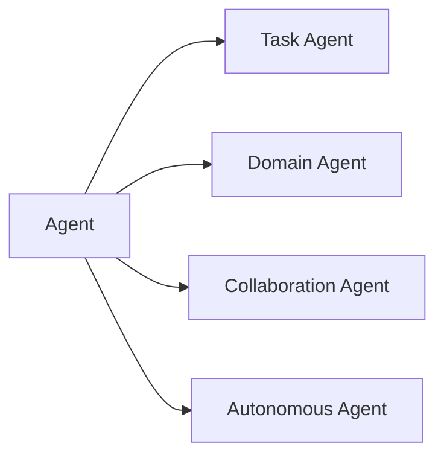
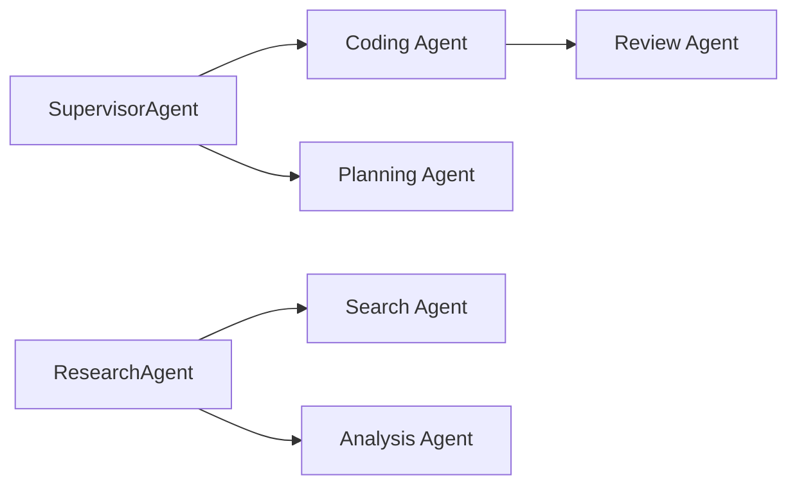
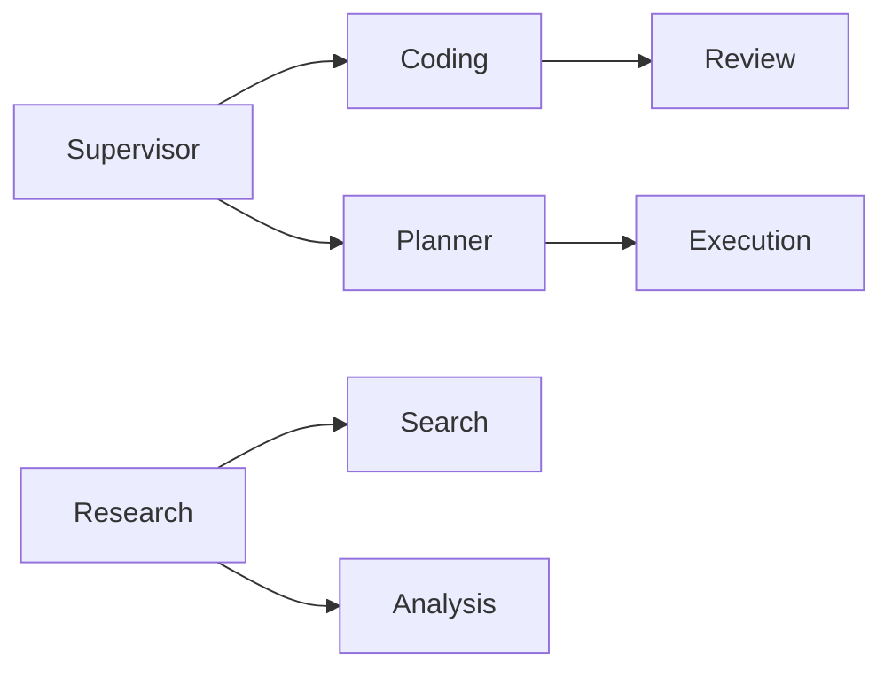

# Agent Types

> AI Social OS AI Layer

Version: 2.0.0

Status: Stable

Last Updated: 2026-07-25

---

# Table of Contents

- Overview
- Objectives
- Why Multiple Agent Types
- Agent Classification
- System Agents
- Task Agents
- Domain Agents
- Collaboration Agents
- Autonomous Agents
- Agent Composition
- Agent Selection
- Agent Hierarchy
- Agent Relationships
- Design Principles
- Design Decisions
- Summary

---

# Overview

Không phải mọi AI Agent đều có cùng vai trò.

Trong AI Social OS, mỗi Agent được thiết kế để thực hiện một nhóm nhiệm vụ cụ thể với khả năng, quyền hạn và trách nhiệm khác nhau.

Việc phân loại Agent giúp.

- giảm độ phức tạp
- tăng khả năng tái sử dụng
- dễ mở rộng
- tối ưu hiệu năng
- hỗ trợ Multi-Agent Architecture

---

# Objectives

Agent Types hướng tới.

- Separation of Responsibilities
- Reusability
- Scalability
- Modularity
- Multi-Agent Collaboration
- Enterprise Governance
- Extensibility
- Predictable Behavior

---

# Why Multiple Agent Types

Nếu chỉ có một Agent tổng quát.

```mermaid
flowchart LR
```

Agent sẽ.

- quá lớn
- khó bảo trì
- khó tối ưu
- khó kiểm thử
- khó mở rộng

AI Social OS chia thành nhiều loại Agent.

---

# Agent Classification



---

# System Agents

System Agent là các Agent phục vụ chính Platform.

Ví dụ.

```text
Planner Agent

Reasoning Agent

Router Agent

Supervisor Agent

Memory Agent
```

Đặc điểm.

- Internal Only
- High Reliability
- Stateless Execution
- Platform Managed

---

# Task Agents

Task Agent thực hiện một nhiệm vụ cụ thể.

Ví dụ.

```text
Research Agent

Coding Agent

Translation Agent

Summarization Agent

Writing Agent

Review Agent
```

Task Agent thường có.

- Goal rõ ràng
- Context riêng
- Tool riêng
- Memory riêng

---

# Domain Agents

Domain Agent được tối ưu cho một lĩnh vực.

Ví dụ.

```text
Finance Agent

Medical Agent

Legal Agent

Education Agent

Marketing Agent

Sales Agent

HR Agent
```

Các Agent này có thể.

- Prompt riêng
- Knowledge riêng
- Tool riêng
- Policy riêng

---

# Collaboration Agents

Collaboration Agent điều phối nhiều Agent khác.

Ví dụ.

```text
Coordinator Agent

Supervisor Agent

Dispatcher Agent

Manager Agent
```

Nhiệm vụ.

- chia Task
- phân công Agent
- theo dõi tiến độ
- tổng hợp kết quả

---

# Autonomous Agents

Autonomous Agent có khả năng hoạt động độc lập trong thời gian dài.

Ví dụ.

```text
Market Monitoring Agent

Security Monitoring Agent

News Tracking Agent

Social Listening Agent
```

Đặc điểm.

- chạy liên tục
- tự lập kế hoạch
- tự cập nhật Memory
- tự phát hiện sự kiện
- tự khởi tạo Workflow

---

# Specialized Agents

AI Social OS có thể mở rộng thêm.

```text
Vision Agent

Voice Agent

Browser Agent

Data Analysis Agent

Planning Agent

Retrieval Agent

Execution Agent

Simulation Agent
```

Các Agent này được xây dựng trên cùng một Agent Architecture.

---

# Agent Composition

Một Agent lớn có thể bao gồm nhiều Agent nhỏ.

Ví dụ.

```text
Research Agent

├── Search Agent

├── Retrieval Agent

├── Analysis Agent

├── Citation Agent

└── Report Agent
```

Composition giúp.

- tái sử dụng
- kiểm thử độc lập
- mở rộng dễ dàng

---

# Agent Selection

Model Router hoặc Workflow có thể lựa chọn Agent phù hợp.

Ví dụ.

```mermaid
flowchart LR
```

Hoặc.

```mermaid
flowchart LR
```

Việc lựa chọn dựa trên.

- Goal
- Domain
- Capability
- Policy
- Cost
- Availability

---

# Agent Hierarchy



Mỗi Agent có thể quản lý nhiều Agent con.

---

# Agent Capability Matrix

| Agent Type | Planning | Memory | Tool Calling | Multi-Agent | Long Running |
|------------|----------|---------|--------------|-------------|--------------|
| Assistant Agent | ✓ | ✓ | ✓ | ✗ | ✗ |
| Research Agent | ✓ | ✓ | ✓ | ✓ | ✓ |
| Coding Agent | ✓ | ✓ | ✓ | ✓ | ✓ |
| Supervisor Agent | ✓ | ✓ | ✓ | ✓ | ✓ |
| Router Agent | ✗ | ✗ | ✗ | ✓ | ✗ |
| Memory Agent | ✗ | ✓ | ✗ | ✗ | ✓ |
| Planner Agent | ✓ | ✗ | ✗ | ✗ | ✗ |
| Autonomous Agent | ✓ | ✓ | ✓ | ✓ | ✓ |

---

# Agent Relationships



---

# Runtime Interaction

```mermaid
flowchart LR
```

Runtime không quan tâm Agent là loại nào.

Mọi Agent đều triển khai cùng một Runtime Interface.

---

# Extensibility

AI Social OS cho phép bổ sung Agent mới.

Ví dụ.

```text
Climate Agent

Cybersecurity Agent

Medical Diagnosis Agent

Financial Advisor Agent
```

Chỉ cần triển khai.

- Agent Interface
- Capability Descriptor
- Metadata
- Registration

Không cần sửa Runtime.

---

# Design Principles

Agent Types được xây dựng theo các nguyên tắc.

- Single Responsibility
- Composition over Inheritance
- Capability Driven
- Domain Oriented
- Extensible
- Observable
- Reusable
- Model Agnostic

---

# Design Decisions

| Decision | Reason |
|-----------|--------|
| Phân loại Agent | Giảm độ phức tạp |
| Capability-based Selection | Chọn Agent linh hoạt |
| Supervisor riêng | Điều phối Multi-Agent |
| Domain Agent | Tối ưu theo nghiệp vụ |
| Composition Architecture | Tăng khả năng tái sử dụng |
| Runtime Interface thống nhất | Đơn giản hóa thực thi |
| Metadata-driven Registration | Dễ mở rộng hệ thống |

---

# Summary

Agent Types định nghĩa các nhóm AI Agent trong AI Social OS theo vai trò, năng lực và phạm vi trách nhiệm.

Thông qua việc phân tách thành System Agent, Task Agent, Domain Agent, Collaboration Agent và Autonomous Agent, nền tảng có thể xây dựng các hệ thống Multi-Agent linh hoạt, dễ mở rộng và phù hợp với nhiều bài toán doanh nghiệp khác nhau mà vẫn duy trì một kiến trúc thống nhất.