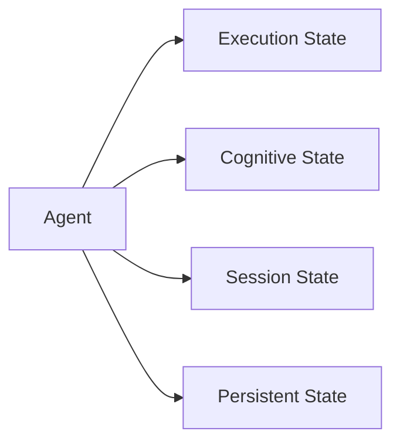
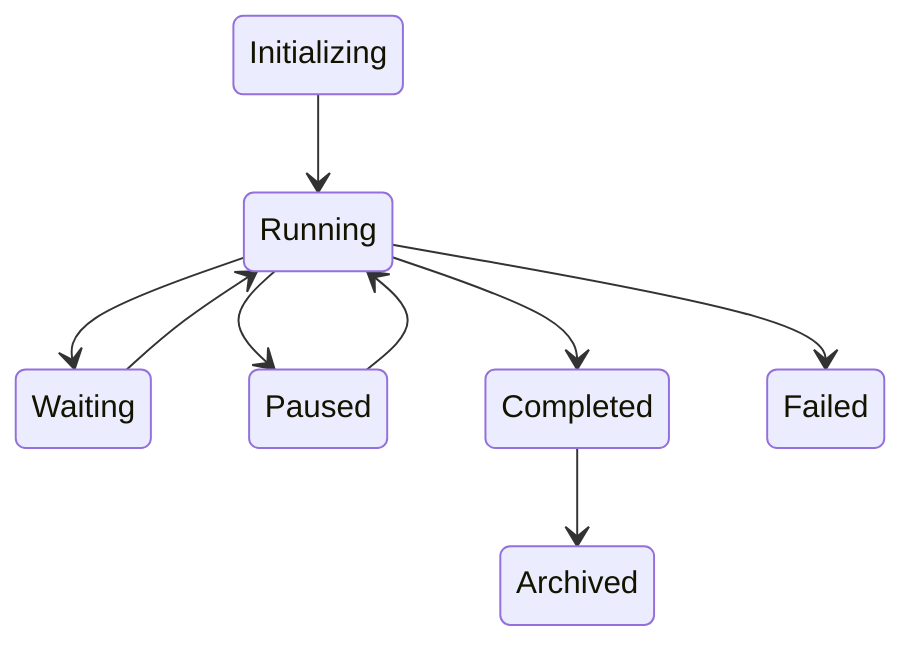
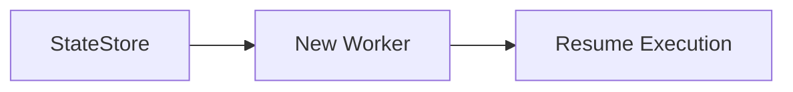
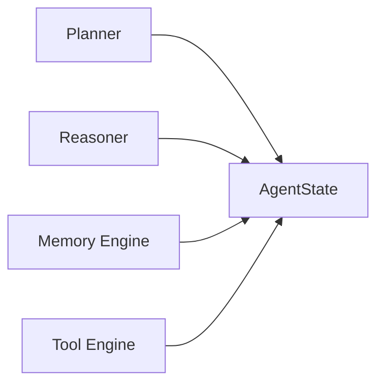

# Agent State

> AI Social OS AI Layer

Version: 2.0.0

Status: Stable

Last Updated: 2026-07-25

---

# Table of Contents

- Overview
- Objectives
- Why Agent State
- State Categories
- Runtime State
- Execution State
- Cognitive State
- Session State
- State Transitions
- State Persistence
- State Synchronization
- State Recovery
- State Events
- State Model
- Design Principles
- Design Decisions
- Summary

---

# Overview

Agent State mô tả toàn bộ trạng thái nội bộ của một AI Agent trong suốt vòng đời hoạt động.

Khác với Agent Lifecycle chỉ mô tả các giai đoạn hoạt động, Agent State mô tả toàn bộ dữ liệu mà Agent đang sở hữu tại một thời điểm.

State giúp Agent.

- tiếp tục công việc
- phục hồi sau lỗi
- cộng tác với Agent khác
- ghi nhớ tiến trình
- theo dõi trạng thái thực thi

---

# Objectives

Agent State hướng tới.

- Consistent Execution
- Recoverability
- Distributed Synchronization
- Fault Tolerance
- Checkpoint Support
- Multi-Agent Sharing
- Observability
- Scalability

---

# Why Agent State

Nếu Agent chỉ dựa vào Prompt.

```mermaid
flowchart LR
```

thì Agent sẽ không biết.

- đã thực hiện bước nào
- Tool nào đã gọi
- Memory nào đã cập nhật
- Task nào còn lại

State giúp Agent hoạt động liên tục và có khả năng phục hồi.

---

# State Categories

Agent State được chia thành năm nhóm.

```text
Runtime State

Execution State

Cognitive State

Session State

Persistent State
```

Mỗi nhóm phục vụ một mục đích khác nhau.

---

# Runtime State

Runtime State phản ánh tình trạng hiện tại của Agent.

Ví dụ.

```text
Created

Initializing

Running

Waiting

Paused

Completed

Failed

Cancelled
```

Runtime sử dụng trạng thái này để điều phối Agent.

---

# Execution State

Execution State lưu tiến trình thực hiện.

Ví dụ.

```text
Current Task

Completed Tasks

Remaining Tasks

Current Tool

Retry Count

Execution Step

Checkpoint ID
```

Execution State thay đổi liên tục trong quá trình làm việc.

---

# Cognitive State

Cognitive State biểu diễn trạng thái suy luận của Agent.

Bao gồm.

```text
Current Goal

Current Plan

Reasoning Result

Selected Strategy

Confidence Score

Next Action
```

Đây là phần "tư duy" của Agent.

---

# Session State

Session State lưu thông tin liên quan đến phiên làm việc.

Ví dụ.

```text
Session ID

User ID

Workspace ID

Conversation ID

Locale

Timezone

Permissions
```

Session State được chia sẻ với Runtime.

---

# Persistent State

Persistent State được lưu dài hạn.

Bao gồm.

```text
Memory References

Knowledge References

User Preferences

Agent Profile

Historical Decisions
```

Persistent State không mất khi Worker khởi động lại.

---

# State Model



---

# State Transitions



Mỗi lần chuyển trạng thái đều phát sinh Event.

---

# State Synchronization

Trong hệ thống phân tán.

```mermaid
flowchart LR
```

Agent State phải luôn được đồng bộ.

Điều này cho phép.

- Worker Migration
- Failover
- Load Balancing
- Horizontal Scaling

---

# State Persistence

State được lưu định kỳ.

```mermaid
flowchart LR
```

Persistence bao gồm.

- Snapshot
- Incremental Update
- Final State

---

# Checkpoint Recovery

Nếu Worker gặp lỗi.



Agent tiếp tục từ Checkpoint gần nhất thay vì thực hiện lại từ đầu.

---

# State Sharing

Trong Multi-Agent.

```mermaid
flowchart LR
```

Một phần State có thể được chia sẻ giữa nhiều Agent.

Ví dụ.

- Goal
- Progress
- Shared Memory
- Task Queue

Không phải mọi State đều được chia sẻ.

---

# State Consistency

Agent State phải đảm bảo.

- Atomic Update
- Versioning
- Conflict Detection
- Idempotency
- Event Ordering

Điều này đặc biệt quan trọng trong môi trường phân tán.

---

# State Events

Các sự kiện liên quan đến State.

```text
StateCreated

StateUpdated

CheckpointCreated

CheckpointRestored

StateSynced

StateArchived

StateDeleted
```

Monitoring có thể sử dụng các Event này để theo dõi Agent.

---

# State Storage

Agent State có thể được lưu trong.

```text
Redis

PostgreSQL

Object Storage

Distributed State Store
```

Tùy theo loại State.

- Runtime State thường lưu trong Redis.
- Persistent State lưu trong Database.
- Snapshot lớn có thể lưu trong Object Storage.

---

# Relationship with Other Components



Mọi thành phần của Agent đều đọc hoặc cập nhật State.

---

# Design Principles

Agent State được xây dựng theo các nguyên tắc.

- State Driven
- Distributed
- Recoverable
- Observable
- Immutable History
- Checkpoint Native
- Eventually Consistent
- Extensible

---

# Design Decisions

| Decision | Reason |
|-----------|--------|
| Tách State khỏi Lifecycle | Lifecycle mô tả hành vi, State mô tả dữ liệu |
| Phân loại State | Dễ quản lý và tối ưu lưu trữ |
| Checkpoint định kỳ | Hỗ trợ khôi phục nhanh |
| State Store tập trung | Đồng bộ giữa nhiều Worker |
| Event cho mọi thay đổi | Phục vụ Audit và Monitoring |
| Shared State có kiểm soát | Hỗ trợ Multi-Agent Collaboration |
| Versioned State | Tránh ghi đè và xung đột |

---

# Summary

Agent State định nghĩa toàn bộ trạng thái dữ liệu của AI Agent trong AI Social OS, bao gồm Runtime State, Execution State, Cognitive State, Session State và Persistent State.

Thông qua cơ chế Checkpoint, State Synchronization, Shared State và State Persistence, Agent có thể hoạt động liên tục, phục hồi sau lỗi và cộng tác hiệu quả trong môi trường AI phân tán quy mô doanh nghiệp.