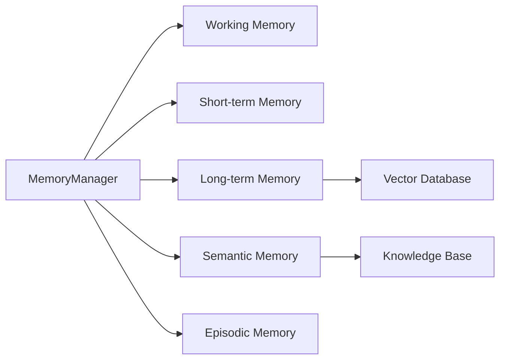
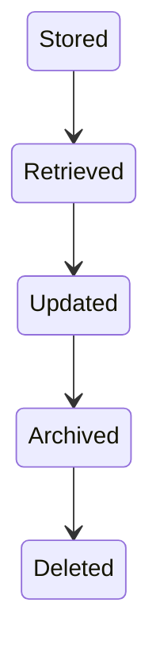
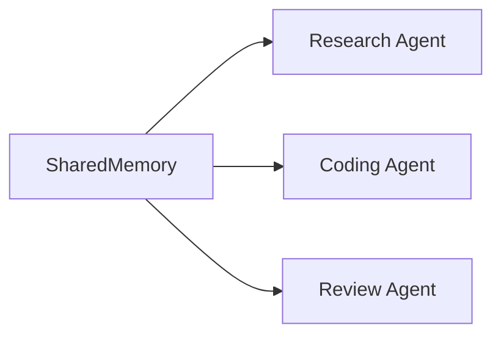
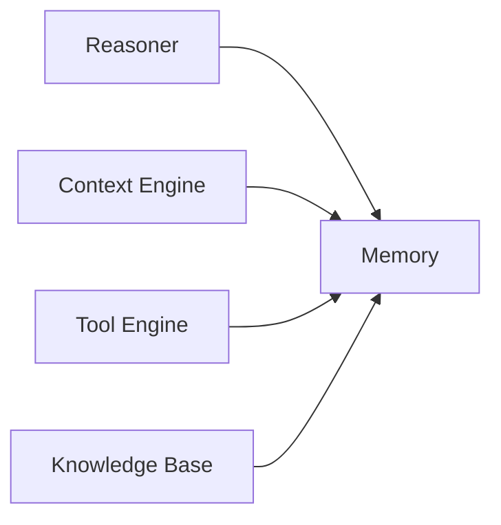

# Agent Memory

> AI Social OS AI Layer

Version: 2.0.0

Status: Stable

Last Updated: 2026-07-25

---

# Table of Contents

- Overview
- Objectives
- Why Memory
- Memory Principles
- Memory Architecture
- Memory Types
- Memory Lifecycle
- Memory Operations
- Memory Retrieval
- Memory Consolidation
- Memory Expiration
- Memory Sharing
- Memory Security
- Design Principles
- Design Decisions
- Summary

---

# Overview

Memory là khả năng giúp AI Agent lưu giữ, truy xuất và sử dụng thông tin trong suốt quá trình hoạt động.

Không giống Large Language Model chỉ dựa trên Context Window, Memory giúp Agent duy trì tri thức lâu dài và liên tục cải thiện chất lượng quyết định.

Trong AI Social OS, Memory là một thành phần độc lập của AI Layer và không phụ thuộc vào bất kỳ Model nào.

---

# Objectives

Agent Memory hướng tới.

- Persistent Intelligence
- Long-term Learning
- Context Continuity
- Knowledge Reuse
- Personalized AI
- Distributed Storage
- Multi-Agent Sharing
- Enterprise Ready

---

# Why Memory

Nếu Agent chỉ dựa vào Prompt.

```mermaid
flowchart LR
```

thì mỗi Request đều là một phiên làm việc mới.

Agent sẽ.

- quên người dùng
- quên nhiệm vụ trước
- quên kinh nghiệm
- quên kết quả Tool

Memory giúp Agent duy trì tính liên tục.

---

# Memory Principles

Memory được xây dựng theo các nguyên tắc.

- Memory tách khỏi Model
- Memory tách khỏi Runtime
- Memory có thể mở rộng
- Memory có thể tìm kiếm
- Memory có Version
- Memory có Lifecycle
- Memory có Policy

---

# Memory Architecture



---

# Memory Types

## Working Memory

Lưu dữ liệu tạm thời trong quá trình suy luận.

Ví dụ.

```text
Current Task

Current Tool Result

Current Plan

Temporary Variables
```

Working Memory chỉ tồn tại trong một lần thực thi.

---

## Short-term Memory

Lưu thông tin trong một Session.

Ví dụ.

- Conversation
- Tool History
- Recent Decisions
- Session Variables

Short-term Memory thường bị xóa khi Session kết thúc.

---

## Long-term Memory

Lưu tri thức lâu dài.

Ví dụ.

- User Preferences
- Agent Experience
- Learned Facts
- Persistent Knowledge

Long-term Memory có thể tồn tại nhiều tháng hoặc nhiều năm.

---

## Semantic Memory

Lưu kiến thức mang tính khái niệm.

Ví dụ.

```text
Company Policy

Technical Documentation

Domain Knowledge

Business Rules
```

Semantic Memory thường được lập chỉ mục bằng Vector Database.

---

## Episodic Memory

Lưu lại các sự kiện đã xảy ra.

Ví dụ.

```text
Meeting Summary

Completed Workflow

Previous Conversation

Past Decisions
```

Episodic Memory giúp Agent học từ kinh nghiệm.

---

# Memory Lifecycle



Memory có thể được cập nhật nhiều lần trong suốt vòng đời.

---

# Memory Operations

Memory Manager hỗ trợ.

```text
Create

Read

Update

Delete

Search

Summarize

Archive

Expire
```

Mọi thao tác đều được Audit.

---

# Memory Retrieval

Memory được truy xuất theo nhiều chiến lược.

## Similarity Search

```mermaid
flowchart LR
```

---

## Keyword Search

Sử dụng Full-text Search.

Ví dụ.

```text
invoice

customer

marketing
```

---

## Metadata Filtering

Lọc theo.

```text
User

Workspace

Agent

Project

Tag

Time
```

---

## Hybrid Search

Kết hợp.

- Vector Search
- Keyword Search
- Metadata Filter

để tăng độ chính xác.

---

# Memory Consolidation

Sau mỗi Session.

Agent có thể.

```mermaid
flowchart LR
```

Không phải toàn bộ Conversation đều được lưu.

Memory Engine chỉ lưu thông tin có giá trị.

---

# Memory Expiration

Một số Memory có thời hạn.

Ví dụ.

```text
OTP

Temporary Token

Session Cache

Draft
```

Memory Engine hỗ trợ.

- TTL
- Auto Cleanup
- Retention Policy

---

# Memory Sharing

Trong Multi-Agent.



Có hai loại.

- Private Memory
- Shared Memory

Shared Memory giúp nhiều Agent cộng tác.

---

# Memory Security

Memory phải đảm bảo.

- Encryption
- Access Control
- Workspace Isolation
- Audit Log
- Versioning
- Secret Redaction

Agent chỉ được truy cập Memory mà nó có quyền.

---

# Memory Relationships



Memory là nguồn dữ liệu cho hầu hết các thành phần AI.

---

# Memory Storage Strategy

| Memory Type | Storage |
|--------------|---------|
| Working Memory | Runtime Cache |
| Short-term Memory | Redis |
| Long-term Memory | PostgreSQL |
| Semantic Memory | Vector Database |
| Episodic Memory | Object Storage + Database |

---

# Design Principles

Agent Memory được xây dựng theo các nguyên tắc.

- Memory Native
- Retrieval First
- Persistent
- Searchable
- Distributed
- Versioned
- Secure
- Explainable

---

# Design Decisions

| Decision | Reason |
|-----------|--------|
| Memory độc lập với Model | Dễ thay thế LLM |
| Phân loại nhiều loại Memory | Tối ưu hiệu năng và lưu trữ |
| Hybrid Retrieval | Tăng chất lượng truy xuất |
| Shared Memory | Hỗ trợ Multi-Agent |
| Memory Consolidation | Giảm dữ liệu dư thừa |
| Versioning | Theo dõi thay đổi |
| Encryption mặc định | Bảo vệ dữ liệu doanh nghiệp |

---

# Summary

Agent Memory cung cấp khả năng lưu trữ, truy xuất và quản lý tri thức cho AI Agent trong AI Social OS.

Thông qua Working Memory, Short-term Memory, Long-term Memory, Semantic Memory và Episodic Memory, Agent có thể duy trì ngữ cảnh, học từ kinh nghiệm và cộng tác với các Agent khác, đồng thời đảm bảo khả năng mở rộng, bảo mật và hoạt động liên tục trong môi trường doanh nghiệp.