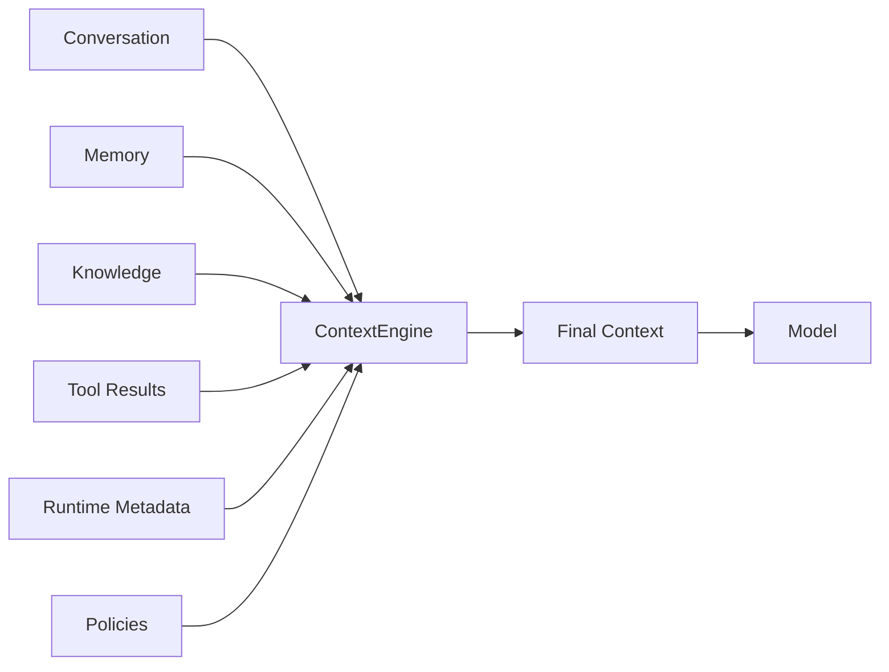
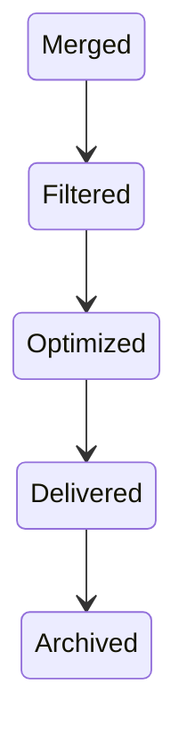
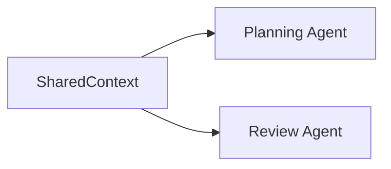
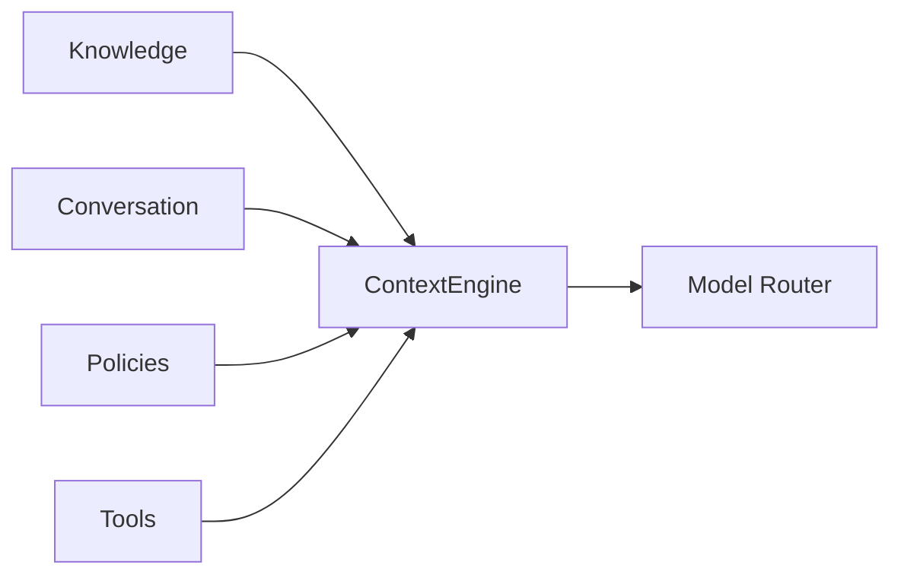

# Agent Context

> AI Social OS AI Layer

Version: 2.0.0

Status: Stable

Last Updated: 2026-07-25

---

# Table of Contents

- Overview
- Objectives
- Why Context
- Context Principles
- Context Architecture
- Context Sources
- Context Lifecycle
- Context Assembly
- Context Window Management
- Context Optimization
- Context Sharing
- Context Security
- Design Principles
- Design Decisions
- Summary

---

# Overview

Context là toàn bộ thông tin mà Agent sử dụng để đưa ra quyết định tại một thời điểm.

Trong AI Social OS, Context không chỉ là Prompt.

Context là sự kết hợp của.

- User Request
- Conversation
- Memory
- Knowledge
- Tool Results
- Runtime Metadata
- System Policies

Context Engine chịu trách nhiệm xây dựng một Context hoàn chỉnh trước mỗi lần Agent suy luận.

---

# Objectives

Agent Context hướng tới.

- High Quality Context
- Consistent Reasoning
- Context Reusability
- Dynamic Context Assembly
- Multi-Agent Sharing
- Efficient Token Usage
- Explainability
- Enterprise Ready

---

# Why Context

Một Model mạnh nhưng Context kém vẫn tạo ra kết quả không chính xác.

Ví dụ.

```mermaid
flowchart LR
```

Nếu Prompt thiếu.

- lịch sử hội thoại
- dữ liệu liên quan
- kết quả Tool
- Memory

thì Agent phải suy đoán.

Context Engine giúp loại bỏ việc suy đoán này.

---

# Context Principles

AI Social OS xây dựng Context theo các nguyên tắc.

- Context is Dynamic
- Context is Composable
- Context is Observable
- Context is Explainable
- Context is Minimal
- Context is Secure
- Context is Reproducible

---

# Context Architecture



---

# Context Sources

## User Input

Thông tin người dùng vừa gửi.

Ví dụ.

```text
Write a project proposal
```

---

## Conversation History

Các tin nhắn gần đây.

Ví dụ.

```text
User

Assistant

User

Assistant
```

Conversation giúp duy trì ngữ cảnh hội thoại.

---

## Memory

Memory bổ sung.

- User Preferences
- Previous Tasks
- Long-term Knowledge
- Session Information

---

## Knowledge

Knowledge đến từ.

- RAG
- Documentation
- Database
- Wiki
- Files
- APIs

---

## Tool Results

Ví dụ.

```text
Search Result

Database Query

API Response

Code Execution

Web Browser
```

---

## Runtime Metadata

Bao gồm.

```text
Workspace

User

Role

Permissions

Language

Timezone

Environment
```

---

## System Policies

Ví dụ.

```text
Security Policy

Compliance

Business Rules

Prompt Rules
```

System Policy luôn được đưa vào Context.

---

# Context Lifecycle



---

# Context Assembly

Context Engine xây dựng Context theo trình tự.

```mermaid
flowchart LR
```

Mỗi bước có thể bổ sung hoặc loại bỏ thông tin.

---

# Context Window Management

Do giới hạn Token.

Context phải được tối ưu.

Ví dụ.

```mermaid
flowchart LR
```

Thay vì gửi toàn bộ lịch sử.

---

# Context Prioritization

Không phải mọi dữ liệu đều quan trọng như nhau.

Ví dụ.

| Priority | Source |
|----------|--------|
| Critical | User Request |
| High | Current Memory |
| High | Tool Results |
| Medium | Recent Conversation |
| Medium | Retrieved Knowledge |
| Low | Historical Memory |

Context Engine ưu tiên dữ liệu có giá trị cao.

---

# Context Optimization

Các kỹ thuật tối ưu.

- Deduplication
- Summarization
- Compression
- Chunk Selection
- Token Budgeting
- Ranking

Mục tiêu.

```text
Maximum Information

Minimum Tokens
```

---

# Context Sharing

Trong Multi-Agent.



Có hai loại.

- Private Context
- Shared Context

---

# Context Isolation

Mỗi Workspace có Context riêng.

```text
Workspace A

≠

Workspace B
```

Không có Context nào được chia sẻ giữa hai Workspace nếu không được cho phép.

---

# Context Security

Context phải đảm bảo.

- Access Control
- Workspace Isolation
- Secret Masking
- Data Encryption
- Audit Logging
- Sensitive Data Filtering

Thông tin nhạy cảm phải được loại bỏ trước khi gửi đến Model.

---

# Context Relationships



Context Engine là điểm hợp nhất của toàn bộ dữ liệu trước khi suy luận.

---

# Context Quality Metrics

AI Social OS có thể đánh giá Context theo.

- Relevance
- Freshness
- Completeness
- Token Usage
- Redundancy
- Retrieval Accuracy

Các chỉ số này hỗ trợ tối ưu chất lượng phản hồi.

---

# Design Principles

Agent Context được xây dựng theo các nguyên tắc.

- Context First
- Dynamic Assembly
- Retrieval Driven
- Token Efficient
- Explainable
- Observable
- Secure
- Reusable

---

# Design Decisions

| Decision | Reason |
|-----------|--------|
| Context Engine riêng | Chuẩn hóa quá trình xây dựng Context |
| Dynamic Assembly | Context thay đổi theo từng nhiệm vụ |
| Hybrid Context Sources | Kết hợp nhiều nguồn dữ liệu |
| Token Budgeting | Tối ưu chi phí và hiệu năng |
| Shared Context | Hỗ trợ Multi-Agent Collaboration |
| Security Filtering | Bảo vệ dữ liệu nhạy cảm |
| Context Metrics | Đánh giá và cải thiện chất lượng |

---

# Summary

Agent Context định nghĩa cách AI Social OS thu thập, tổng hợp, tối ưu và cung cấp toàn bộ thông tin cần thiết cho AI Agent trước mỗi lần suy luận.

Thông qua Context Engine, hệ thống kết hợp User Input, Conversation, Memory, Knowledge, Tool Results và System Policies thành một Context thống nhất, giúp Agent đưa ra quyết định chính xác, nhất quán và hiệu quả trong các môi trường AI quy mô doanh nghiệp.