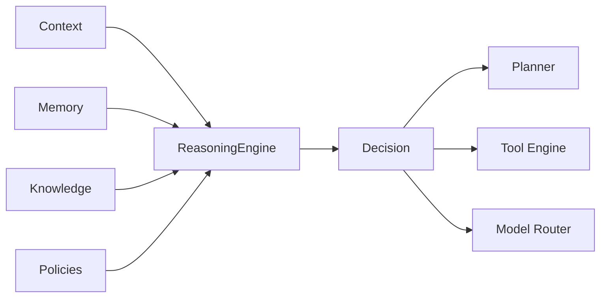
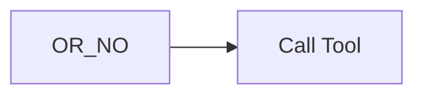
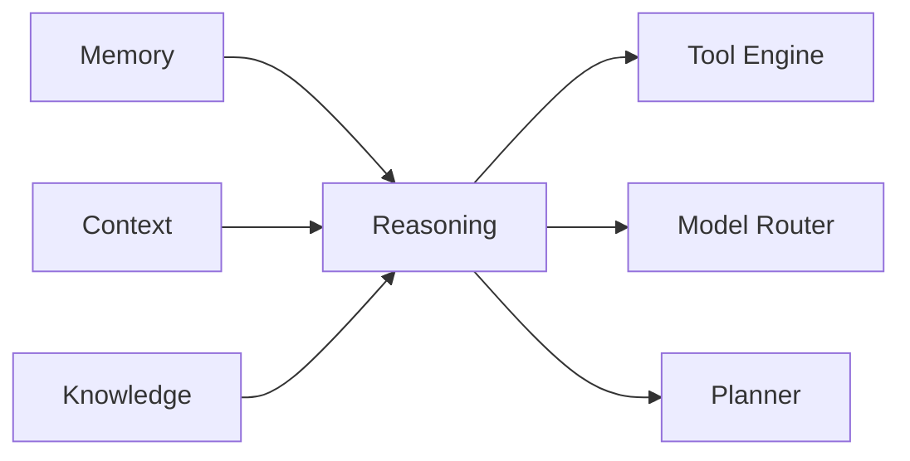

# Agent Reasoning

> AI Social OS AI Layer

Version: 2.0.0

Status: Stable

Last Updated: 2026-07-25

---

# Table of Contents

- Overview
- Objectives
- Why Reasoning
- Reasoning Principles
- Reasoning Architecture
- Reasoning Process
- Reasoning Strategies
- Decision Making
- Tool Reasoning
- Reflection
- Error Handling
- Explainability
- Reasoning Metrics
- Design Principles
- Design Decisions
- Summary

---

# Overview

Reasoning là khả năng phân tích, đánh giá và đưa ra quyết định của Agent trước khi thực hiện một hành động.

Reasoning không chỉ đơn thuần là sinh văn bản bằng Large Language Model.

Đó là quá trình.

- hiểu mục tiêu
- phân tích dữ liệu
- lựa chọn chiến lược
- đánh giá kết quả
- quyết định bước tiếp theo

Trong AI Social OS, Reasoning Engine là thành phần trung tâm quyết định hành vi của Agent.

---

# Objectives

Reasoning Engine hướng tới.

- Goal-oriented Decision Making
- Explainable AI
- Tool-aware Reasoning
- Context-aware Reasoning
- Multi-step Reasoning
- Error Recovery
- Reflection
- Enterprise Ready

---

# Why Reasoning

Nếu Agent chỉ hoạt động theo mô hình.

```mermaid
flowchart LR
```

thì Agent sẽ.

- không biết khi nào cần Tool
- không biết khi nào cần hỏi thêm
- không biết khi nào cần Retry
- không biết khi nào nên kết thúc

Reasoning giúp Agent chủ động đưa ra quyết định.

---

# Reasoning Principles

Reasoning tuân theo các nguyên tắc.

- Goal Driven
- Context Aware
- Evidence Based
- Tool First
- Explainable
- Deterministic Workflow
- Continuous Reflection
- Policy Compliant

---

# Reasoning Architecture



---

# Reasoning Process

Mỗi chu kỳ Reasoning gồm các bước.

```mermaid
flowchart LR
```

Đây là vòng lặp liên tục cho đến khi Goal hoàn thành.

---

# Understanding the Goal

Agent xác định.

- mục tiêu chính
- ràng buộc
- đầu ra mong muốn
- mức độ ưu tiên

Ví dụ.

```text
Generate Weekly Sales Report
```

Agent cần hiểu rằng.

- phải lấy dữ liệu
- phải phân tích
- phải tạo báo cáo

chứ không chỉ sinh văn bản.

---

# Context Analysis

Reasoning Engine đánh giá.

```text
User Request

Conversation

Memory

Knowledge

Tool Results

Policies
```

để xác định Agent đang biết gì và còn thiếu gì.

---

# Strategy Selection

Sau khi phân tích.

Reasoning Engine lựa chọn chiến lược.

Ví dụ.

```mermaid
flowchart LR
```

Không phải mọi yêu cầu đều cần LLM trả lời trực tiếp.

---

# Decision Making

Mỗi vòng Reasoning tạo ra một Decision.

Ví dụ.

```text
Continue

Retry

Use Tool

Ask User

Switch Model

End Task
```

Decision là đầu ra chính của Reasoning Engine.

---

# Tool Reasoning

Reasoning xác định.



Ví dụ.

```text
Current Weather
```

LLM không có dữ liệu thời gian thực.

Reasoning sẽ chọn.

```text
Weather API
```

thay vì tạo câu trả lời dự đoán.

---

# Multi-step Reasoning

Một Goal lớn thường cần nhiều vòng suy luận.

Ví dụ.

```mermaid
flowchart LR
```

Reasoning điều phối toàn bộ chuỗi quyết định này.

---

# Reflection

Sau mỗi bước.

Agent tự đánh giá.

```mermaid
flowchart LR
```

Reflection giúp cải thiện chất lượng mà không cần người dùng yêu cầu lại.

---

# Error Handling

Reasoning xử lý nhiều loại lỗi.

Ví dụ.

- Tool Failure
- Timeout
- Invalid Result
- Missing Context
- Empty Retrieval

Tùy từng trường hợp.

Agent có thể.

```text
Retry

Switch Tool

Switch Model

Ask User

Abort
```

---

# Explainability

Mọi Decision nên có thể giải thích.

Ví dụ.

```text
Decision:
Use Database

Reason:
Information requires real-time data.
```

Điều này giúp.

- Debug
- Audit
- Compliance
- Human Review

---

# Reasoning Metrics

Reasoning Engine theo dõi.

- Decision Accuracy
- Retry Count
- Tool Success Rate
- Reflection Rate
- Completion Rate
- Average Reasoning Steps
- Decision Latency

Các Metrics được gửi tới Monitoring Platform.

---

# Relationship with Other Components



Reasoning Engine là trung tâm điều phối hành vi của Agent.

---

# Design Principles

Reasoning Engine được xây dựng theo các nguyên tắc.

- Think Before Acting
- Goal Driven
- Context First
- Tool Native
- Explainable
- Observable
- Extensible
- Policy Aware

---

# Design Decisions

| Decision | Reason |
|-----------|--------|
| Reasoning Engine riêng | Tách logic suy luận khỏi Planner |
| Decision-based Architecture | Chuẩn hóa hành động của Agent |
| Reflection sau mỗi bước | Nâng cao chất lượng kết quả |
| Tool-aware Reasoning | Khuyến khích sử dụng dữ liệu thực tế |
| Explainable Decisions | Hỗ trợ Audit và Debug |
| Metrics cho mọi Decision | Đánh giá hiệu quả suy luận |
| Policy Integration | Đảm bảo tuân thủ quy định doanh nghiệp |

---

# Summary

Agent Reasoning định nghĩa cơ chế phân tích, đánh giá và ra quyết định của AI Agent trong AI Social OS.

Thông qua Reasoning Engine, Agent có thể hiểu mục tiêu, phân tích Context, lựa chọn chiến lược, quyết định khi nào sử dụng Tool hoặc Model, tự đánh giá kết quả và điều chỉnh hành vi trong suốt quá trình thực hiện nhiệm vụ. Đây là thành phần cốt lõi tạo nên khả năng tư duy và thích ứng của AI Agent trong môi trường doanh nghiệp.