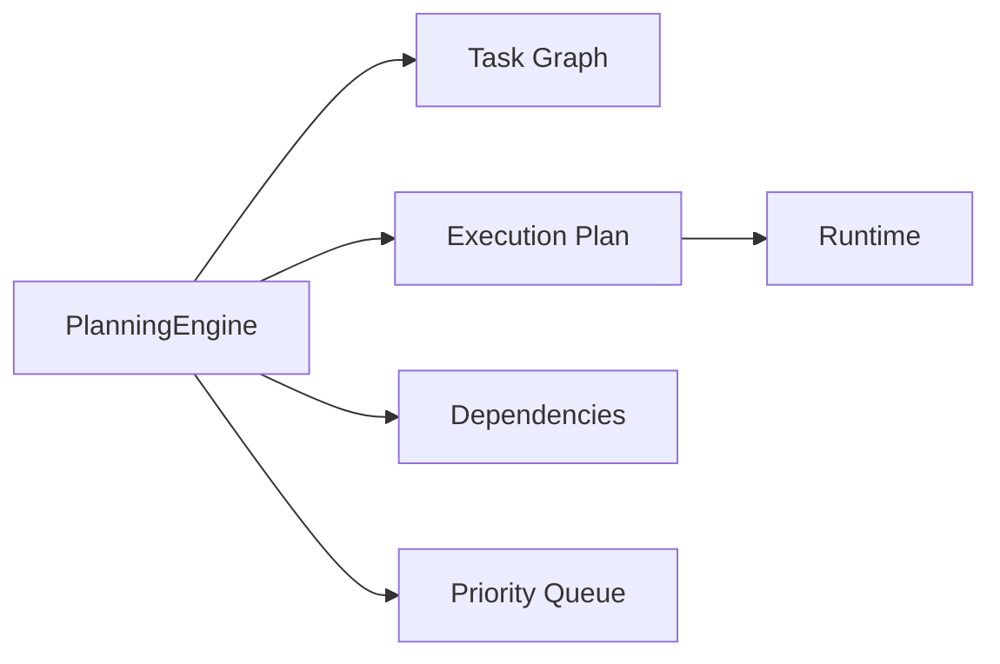
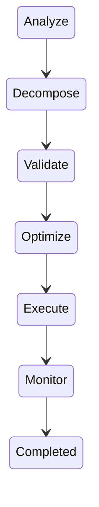
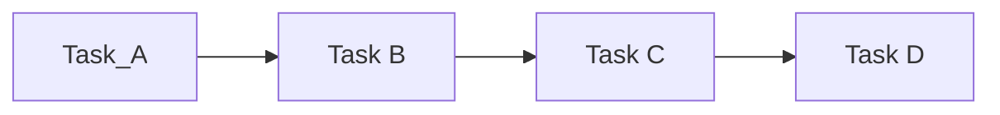
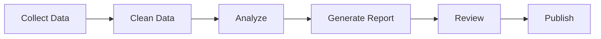
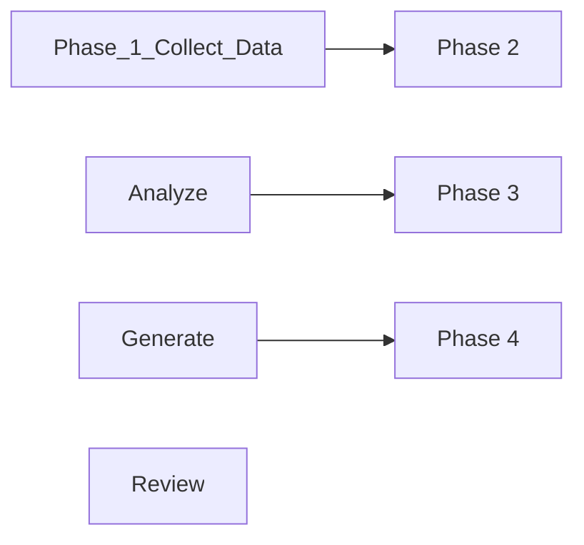
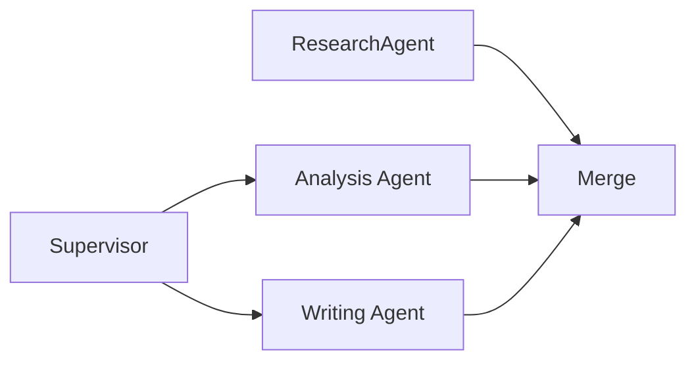
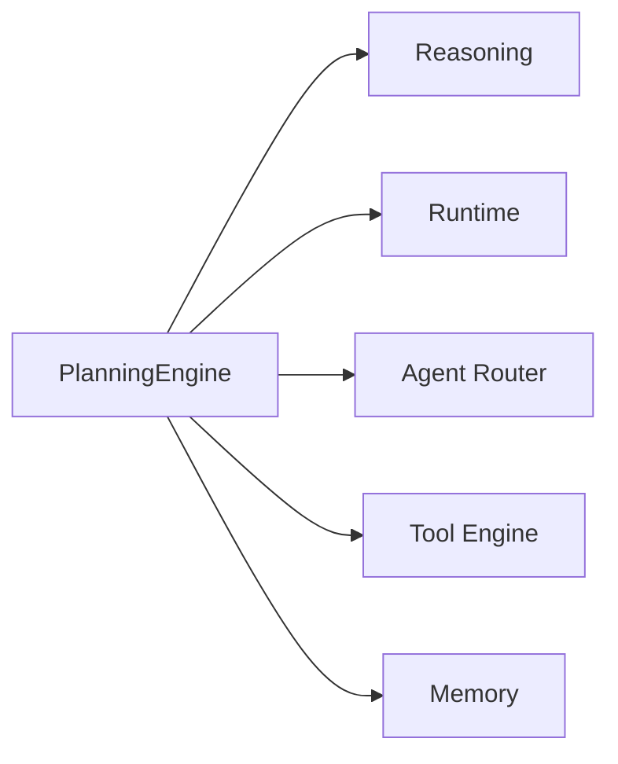

# Agent Planning

> AI Social OS AI Layer

Version: 2.0.0

Status: Stable

Last Updated: 2026-07-25

---

# Table of Contents

- Overview
- Objectives
- Why Planning
- Planning Principles
- Planning Architecture
- Planning Lifecycle
- Goal Decomposition
- Task Planning
- Dynamic Replanning
- Plan Validation
- Plan Optimization
- Planning Metrics
- Planning Events
- Design Principles
- Design Decisions
- Summary

---

# Overview

Planning là khả năng chuyển đổi một Goal thành một chuỗi các nhiệm vụ có thể thực thi.

Planning không tạo ra câu trả lời.

Planning tạo ra lộ trình để đạt được mục tiêu.

Trong AI Social OS, Planning Engine chịu trách nhiệm.

- phân tích Goal
- chia nhỏ nhiệm vụ
- xác định thứ tự thực hiện
- xác định phụ thuộc
- tối ưu kế hoạch
- điều chỉnh kế hoạch khi môi trường thay đổi

---

# Objectives

Planning Engine hướng tới.

- Goal Decomposition
- Task Scheduling
- Adaptive Planning
- Explainable Plans
- Reusable Plans
- Multi-Agent Planning
- Efficient Execution
- Enterprise Ready

---

# Why Planning

Nếu Agent nhận một Goal lớn.

```text
Create Business Plan
```

và gửi trực tiếp cho LLM.

```mermaid
flowchart LR
```

thì.

- khó kiểm soát
- khó Retry
- khó cộng tác
- khó mở rộng

Planning chia Goal thành các bước nhỏ trước khi thực thi.

---

# Planning Principles

Planning tuân theo các nguyên tắc.

- Goal Driven
- Hierarchical
- Incremental
- Adaptive
- Observable
- Explainable
- Reusable
- Deterministic

---

# Planning Architecture



---

# Planning Lifecycle



Replan
```

---

# Goal Analysis

Planning Engine xác định.

- mục tiêu
- đầu ra mong muốn
- ràng buộc
- dữ liệu cần thiết
- Tool cần sử dụng
- Agent cần tham gia

Ví dụ.

```
```text
Prepare Monthly Financial Report
```

Planner sẽ xác định.

- lấy dữ liệu
- phân tích
- tạo biểu đồ
- sinh báo cáo
- gửi Email

---

# Goal Decomposition

Một Goal được chia thành nhiều Task.

```text
```

```

Task phải.

- độc lập
- có đầu vào
- có đầu ra
- có trạng thái

---

# Task Graph

Planner biểu diễn kế hoạch dưới dạng DAG.

```


DAG giúp Runtime xác định.

- Task song song
- Task phụ thuộc
- Critical Path

---

# Task Properties

Mỗi Task bao gồm.

```text
Task ID

Goal ID

Priority

Dependencies

Assigned Agent

Required Tools

Expected Output

Timeout

Retry Policy
```

---

# Execution Plan

Planner tạo Execution Plan.

Ví dụ.



Execution Plan được Runtime thực thi.

---

# Dynamic Replanning

Nếu điều kiện thay đổi.

Planner có thể tạo kế hoạch mới.

Ví dụ.

```mermaid
flowchart LR
```

Hoặc.

```mermaid
flowchart LR
```

---

# Parallel Planning

Một số Task có thể chạy đồng thời.

Ví dụ.

```text
Collect News

||

Collect Market Data

||

Collect Financial Data
```

Sau đó.

```mermaid
flowchart LR
```

Planner đánh dấu các Task có thể thực thi song song.

---

# Multi-Agent Planning

Planner có thể phân chia công việc.



Mỗi Agent nhận một phần của kế hoạch.

---

# Plan Validation

Planner kiểm tra.

- Circular Dependency
- Missing Task
- Invalid Tool
- Invalid Agent
- Policy Violation
- Resource Availability

Chỉ các kế hoạch hợp lệ mới được Runtime thực thi.

---

# Plan Optimization

Planner tối ưu.

- số lượng Task
- số lần gọi Tool
- chi phí Model
- thời gian thực thi
- mức độ song song

Mục tiêu.

```text
Minimum Cost

Maximum Performance
```

---

# Planning Events

Planning Engine phát sinh.

```text
GoalReceived

PlanCreated

PlanValidated

PlanOptimized

PlanUpdated

TaskCreated

TaskAssigned

PlanCompleted
```

Các Event được gửi tới Event Bus.

---

# Planning Metrics

Planner theo dõi.

- Planning Time
- Task Count
- Parallel Tasks
- Replanning Count
- Completion Rate
- Average Plan Depth
- Plan Success Rate

---

# Relationship with Other Components



Planner là cầu nối giữa Goal và Execution.

---

# Design Principles

Planning Engine được xây dựng theo.

- Goal First
- Hierarchical Planning
- Task Graph
- Adaptive Planning
- Parallel Execution
- Explainable Plans
- Event Driven
- Reusable

---

# Design Decisions

| Decision | Reason |
|-----------|--------|
| Planner tách khỏi Reasoner | Phân tách lập kế hoạch và ra quyết định |
| DAG-based Task Graph | Hỗ trợ thực thi song song |
| Dynamic Replanning | Thích ứng với thay đổi |
| Multi-Agent Planning | Chia nhỏ công việc |
| Plan Validation | Tránh lỗi trước khi thực thi |
| Plan Optimization | Giảm chi phí và thời gian |
| Event-driven Planning | Hỗ trợ Monitoring và Audit |

---

# Summary

Agent Planning định nghĩa cách AI Agent chuyển đổi một Goal thành một Execution Plan có cấu trúc.

Thông qua Goal Decomposition, Task Graph, Dynamic Replanning và Plan Optimization, Planning Engine giúp Agent xây dựng các kế hoạch có khả năng mở rộng, hỗ trợ Multi-Agent Collaboration và tối ưu hóa quá trình thực thi trong môi trường AI doanh nghiệp.