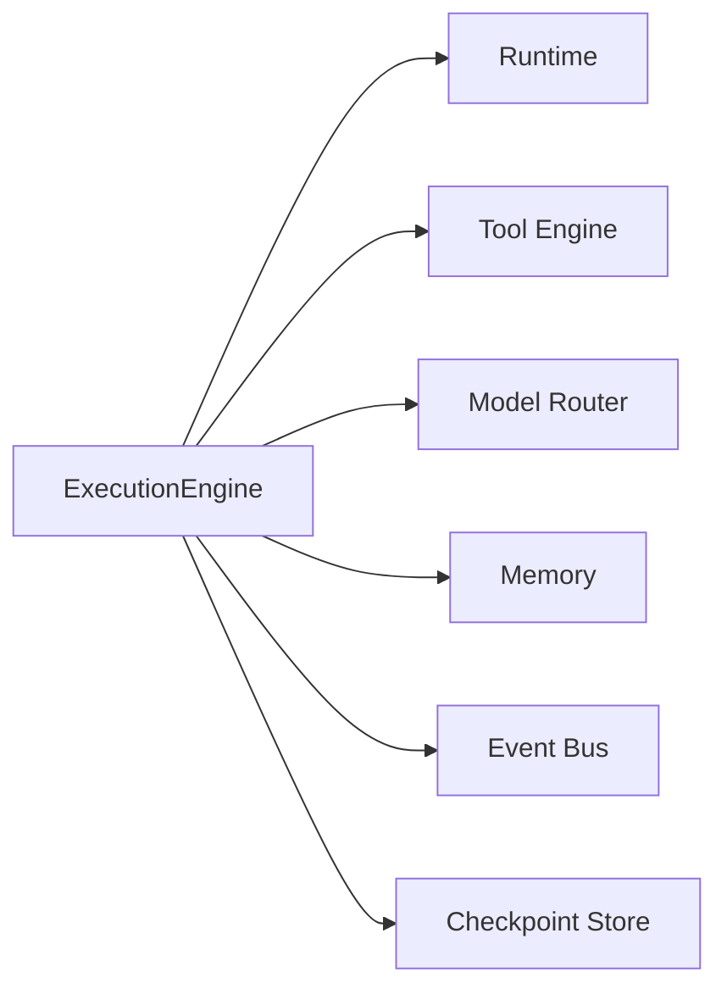
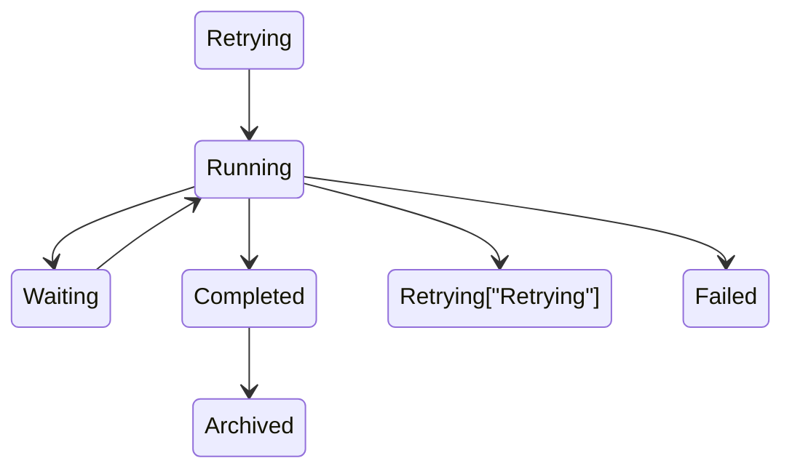
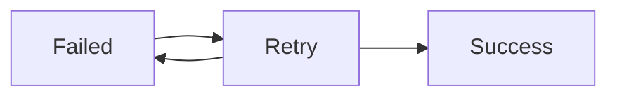
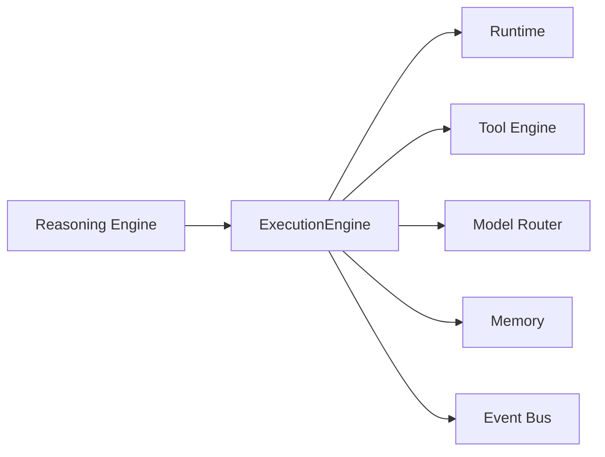

# Agent Execution

> AI Social OS AI Layer

Version: 2.0.0

Status: Stable

Last Updated: 2026-07-25

---

# Table of Contents

- Overview
- Objectives
- Why Execution Engine
- Execution Principles
- Execution Architecture
- Execution Lifecycle
- Execution Pipeline
- Task Execution
- Tool Execution
- Model Execution
- Retry Strategy
- Timeout Handling
- Checkpoint Execution
- Parallel Execution
- Execution Events
- Execution Metrics
- Design Principles
- Design Decisions
- Summary

---

# Overview

Execution là quá trình biến một Execution Plan thành các hành động thực tế.

Planning xác định **làm gì**.

Reasoning quyết định **nên làm gì tiếp theo**.

Execution chịu trách nhiệm **thực hiện**.

Execution Engine là cầu nối giữa AI Layer và Runtime Layer, đảm bảo mọi Task được thực thi đúng thứ tự, đúng điều kiện và có khả năng phục hồi khi xảy ra lỗi.

---

# Objectives

Execution Engine hướng tới.

- Reliable Execution
- Fault Tolerance
- Parallel Processing
- Checkpoint Support
- Retry Management
- Resource Efficiency
- Observability
- Enterprise Ready

---

# Why Execution

Nếu Agent chỉ sinh kế hoạch.

```mermaid
flowchart LR
```

thì Goal sẽ không bao giờ hoàn thành.

Execution Engine biến kế hoạch thành hành động thực tế.

Ví dụ.

```mermaid
flowchart LR
```

---

# Execution Principles

Execution tuân theo.

- Plan Driven
- State Aware
- Event Driven
- Idempotent
- Recoverable
- Observable
- Distributed
- Secure

---

# Execution Architecture



---

# Execution Lifecycle



---

# Execution Pipeline

```mermaid
flowchart LR
```

Pipeline được lặp lại cho đến khi toàn bộ Plan hoàn thành.

---

# Task Execution

Mỗi Task được thực hiện theo.

```mermaid
flowchart LR
```

Nếu Verification thất bại.

Execution Engine có thể.

- Retry
- Replan
- Ask Reasoning Engine

---

# Tool Execution

Execution Engine không gọi Tool trực tiếp.

Luồng chuẩn.

```mermaid
flowchart LR
```

Điều này đảm bảo mọi Tool đều có.

- Logging
- Audit
- Permission Check
- Retry

---

# Model Execution

Nếu Task cần AI.

Execution Engine chuyển yêu cầu.

```mermaid
flowchart LR
```

Execution Engine không phụ thuộc Model.

---

# State Update

Sau mỗi Task.

Execution Engine cập nhật.

```text
Execution State

Memory

Metrics

Progress

Checkpoint
```

Mọi thay đổi đều được ghi nhận.

---

# Retry Strategy

Nếu Task thất bại.



Retry Policy có thể cấu hình.

Ví dụ.

```text
Max Retry = 3

Backoff = Exponential

Delay = 2s
```

---

# Timeout Handling

Mỗi Task đều có Timeout.

```mermaid
flowchart LR
```

Timeout giúp tránh Worker bị treo.

---

# Checkpoint Execution

Execution Engine tạo Checkpoint.

```mermaid
flowchart LR
```

Nếu Worker lỗi.

Execution tiếp tục từ Checkpoint gần nhất.

---

# Parallel Execution

Các Task độc lập có thể chạy song song.

```mermaid
flowchart LR
    TaskB[Task B] --> Merge
    TaskC[Task C] --> Merge
    Merge --> TaskD[Task D]
    ` ```
```

Planner quyết định Task nào có thể chạy đồng thời.

---

# Human Approval

Một số Task yêu cầu xác nhận.

```mermaid
flowchart LR
```

Ví dụ.

- Gửi Email
- Xóa dữ liệu
- Thanh toán
- Ký hợp đồng

---

# Failure Recovery

Nếu lỗi xảy ra.

Execution Engine thử.

```mermaid
flowchart LR
```

Quyết định cuối cùng thuộc về Reasoning Engine.

---

# Execution Events

Execution phát sinh.

```text
ExecutionStarted

TaskStarted

ToolInvoked

ToolCompleted

CheckpointCreated

RetryStarted

ExecutionCompleted

ExecutionFailed
```

Event được gửi tới Event Bus.

---

# Execution Metrics

Execution Engine theo dõi.

- Execution Time
- Task Duration
- Retry Count
- Timeout Count
- Tool Latency
- Success Rate
- Parallel Tasks
- Resource Usage

---

# Relationship with Other Components



Execution Engine là trung tâm điều phối quá trình thực thi.

---

# Design Principles

Execution Engine được xây dựng theo.

- Reliable Execution
- Event Driven
- Distributed
- Fault Tolerant
- Checkpoint Native
- Observable
- Secure
- Extensible

---

# Design Decisions

| Decision | Reason |
|-----------|--------|
| Execution tách khỏi Runtime | Phân tách Infrastructure và AI Logic |
| Checkpoint định kỳ | Hỗ trợ phục hồi |
| Retry Policy cấu hình | Thích ứng nhiều loại Task |
| Tool thông qua Tool Engine | Chuẩn hóa thực thi |
| Event cho mọi Task | Monitoring và Audit |
| Parallel Execution | Tăng hiệu năng |
| Human Approval | Hỗ trợ quy trình doanh nghiệp |

---

# Summary

Agent Execution định nghĩa cách AI Agent thực thi các kế hoạch đã được tạo bởi Planning Engine.

Execution Engine chịu trách nhiệm điều phối Task, gọi Tool và Model, cập nhật State, tạo Checkpoint, xử lý Retry và Timeout, đồng thời phát sinh các Event phục vụ Monitoring. Kiến trúc này đảm bảo Agent có thể thực hiện các tác vụ một cách tin cậy, có khả năng phục hồi và mở rộng trong môi trường AI doanh nghiệp.