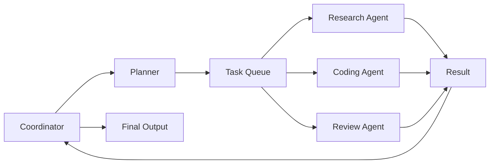
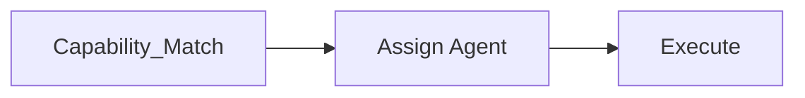
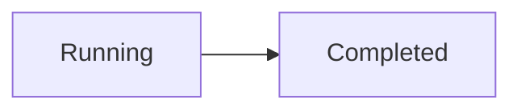
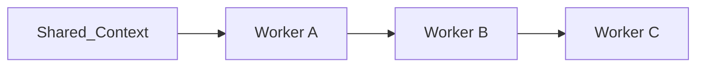
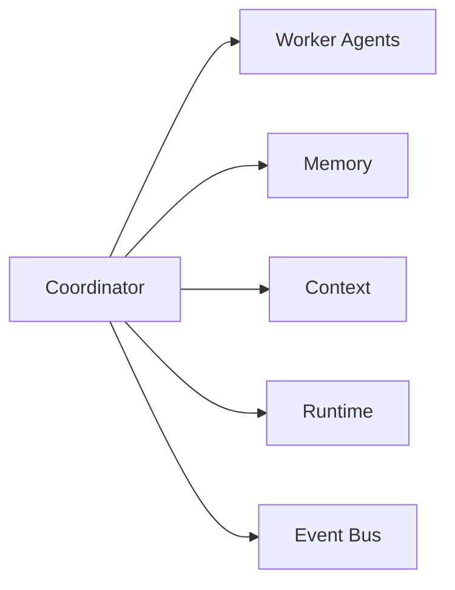

# Agent Coordination

> AI Social OS AI Layer

Version: 2.0.0

Status: Stable

Last Updated: 2026-07-25

---

# Table of Contents

- Overview
- Objectives
- Why Coordination
- Coordination Principles
- Coordination Architecture
- Coordination Roles
- Task Delegation
- Task Scheduling
- Shared Context
- Shared Memory
- Conflict Resolution
- Synchronization
- Failure Recovery
- Coordination Events
- Metrics
- Design Principles
- Design Decisions
- Summary

---

# Overview

Agent Coordination là cơ chế giúp nhiều AI Agent có thể cộng tác để hoàn thành một Goal chung.

Trong AI Social OS, một Goal không nhất thiết chỉ do một Agent thực hiện.

Một Goal có thể được chia thành nhiều nhiệm vụ nhỏ và giao cho nhiều Agent khác nhau.

Coordination Layer chịu trách nhiệm.

- phân công
- đồng bộ
- theo dõi
- tổng hợp
- xử lý xung đột
- phục hồi

---

# Objectives

Agent Coordination hướng tới.

- Multi-Agent Collaboration
- Distributed Execution
- Parallel Processing
- Dynamic Assignment
- Fault Tolerance
- High Throughput
- Enterprise Scalability
- Explainable Coordination

---

# Why Coordination

Nếu chỉ có một Agent.

```mermaid
flowchart LR
```

thì.

- chậm
- khó mở rộng
- không tận dụng chuyên môn
- khó thực hiện tác vụ lớn

Coordination cho phép.

```mermaid
flowchart LR
```

---

# Coordination Principles

Coordination tuân theo.

- Goal Driven
- Event Driven
- Stateless Coordination
- Shared Context
- Shared Memory
- Observable
- Recoverable
- Extensible

---

# Coordination Architecture


```

---

# Coordination Roles

## Coordinator

Điều phối toàn bộ Workflow.

Nhiệm vụ.

- chia Task
- theo dõi tiến độ
- xử lý lỗi
- hợp nhất kết quả

---

## Worker Agent

Worker thực hiện Task.

Ví dụ.

```
```text
Search

Summarize

Translate

Review

Analyze
```

Worker không điều phối Agent khác.

---

## Supervisor

Supervisor giám sát toàn bộ hệ thống.

Có thể.

- dừng Workflow
- Retry
- Replan
- chuyển Worker

---

# Task Delegation

Planner tạo Task.

Coordinator quyết định Agent phù hợp.

```text
```

```

Việc phân công dựa trên.

- Capability
- Cost
- Availability
- Priority
- Policy

---

# Task Scheduling

Task Queue quản lý.

```
```text
```

```

Các Task độc lập có thể chạy song song.

---

# Shared Context

Các Agent có thể chia sẻ Context.

```
```text
```

```

Shared Context bao gồm.

- Goal
- Progress
- Current Plan
- Constraints

---

# Shared Memory

Một số Memory được chia sẻ.

Ví dụ.

```
```text
Project Knowledge

Research Notes

Workflow State
```

Trong khi.

```text
Reasoning Cache

Temporary Variables
```

vẫn là Private Memory.

---

# Synchronization

Coordinator đồng bộ.

- Task Status
- Progress
- Shared Memory
- Shared Context

định kỳ hoặc theo Event.

---

# Conflict Resolution

Có thể xảy ra.

```text
```
```mermaid
flowchart LR
```

```mermaid
flowchart LR
```
```

Coordinator xử lý bằng.

- Priority
- Confidence Score
- Human Approval
- Voting
- Rule Engine

---

# Failure Recovery

Nếu Worker lỗi.

```
```mermaid
flowchart LR
```
flowchart LR
    ```mermaid
flowchart LR
    Worker -->   Failure
    Failure -->   Retry
    Retry -->   NewWorker["New Worker"]
    NewWorker -->   Continue
    ```
    ```
```

Workflow không cần khởi động lại từ đầu.

---

# Dynamic Coordination

Trong quá trình thực thi.

Coordinator có thể.

- tạo Agent mới
- hủy Agent
- đổi Agent
- thay đổi Task

Ví dụ.

```mermaid
flowchart LR
```

---

# Coordination Events

Các Event chính.

```text
AgentAssigned

TaskDelegated

TaskStarted

TaskCompleted

AgentFailed

AgentReplaced

WorkflowMerged

CoordinationCompleted
```

---

# Coordination Metrics

Coordinator theo dõi.

- Agent Utilization
- Queue Length
- Task Latency
- Merge Time
- Retry Count
- Success Rate
- Parallelism
- Coordination Overhead

---

# Relationship with Other Components



---

# Design Principles

Agent Coordination được xây dựng theo.

- Distributed First
- Event Driven
- Shared Context
- Shared Memory
- Capability Based
- Observable
- Fault Tolerant
- Scalable

---

# Design Decisions

| Decision | Reason |
|-----------|--------|
| Coordinator riêng | Tách điều phối khỏi Worker |
| Shared Context | Đồng bộ mục tiêu |
| Shared Memory | Chia sẻ tri thức |
| Dynamic Assignment | Tăng khả năng mở rộng |
| Retry theo Agent | Không ảnh hưởng Workflow |
| Event-driven Coordination | Monitoring và Audit |
| Capability Matching | Chọn đúng Agent cho từng Task |

---

# Summary

Agent Coordination định nghĩa cơ chế phối hợp giữa nhiều AI Agent trong AI Social OS.

Thông qua Coordinator, Shared Context, Shared Memory và Task Delegation, hệ thống có thể phân chia công việc, đồng bộ tiến trình, xử lý lỗi và hợp nhất kết quả từ nhiều Agent khác nhau, tạo nền tảng cho các Workflow AI phân tán có khả năng mở rộng ở quy mô doanh nghiệp.