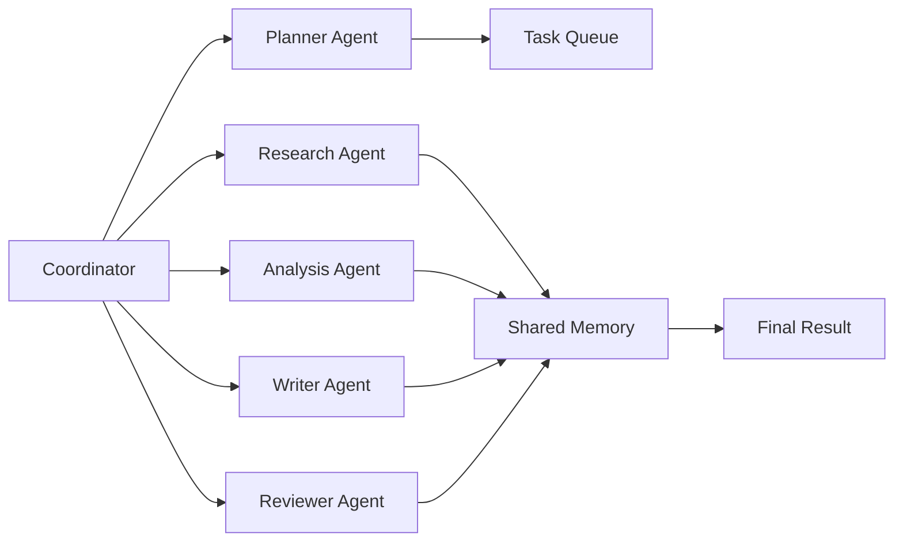
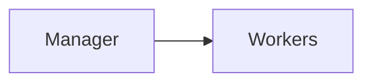
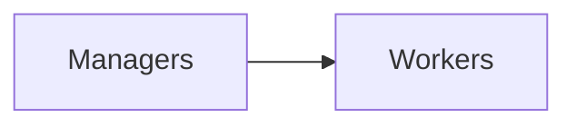
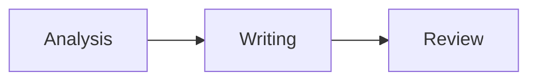
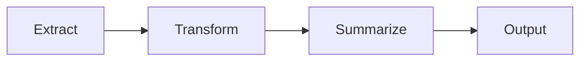
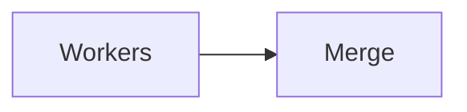
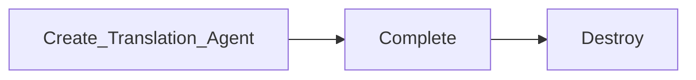
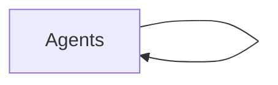
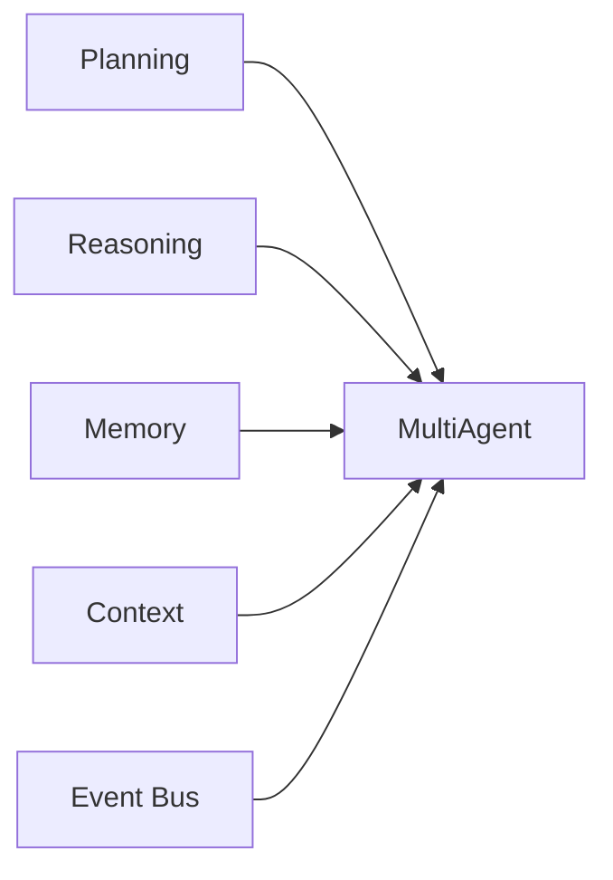

# Multi-Agent System

> AI Social OS AI Layer

Version: 2.0.0

Status: Stable

Last Updated: 2026-07-25

---

# Table of Contents

- Overview
- Objectives
- Why Multi-Agent
- Core Principles
- Architecture
- Agent Topologies
- Communication
- Collaboration Patterns
- Shared Resources
- Consensus
- Scalability
- Failure Recovery
- Observability
- Design Principles
- Design Decisions
- Summary

---

# Overview

Multi-Agent System (MAS) là kiến trúc cho phép nhiều AI Agent phối hợp để giải quyết một bài toán lớn thay vì giao toàn bộ nhiệm vụ cho một Agent duy nhất.

Trong AI Social OS, Multi-Agent là kiến trúc mặc định cho các Workflow phức tạp.

Mỗi Agent có.

- nhiệm vụ riêng
- chuyên môn riêng
- Memory riêng
- Tool riêng
- Context riêng

và phối hợp thông qua Runtime cùng Event Bus.

---

# Objectives

Multi-Agent System hướng tới.

- Distributed Intelligence
- Parallel Execution
- Specialization
- Scalability
- Fault Tolerance
- Collaboration
- Resource Optimization
- Enterprise Ready

---

# Why Multi-Agent

Một Agent duy nhất sẽ gặp giới hạn.

- Context Window
- Processing Time
- Tool Complexity
- Domain Knowledge
- Reliability

Trong khi đó.

```mermaid
flowchart LR
```

giúp.

- nhanh hơn
- chính xác hơn
- dễ mở rộng
- dễ bảo trì

---

# Core Principles

Multi-Agent System được xây dựng dựa trên.

- Decentralized Intelligence
- Shared Goal
- Specialized Capability
- Event Driven
- Stateless Runtime
- Shared Knowledge
- Recoverable Execution
- Explainable Collaboration

---

# High-Level Architecture


```

---

# Agent Topologies

## Centralized

```
```text
```
```mermaid
flowchart LR
```
```

Ưu điểm.

- dễ kiểm soát
- dễ Audit
- đơn giản

Nhược điểm.

- Coordinator có thể trở thành Bottleneck.

---

## Hierarchical

```
```text
```

```

Phù hợp.

- Enterprise Workflow
- Large Projects

---

## Mesh

```
```text
Agent A

↔

Agent B

↔

Agent C
```

Agent có thể trao đổi trực tiếp.

Phù hợp.

- nghiên cứu
- brainstorming
- simulation

---

## Hybrid

Kết hợp nhiều mô hình.

```text
```


↔

Workers
```

Đây là mô hình mặc định của AI Social OS.

---

# Communication

Agent giao tiếp thông qua.

```
```text
Event Bus

Message Queue

RPC

Shared Memory
```

Không gọi trực tiếp lẫn nhau.

Điều này giúp.

- Loose Coupling
- Retry
- Scaling

---

# Collaboration Patterns

## Sequential

```text
```

```

---

## Parallel

```
```text
Research A

||

Research B

||

Research C
```

Sau đó hợp nhất kết quả.

---

## Pipeline

```text
```

```

---

## Fan-out / Fan-in

```
```text
```

```

Rất phù hợp với.

- Search
- Crawling
- Batch Processing

---

# Shared Resources

Các Agent có thể chia sẻ.

```
```text
Shared Memory

Shared Context

Knowledge Base

Workflow State

Event Bus
```

Nhưng không chia sẻ.

```text
Temporary Variables

Reasoning Cache

Prompt Buffer
```

---

# Consensus

Nếu nhiều Agent đưa ra kết quả khác nhau.

```text
```
```mermaid
flowchart LR
```

```mermaid
flowchart LR
```

```mermaid
flowchart LR
```
```

Coordinator có thể.

- Voting
- Confidence Score
- Rule Engine
- Human Review

để chọn kết quả cuối cùng.

---

# Dynamic Agent Creation

Coordinator có thể sinh Agent mới.

Ví dụ.

```
```text
```

```

Agent không nhất thiết tồn tại lâu dài.

---

# Agent Discovery

Mọi Agent đều đăng ký Capability.

Ví dụ.

```
```text
Research

Writing

Translation

Vision

Code

Planning
```

Coordinator tìm Agent thông qua Capability Registry thay vì tên Agent.

---

# Scalability

Multi-Agent hỗ trợ.

```text
```

```

Thông qua.

- Horizontal Scaling
- Stateless Workers
- Distributed Queue
- Shared Storage

---

# Failure Recovery

Nếu một Agent lỗi.

```
```mermaid
flowchart LR
```
flowchart LR
    ```mermaid
flowchart LR
    Worker -->   Failure["Failure"]
    Failure -->   ReplaceAgent["Replace Agent"]
    ReplaceAgent -->   ContinueWorkflow["Continue Workflow"]
    ```
```

Workflow vẫn tiếp tục.

Không cần khởi động lại toàn bộ.

---

# Observability

Hệ thống theo dõi.

- Agent Status
- Active Agents
- Queue Length
- Message Count
- Collaboration Time
- Merge Latency
- Agent Health
- Success Rate

---

# Relationship with Other Components

```


---

# Design Principles

Multi-Agent System được xây dựng theo.

- Distributed by Default
- Capability Driven
- Event Driven
- Loose Coupling
- Shared Knowledge
- Fault Tolerant
- Observable
- Extensible

---

# Design Decisions

| Decision | Reason |
|-----------|--------|
| Hybrid Topology | Cân bằng giữa hiệu năng và khả năng quản lý |
| Capability Registry | Không phụ thuộc tên Agent |
| Event Bus Communication | Loose Coupling |
| Shared Memory | Chia sẻ tri thức |
| Coordinator độc lập | Điều phối Workflow |
| Dynamic Agent Creation | Tiết kiệm tài nguyên |
| Consensus Layer | Tăng chất lượng kết quả |

---

# Summary

Multi-Agent System là nền tảng cho mọi Workflow AI quy mô lớn trong AI Social OS.

Thông qua Coordinator, Capability Registry, Shared Memory, Event Bus và các mô hình Collaboration khác nhau, hệ thống có thể phối hợp hàng trăm Agent chuyên biệt để thực hiện các tác vụ phức tạp với khả năng mở rộng, phục hồi và giám sát cao, đáp ứng yêu cầu của các hệ thống AI doanh nghiệp hiện đại.