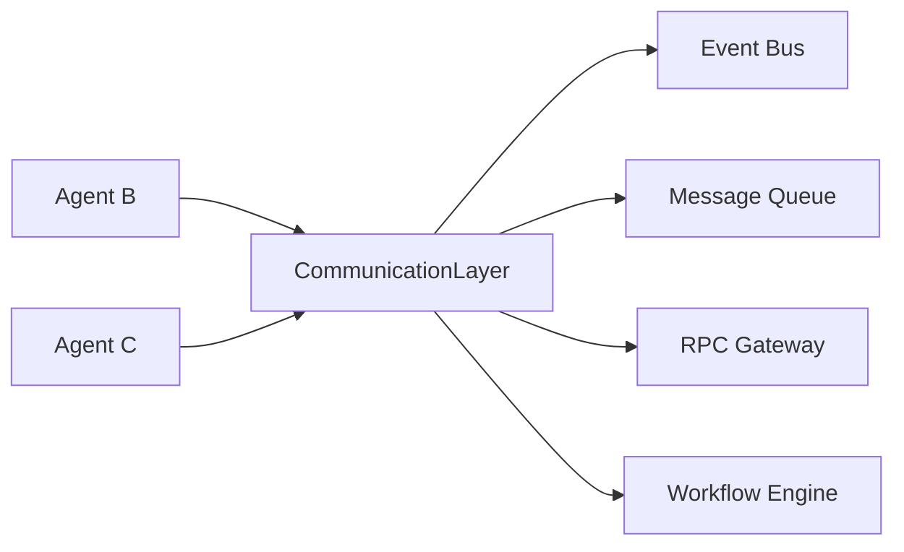
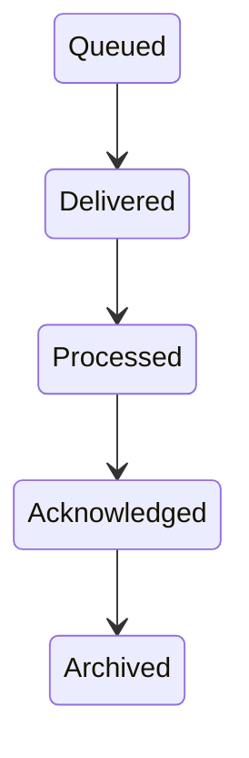
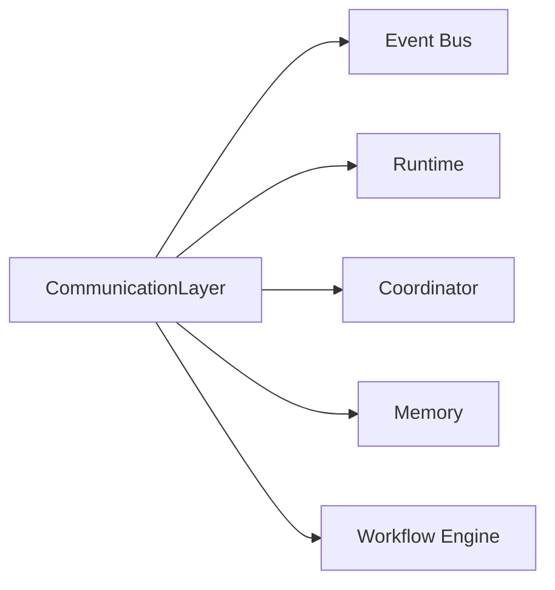

# Agent Communication

> AI Social OS AI Layer

Version: 2.0.0

Status: Stable

Last Updated: 2026-07-25

---

# Table of Contents

- Overview
- Objectives
- Why Communication
- Communication Principles
- Communication Architecture
- Communication Models
- Message Types
- Communication Protocol
- Event-based Communication
- Request/Response
- Broadcast
- Publish/Subscribe
- Reliability
- Security
- Communication Metrics
- Design Principles
- Design Decisions
- Summary

---

# Overview

Agent Communication định nghĩa cách các AI Agent trao đổi thông tin với nhau trong AI Social OS.

Một Agent không nên gọi trực tiếp Agent khác.

Thay vào đó, mọi giao tiếp đều thông qua Communication Layer.

Communication Layer đảm bảo.

- Loose Coupling
- Reliability
- Scalability
- Observability
- Fault Tolerance

---

# Objectives

Communication Layer hướng tới.

- Reliable Messaging
- Loose Coupling
- Asynchronous Communication
- Distributed Coordination
- High Throughput
- Event Driven
- Secure Communication
- Enterprise Ready

---

# Why Communication

Nếu Agent gọi trực tiếp nhau.

```mermaid
flowchart LR
```

sẽ dẫn tới.

- phụ thuộc chặt
- khó mở rộng
- khó Retry
- khó Monitoring

Communication Layer tách rời các Agent.

---

# Communication Principles

Communication tuân theo.

- Message Driven
- Event Driven
- Asynchronous First
- Reliable Delivery
- Idempotent
- Traceable
- Secure
- Extensible

---

# Communication Architecture



---

# Communication Models

AI Social OS hỗ trợ nhiều mô hình giao tiếp.

```text
Request / Response

Publish / Subscribe

Broadcast

Command

Event

Streaming
```

Mỗi mô hình phù hợp với từng loại Workflow.

---

# Request / Response

Dùng khi Agent cần phản hồi ngay.

```mermaid
flowchart LR
```

Ví dụ.

- Translation
- Summarization
- Classification

---

# Publish / Subscribe

Agent phát Event.

```mermaid
flowchart LR
```

Không cần biết Subscriber nào đang tồn tại.

---

# Broadcast

Một thông điệp được gửi tới toàn bộ Agent.

```mermaid
flowchart LR
```

Ví dụ.

- Stop Workflow
- Update Policy
- Shutdown
- Refresh Memory

---

# Command

Command yêu cầu Agent thực hiện một hành động.

Ví dụ.

```text
Execute Task

Pause

Resume

Cancel

Retry
```

Command luôn có một đối tượng nhận.

---

# Event

Event mô tả điều đã xảy ra.

Ví dụ.

```text
TaskCompleted

MemoryUpdated

PlanCreated

WorkflowFinished
```

Event không yêu cầu phản hồi.

---

# Streaming Communication

Một số Agent gửi dữ liệu liên tục.

```mermaid
flowchart LR
```

Hoặc.

```mermaid
flowchart LR
```

Streaming giảm độ trễ.

---

# Message Structure

Mọi Message đều có cấu trúc chuẩn.

```text
Message ID

Correlation ID

Sender

Receiver

Message Type

Payload

Metadata

Timestamp

Version
```

Điều này giúp.

- Audit
- Debug
- Retry
- Trace

---

# Communication Lifecycle



---

# Reliable Delivery

Communication Layer hỗ trợ.

- Retry
- Dead Letter Queue
- Duplicate Detection
- Ordering
- Delivery Confirmation

Không có Message nào bị mất mà không được ghi nhận.

---

# Correlation ID

Mỗi Workflow có Correlation ID.

Ví dụ.

```mermaid
flowchart LR
```

Tất cả đều chia sẻ cùng Correlation ID.

Điều này giúp theo dõi toàn bộ Workflow.

---

# Message Routing

Communication Layer định tuyến dựa trên.

- Agent ID
- Capability
- Topic
- Workflow
- Workspace
- Priority

Ví dụ.

```mermaid
flowchart LR
```

---

# Priority

Thông điệp có thể được ưu tiên.

```text
Critical

High

Normal

Low

Background
```

Queue Scheduler xử lý theo Priority.

---

# Security

Communication phải đảm bảo.

- Authentication
- Authorization
- Encryption
- Signature Verification
- Replay Protection
- Audit Logging

Agent chỉ nhận Message mà nó được phép xử lý.

---

# Communication Metrics

Communication Layer theo dõi.

- Message Count
- Delivery Time
- Retry Count
- Queue Size
- Processing Latency
- Failed Messages
- Throughput
- Error Rate

---

# Relationship with Other Components



---

# Design Principles

Communication Layer được xây dựng theo.

- Message Driven
- Event Driven
- Loose Coupling
- Reliable Delivery
- Observable
- Secure
- Scalable
- Extensible

---

# Design Decisions

| Decision | Reason |
|-----------|--------|
| Không gọi Agent trực tiếp | Giảm phụ thuộc |
| Event Bus mặc định | Hỗ trợ bất đồng bộ |
| Message chuẩn hóa | Dễ mở rộng |
| Correlation ID | Trace toàn bộ Workflow |
| Dead Letter Queue | Xử lý lỗi |
| Capability Routing | Không phụ thuộc Agent cụ thể |
| Priority Queue | Tối ưu tài nguyên |

---

# Summary

Agent Communication định nghĩa cơ chế giao tiếp giữa các AI Agent trong AI Social OS.

Thông qua Communication Layer, Event Bus, Message Queue và các mô hình Request/Response, Publish/Subscribe, Broadcast và Streaming, hệ thống đảm bảo các Agent có thể phối hợp với nhau một cách tin cậy, mở rộng và an toàn trong môi trường AI doanh nghiệp phân tán.