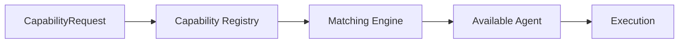
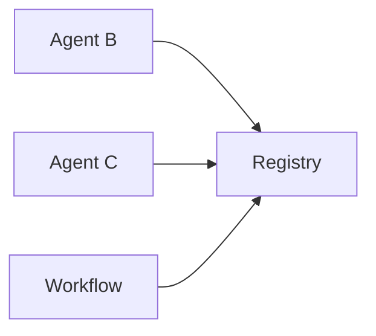
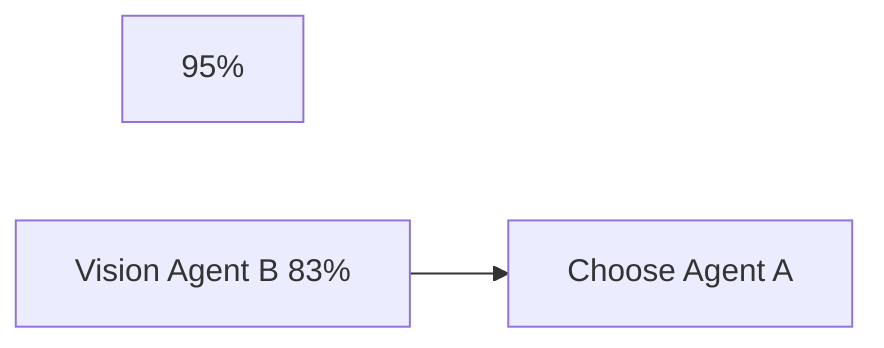
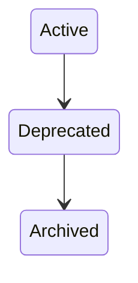
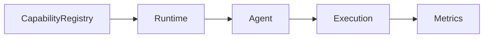

# Agent Capabilities

> AI Social OS AI Layer

Version: 2.0.0

Status: Stable

Last Updated: 2026-07-25

---

# Table of Contents

- Overview
- Objectives
- Why Capabilities
- Capability Principles
- Capability Architecture
- Capability Categories
- Capability Registry
- Capability Discovery
- Capability Matching
- Capability Composition
- Capability Versioning
- Capability Security
- Capability Metrics
- Design Principles
- Design Decisions
- Summary

---

# Overview

Capability là tập hợp các năng lực mà một AI Agent có thể thực hiện.

Thay vì định danh Agent theo tên.

```text
Research Agent

Coding Agent

Writing Agent
```

AI Social OS định danh Agent thông qua Capability.

Ví dụ.

```text
search.document

code.generate

translation.text

vision.detect

workflow.plan
```

Điều này giúp Runtime lựa chọn đúng Agent mà không phụ thuộc vào implementation cụ thể.

---

# Objectives

Capability System hướng tới.

- Capability-based Routing
- Loose Coupling
- Dynamic Discovery
- Reusability
- Extensibility
- Enterprise Governance
- Observability
- Vendor Independence

---

# Why Capabilities

Nếu Workflow gọi.

```text
ResearchAgent
```

thì hệ thống bị phụ thuộc vào Agent đó.

Nếu Agent bị thay thế.

Workflow phải sửa lại.

Trong AI Social OS.

Workflow chỉ yêu cầu.

```text
search.document
```

Runtime sẽ tự tìm Agent phù hợp.

---

# Capability Principles

Capability được xây dựng theo.

- Capability First
- Self-describing
- Discoverable
- Versioned
- Observable
- Secure
- Reusable
- Vendor Neutral

---

# Capability Architecture



---

# Capability Categories

Capability được chia thành nhiều nhóm.

## Reasoning

```text
reason.plan

reason.reflect

reason.evaluate

reason.classify
```

---

## Language

```text
text.generate

text.translate

text.summarize

text.rewrite
```

---

## Coding

```text
code.generate

code.review

code.debug

code.refactor
```

---

## Search

```text
search.web

search.document

search.database

search.vector
```

---

## Vision

```text
vision.detect

vision.segment

vision.caption

vision.ocr
```

---

## Audio

```text
audio.transcribe

audio.translate

audio.synthesize
```

---

## Data

```text
data.query

data.clean

data.transform

data.visualize
```

---

## Workflow

```text
workflow.plan

workflow.execute

workflow.monitor
```

---

# Capability Descriptor

Mỗi Capability đều có Metadata.

Ví dụ.

```yaml
id: search.web

version: 1.2

category: search

description: Search information from the web

input:
    query

output:
    documents

permissions:
    internet

timeout:
    30s
```

Capability Descriptor giúp Runtime hiểu Agent có thể làm gì.

---

# Capability Registry

Tất cả Capability được đăng ký vào Registry.



Registry không lưu Agent State.

Chỉ lưu Metadata.

---

# Capability Discovery

Runtime tìm Agent bằng Capability.

```mermaid
flowchart LR
```

Discovery hoàn toàn động.

---

# Capability Matching

Matching Engine đánh giá.

- Capability
- Version
- Availability
- Cost
- Latency
- Workspace
- Policy
- Health

Ví dụ.



---

# Capability Composition

Một Capability lớn có thể được tạo từ nhiều Capability nhỏ.

Ví dụ.

```mermaid
flowchart LR
```

Workflow không cần biết chi tiết bên trong.

---

# Capability Versioning

Capability hỗ trợ Version.

Ví dụ.

```text
search.web.v1

search.web.v2
```

Workflow có thể.

- pin Version
- latest Version
- compatible Version

---

# Capability Security

Capability có thể yêu cầu Permission.

Ví dụ.

```mermaid
flowchart LR
```

Một số Capability chỉ dành cho.

- Admin
- Internal Agent
- Enterprise

---

# Capability Lifecycle



Capability có thể được thay thế mà không ảnh hưởng Workflow cũ.

---

# Capability Metrics

Capability Registry theo dõi.

- Usage Count
- Success Rate
- Average Latency
- Error Rate
- Availability
- Active Agents
- Cost per Call

---

# Relationship with Other Components



Capability là lớp trung gian giữa Workflow và Agent.

---

# Design Principles

Capability System được xây dựng theo.

- Capability First
- Discoverable
- Versioned
- Observable
- Secure
- Reusable
- Extensible
- Vendor Neutral

---

# Design Decisions

| Decision | Reason |
|-----------|--------|
| Capability thay cho Agent Name | Giảm phụ thuộc |
| Registry riêng | Quản lý tập trung |
| Dynamic Discovery | Dễ mở rộng |
| Metadata Descriptor | Chuẩn hóa Capability |
| Versioning | Hỗ trợ nâng cấp |
| Matching Engine | Chọn Agent tối ưu |
| Permission-based Capability | Tăng bảo mật |

---

# Summary

Agent Capabilities định nghĩa các năng lực mà AI Agent có thể cung cấp trong AI Social OS.

Thông qua Capability Registry, Capability Discovery và Matching Engine, hệ thống có thể lựa chọn Agent phù hợp dựa trên năng lực thay vì tên gọi, giúp kiến trúc trở nên linh hoạt, mở rộng và độc lập với từng implementation cụ thể. Capability là nền tảng cho cơ chế định tuyến, điều phối và tái sử dụng Agent trong toàn bộ hệ thống AI doanh nghiệp.