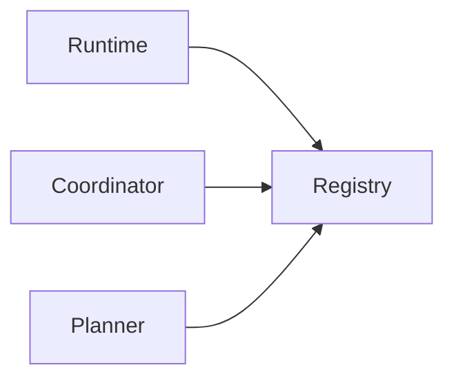

# Agent Registry

> AI Social OS AI Layer

Version: 2.0.0

Status: Stable

---

# Overview

Agent Registry là hệ thống quản lý toàn bộ Agent trong nền tảng.

Registry giúp Runtime biết.

- Agent nào đang tồn tại
- Agent nào đang online
- Agent nào đang khỏe mạnh
- Agent nào sở hữu Capability nào
- Agent nào có thể nhận Task

Registry là nguồn dữ liệu duy nhất cho Agent Discovery.

---

# Responsibilities

Agent Registry chịu trách nhiệm.

- Agent Registration
- Agent Discovery
- Capability Mapping
- Health Tracking
- Metadata Storage
- Version Management

---

# Architecture



---

# Registration

Khi Agent khởi động.

```mermaid
flowchart LR
```

Ví dụ.

```json
{
  "agentId":"agent-001",
  "name":"Research Agent",
  "version":"1.0.0",
  "capabilities":[
    "search.web",
    "search.document"
  ]
}
```

---

# Agent Metadata

Mỗi Agent chứa.

```text
Agent ID

Name

Version

Capabilities

Workspace

Owner

Status

Health

Created At

Updated At
```

---

# Discovery

Runtime tìm Agent.

```mermaid
flowchart LR
```

---

# Health Check

Registry theo dõi.

```text
Healthy

Degraded

Unavailable
```

---

# Agent Lifecycle


---

# Summary

Agent Registry là nguồn sự thật duy nhất về Agent trong hệ thống.