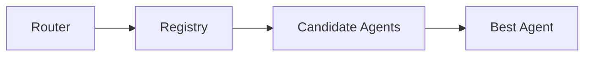
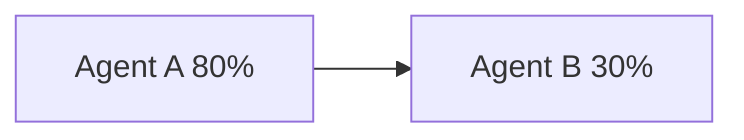

# Agent Routing

> AI Social OS AI Layer

Version: 2.0.0

Status: Stable

---

# Overview

Agent Routing xác định Agent nào sẽ nhận Task.

Routing không dựa trên tên Agent.

Routing dựa trên.

- Capability
- Availability
- Cost
- Health
- Priority

---

# Routing Flow



---

# Routing Strategies

## Capability Routing

```mermaid
flowchart LR
```

---

## Cost Routing

```mermaid
flowchart LR
```

---

## Performance Routing

```mermaid
flowchart LR
```

---

## Load-based Routing



---

# Fallback Routing

Nếu Agent lỗi.

```mermaid
flowchart LR
```

---

# Summary

Agent Routing giúp hệ thống lựa chọn Agent tối ưu cho từng Task.