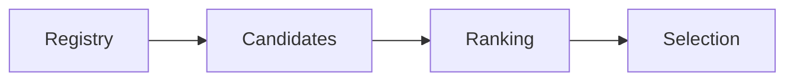

# Agent Discovery

> AI Social OS AI Layer

Version: 2.0.0

Status: Stable

---

# Overview

Agent Discovery là quá trình tìm kiếm Agent phù hợp để thực hiện một Capability.

Discovery hoạt động động.

Không có cấu hình cứng.

---

# Discovery Flow



---

# Matching Criteria

- Capability
- Version
- Workspace
- Health
- Cost
- Availability

---

# Discovery Result

```json
{
  "capability":"search.web",
  "agents":[
    "agent-a",
    "agent-b",
    "agent-c"
  ]
}
```

---

# Summary

Discovery cho phép hệ thống mở rộng Agent mà không cần sửa Workflow.