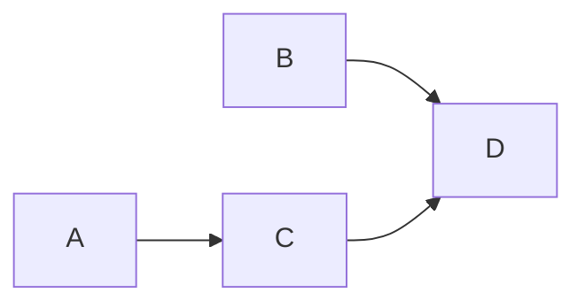

# Agent Workflow

> AI Social OS AI Layer

Version: 2.0.0

Status: Stable

---

# Overview

Workflow là chuỗi Task được phối hợp giữa nhiều Agent để hoàn thành Goal.

---

# Workflow Structure

```mermaid
flowchart LR
```

---

# Workflow Components

- Goal
- Tasks
- Dependencies
- State
- Events
- Results

---

# Workflow States

```text
Created

Running

Paused

Completed

Failed

Cancelled
```

---

# Workflow Example

```mermaid
flowchart LR
```

---

# Workflow DAG



---

# Summary

Workflow là đơn vị điều phối chính của Multi-Agent System.