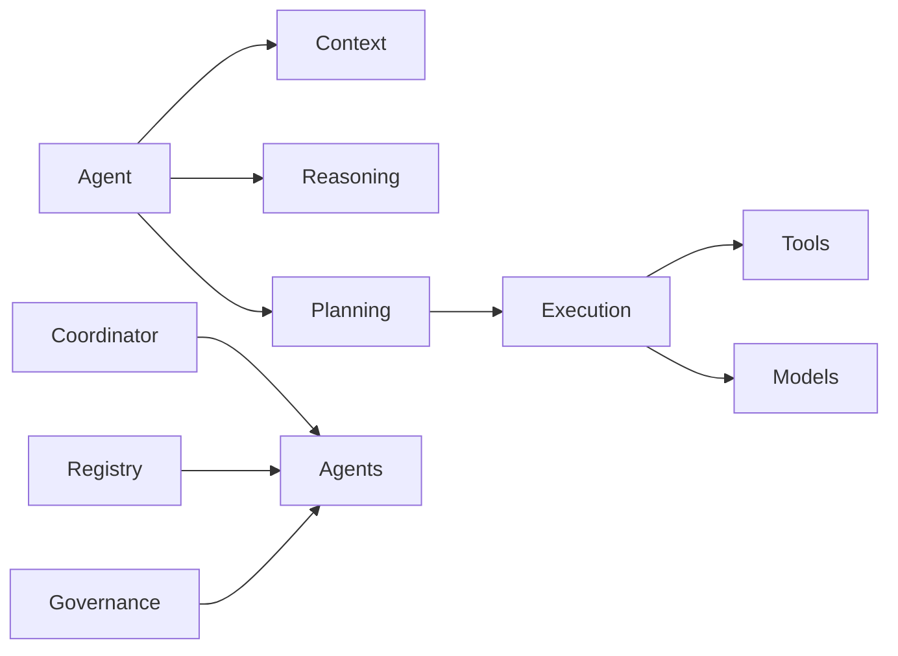

# AI Layer Summary

> AI Social OS

Version: 2.0.0

---

# Components

## Core Agent

- Agent Architecture
- Agent Lifecycle
- Agent Runtime
- Agent State

## Intelligence

- Memory
- Context
- Reasoning
- Planning

## Execution

- Execution Engine
- Coordination
- Multi-Agent
- Communication

## Management

- Capabilities
- Registry
- Routing
- Discovery
- Health

## Operations

- Workflow
- Governance
- Evaluation
- Learning

---

# Architecture

---

# Summary

AI Layer là trái tim của AI Social OS.

Layer này chịu trách nhiệm toàn bộ vòng đời của AI Agent từ tư duy, lập kế hoạch, thực thi, phối hợp, quản trị, đánh giá và học tập. Đây là nền tảng để xây dựng các hệ thống Multi-Agent quy mô lớn, độc lập với Model và có khả năng mở rộng cho môi trường doanh nghiệp.