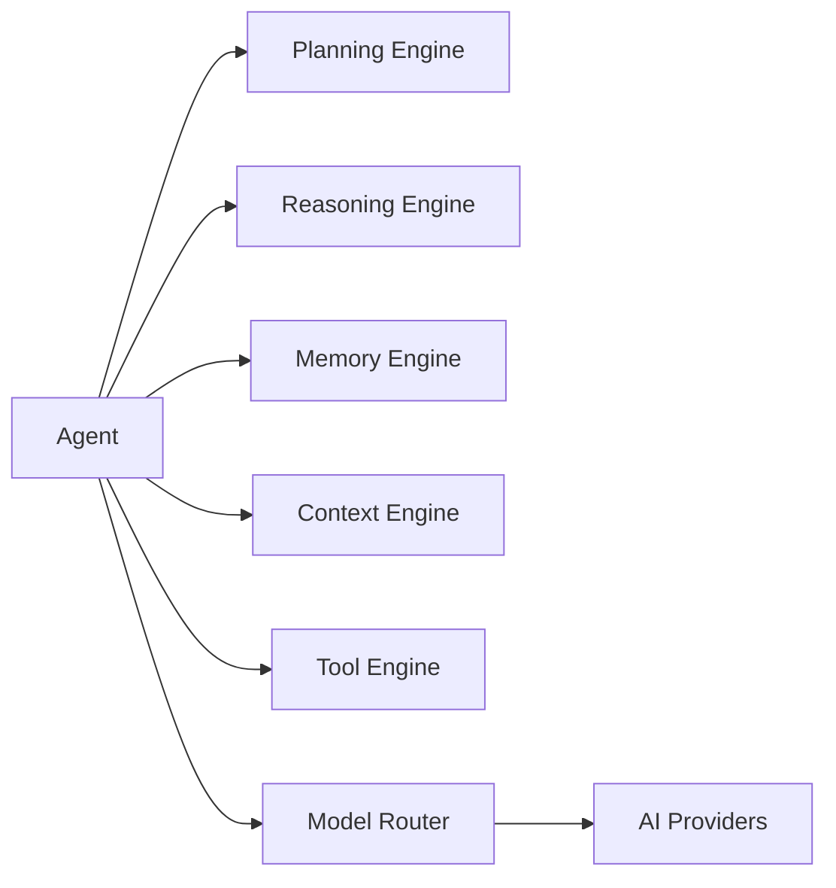
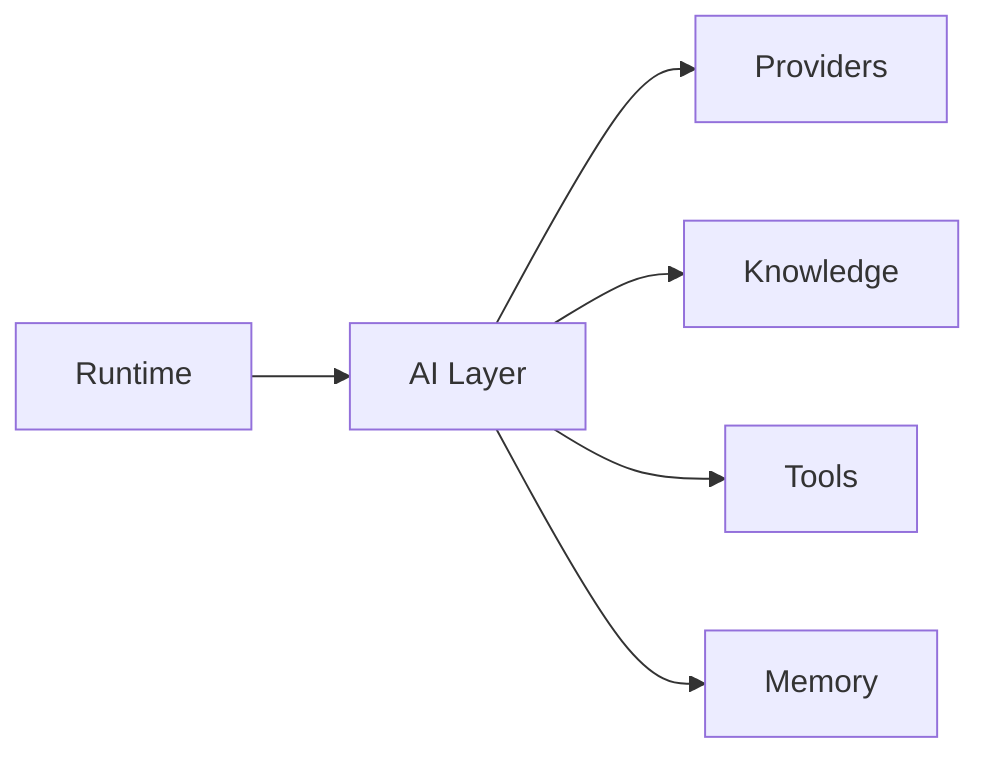

# AI Layer

> AI Social OS

Version: 2.0.0

Status: Stable

Last Updated: 2026-07-25

---

# Overview

AI Layer là tầng trí tuệ (Intelligence Layer) của AI Social OS.

Nếu Platform Layer cung cấp hạ tầng và Runtime Layer chịu trách nhiệm thực thi, thì AI Layer chịu trách nhiệm xây dựng năng lực suy luận (Reasoning), lập kế hoạch (Planning), ghi nhớ (Memory), phối hợp (Coordination) và ra quyết định (Decision Making) của AI Agents.

Đây là nơi tập trung toàn bộ logic liên quan đến Agent Intelligence.

AI Layer được thiết kế độc lập với Runtime và Provider nhằm cho phép thay thế mô hình AI, mở rộng Agent hoặc bổ sung khả năng mới mà không ảnh hưởng đến các thành phần còn lại của hệ thống.

---

# Responsibilities

AI Layer chịu trách nhiệm.

- Agent Architecture
- Agent Lifecycle
- Agent Reasoning
- Agent Planning
- Agent Execution
- Agent Memory
- Agent Context
- Multi-Agent Collaboration
- Model Routing
- Prompt Engineering
- Context Engineering
- Tool Orchestration
- AI Session
- AI Events
- AI Configuration
- AI Observability

AI Layer không chịu trách nhiệm.

- Worker Scheduling
- Infrastructure
- Deployment
- Authentication
- Storage Infrastructure
- Networking

Các nhiệm vụ trên thuộc Runtime hoặc Platform Layer.

---

# Layer Position

```mermaid
flowchart LR
```

AI Layer là cầu nối giữa Runtime và các AI Providers.

---

# Core Concepts

AI Layer được xây dựng quanh một số khái niệm cốt lõi.

### Agent

Một thực thể AI có khả năng.

- nhận mục tiêu
- lập kế hoạch
- suy luận
- gọi Tool
- sử dụng Memory
- cộng tác với Agent khác
- tạo kết quả

---

### Context

Toàn bộ thông tin cần thiết để Agent đưa ra quyết định.

Bao gồm.

- User Input
- Memory
- Knowledge
- Retrieved Documents
- Tool Outputs
- Conversation History
- Runtime Metadata

---

### Memory

Memory lưu giữ trạng thái và tri thức của Agent.

Bao gồm.

- Short-term Memory
- Long-term Memory
- Semantic Memory
- Episodic Memory
- Working Memory

---

### Planning

Planning chia một nhiệm vụ lớn thành nhiều bước nhỏ.

Ví dụ.

```mermaid
flowchart LR
```

---

### Reasoning

Reasoning là quá trình lựa chọn hành động phù hợp.

Ví dụ.

```mermaid
flowchart LR
```

---

### Tool

Tool cho phép Agent tương tác với thế giới bên ngoài.

Ví dụ.

- Search
- Database
- Calendar
- Email
- Browser
- Code Execution
- MCP Server
- External APIs

---

### Model

Model là thành phần thực hiện suy luận ngôn ngữ hoặc đa phương thức.

Ví dụ.

- GPT
- Claude
- Gemini
- Qwen
- DeepSeek
- Llama
- Phi

AI Layer không phụ thuộc vào một Model cụ thể.

---

# AI Layer Architecture



---

# AI Components

AI Layer bao gồm.

```text
Agent

Planning Engine

Reasoning Engine

Memory Engine

Context Engine

Prompt Engine

Tool Engine

Model Router

Inference Engine

Streaming Engine

Session Engine
```

Mỗi thành phần được mô tả chi tiết trong các tài liệu tiếp theo.

---

# Design Goals

AI Layer được xây dựng nhằm đạt được.

- AI Native
- Model Agnostic
- Extensible
- Explainable
- Observable
- Distributed
- Multi-Agent Ready
- Enterprise Ready

---

# Document Structure

```text
01_AI_OVERVIEW

02_AGENT_ARCHITECTURE

03_AGENT_LIFECYCLE

04_AGENT_TYPES

05_AGENT_STATE

06_AGENT_MEMORY

07_AGENT_CONTEXT

08_AGENT_REASONING

09_AGENT_PLANNING

10_AGENT_EXECUTION

11_AGENT_COORDINATION

12_MULTI_AGENT_SYSTEM

13_AGENT_COMMUNICATION

14_AGENT_COLLABORATION

15_AGENT_SUPERVISOR

16_AGENT_ROUTER

17_MODEL_ROUTER

18_PROMPT_ENGINE

19_CONTEXT_ENGINE

20_MEMORY_ENGINE

21_TOOL_ENGINE

22_INFERENCE_ENGINE

23_STREAMING_ENGINE

24_SESSION_ENGINE

25_REASONING_ENGINE

26_PLANNING_ENGINE

27_AI_PIPELINE

28_AI_EVENTS

29_AI_SECURITY

30_AI_OBSERVABILITY

31_AI_CONFIGURATION

32_AI_APIS

33_AI_DEPLOYMENT

34_AI_REFERENCE_ARCHITECTURE

35_AI_ROADMAP
```

---

# Relationships



---

# Guiding Principles

AI Layer tuân theo các nguyên tắc.

- Separation of Concerns
- Model Agnostic
- Tool First
- Context Driven
- Memory Native
- Event Driven
- Extensible
- Observable
- Secure by Default

---

# Summary

AI Layer là tầng trí tuệ của AI Social OS, chịu trách nhiệm xây dựng năng lực suy luận, lập kế hoạch, ghi nhớ và phối hợp của AI Agents.

Thông qua Agent Architecture, Planning Engine, Reasoning Engine, Memory Engine, Context Engine và Model Router, AI Layer cung cấp nền tảng để xây dựng các AI Agent có khả năng mở rộng, cộng tác và hoạt động độc lập trong môi trường doanh nghiệp.