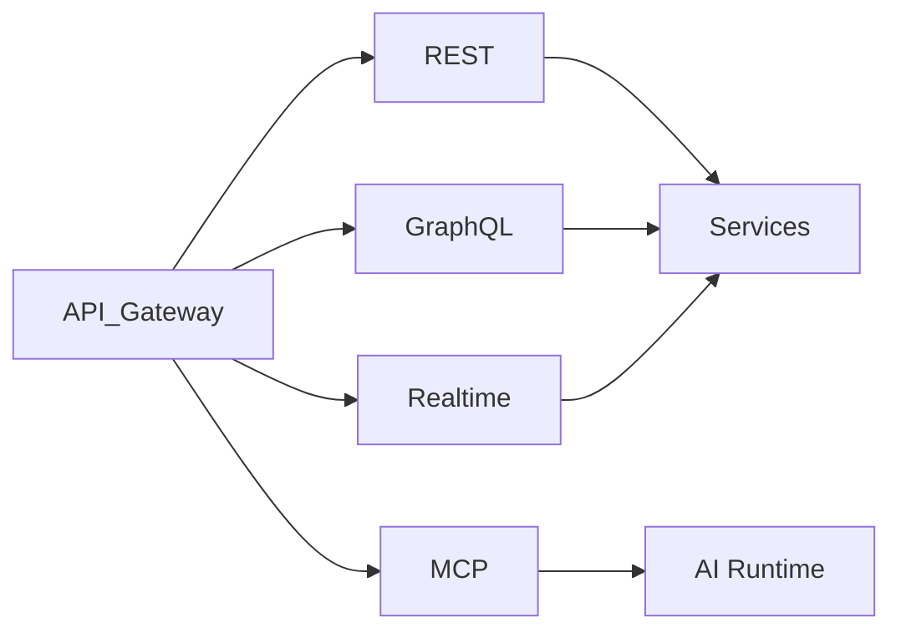

# API Overview

> AI Social OS API Layer

Version: 2.0.0

Status: Stable

Last Updated: 2026-07-25

---

# Table of Contents

- Overview
- Objectives
- API Philosophy
- API Types
- API Consumers
- API Lifecycle
- API Architecture
- API Standards
- API Governance
- Design Principles
- Summary

---

# Overview

API Layer là cổng giao tiếp chuẩn giữa AI Social OS và toàn bộ Client, Services, AI Agents, Plugins cũng như hệ thống bên ngoài.

API được thiết kế theo hướng.

- Cloud Native
- API First
- Event Driven
- Secure by Default

---

# Objectives

API Layer hướng tới.

- Consistency
- Scalability
- Discoverability
- Security
- Observability
- Backward Compatibility

---

# API Philosophy

Triết lý thiết kế.

- API First
- Consumer Driven
- Resource Oriented
- Versioned
- Contract Based

---

# API Types

AI Social OS hỗ trợ.

- REST API
- GraphQL API
- WebSocket API
- Server-Sent Events
- MCP API
- Internal gRPC
- Webhooks

---

# API Consumers

Bao gồm.

- Web Frontend
- Mobile App
- Desktop App
- AI Agents
- Plugins
- Third-party Applications
- Internal Services

---

# API Lifecycle

```mermaid
flowchart LR
```

---

# High-Level Architecture



---

# API Standards

Tuân thủ.

- OpenAPI
- AsyncAPI
- GraphQL Specification
- JSON Schema
- OAuth 2.1
- OpenID Connect

---

# API Governance

Bao gồm.

- Naming Convention
- Versioning
- Review Process
- Documentation
- Deprecation Policy

---

# Design Principles

- API First
- Consistent
- Secure
- Observable
- Backward Compatible

---

# Summary

API Layer cung cấp nền tảng giao tiếp thống nhất giữa toàn bộ thành phần trong AI Social OS, đồng thời đảm bảo khả năng mở rộng, bảo mật và dễ tích hợp.