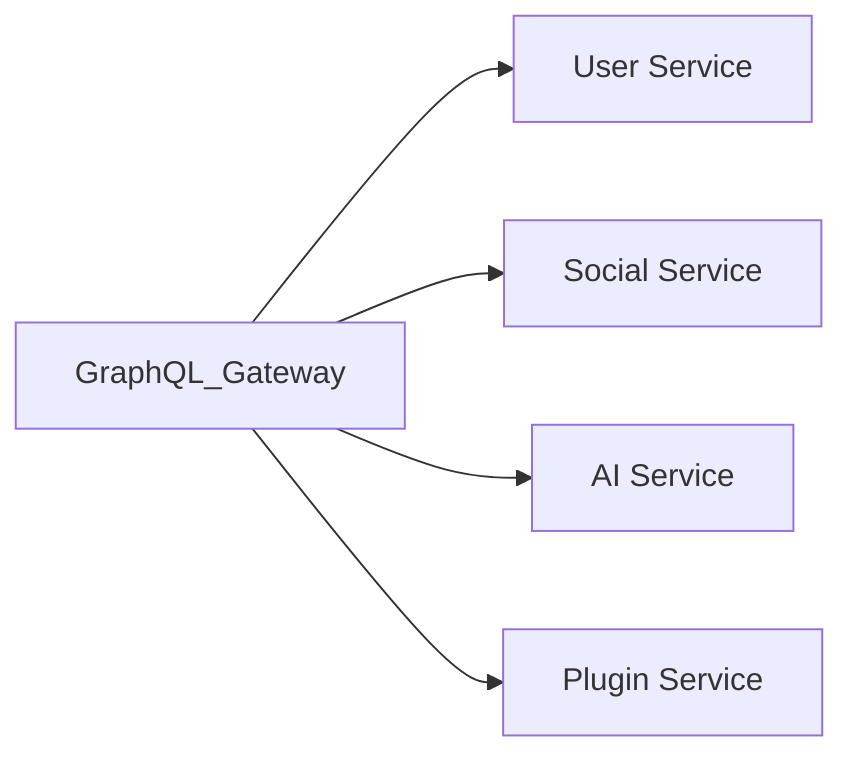

# GraphQL API

> AI Social OS API Layer

Version: 2.0.0

Status: Stable

Last Updated: 2026-07-25

---

# Table of Contents

- Overview
- Objectives
- Architecture
- Schema Design
- Queries
- Mutations
- Subscriptions
- Federation
- Caching
- Security
- Best Practices
- Summary

---

# Overview

GraphQL API cung cấp khả năng truy vấn dữ liệu linh hoạt cho Frontend và AI Applications.

GraphQL đặc biệt phù hợp với.

- Dashboard
- Mobile Applications
- AI Workspace
- Admin Console

---

# Objectives

GraphQL hướng tới.

- Flexible Queries
- Reduced Over-fetching
- Reduced Under-fetching
- Strong Typing
- Developer Productivity

---

# Architecture



---

# Schema Design

Ví dụ.

```graphql
type User {
    id: ID!
    name: String!
    email: String!
}

type Post {
    id: ID!
    title: String!
    content: String!
    author: User!
}
```

Schema là nguồn chân lý (Single Source of Truth).

---

# Queries

Ví dụ.

```graphql
query {

  user(id:"123") {

    name

    email

  }

}
```

Client chỉ nhận dữ liệu cần thiết.

---

# Mutations

Ví dụ.

```graphql
mutation {

  createPost(

    title:"Hello"

    content:"World"

  ){

      id

      title

  }

}
```

---

# Subscriptions

Dùng cho Realtime.

Ví dụ.

- AI Streaming
- Notifications
- Live Collaboration
- Workflow Status

---

# Federation

Schema được chia nhỏ.

```mermaid
flowchart LR
```

---

# Caching

Áp dụng.

- Query Cache
- Persisted Queries
- CDN Cache
- Response Cache

---

# Security

Bao gồm.

- Authentication
- Authorization
- Depth Limiting
- Complexity Analysis
- Rate Limiting

---

# Best Practices

- Small Resolvers
- DataLoader
- Persisted Queries
- Schema Versioning
- Avoid N+1 Queries

---

# Summary

GraphQL API cung cấp khả năng truy vấn dữ liệu linh hoạt và hiệu quả, đặc biệt phù hợp với các ứng dụng Frontend hiện đại và AI Dashboard của AI Social OS.