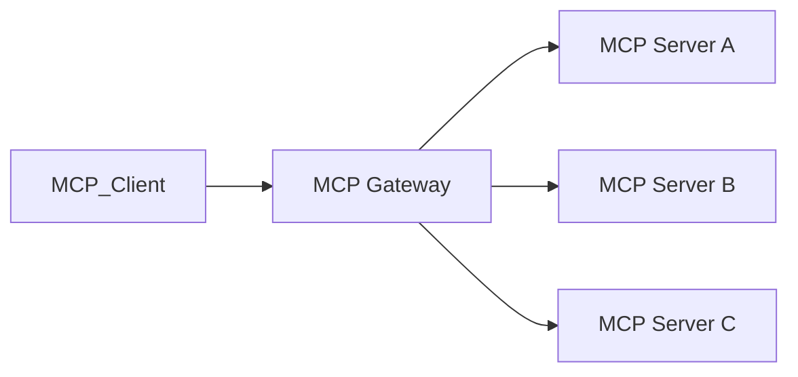

# MCP API

> AI Social OS API Layer

Version: 2.0.0

Status: Stable

Last Updated: 2026-07-25

---

# Table of Contents

- Overview
- Objectives
- MCP Architecture
- Server Registration
- Tool Discovery
- Resource Access
- Prompt Templates
- Authentication
- Authorization
- Monitoring
- Design Principles
- Summary

---

# Overview

MCP API triển khai giao thức Model Context Protocol (MCP) để AI Agents có thể khám phá và sử dụng Tool, Resource và Prompt từ các MCP Servers.

MCP đóng vai trò là lớp tích hợp chuẩn giữa AI Runtime và các hệ thống bên ngoài.

---

# Objectives

MCP API hướng tới.

- Standardized Tool Access
- Dynamic Discovery
- Secure Execution
- Multi-provider Compatibility
- Extensibility

---

# MCP Architecture

---

# Server Registration

Mỗi MCP Server phải đăng ký.

- Server ID
- Version
- Capabilities
- Authentication Method
- Supported Resources

---

# Tool Discovery

AI Agent có thể khám phá.

- Tools
- Resources
- Prompt Templates
- Capabilities

mà không cần Hardcode.

---

# Resource Access

Ví dụ.

- Documents
- Database
- CRM
- Calendar
- Knowledge Base
- Internal APIs

Tất cả đều được truy cập thông qua MCP.

---

# Prompt Templates

MCP Server có thể cung cấp.

- System Prompts
- Task Templates
- Workflow Prompts
- Structured Instructions

---

# Authentication

Hỗ trợ.

- OAuth 2.1
- JWT
- API Keys
- mTLS

---

# Authorization

Quyền truy cập được đánh giá dựa trên.

- User
- AI Agent
- Tenant
- Tool
- Resource
- Policy Engine

---

# Monitoring

Theo dõi.

- Tool Calls
- Latency
- Error Rate
- Token Usage
- Resource Access

---

# Design Principles

- Protocol First
- Secure by Default
- Dynamic Discovery
- Policy Driven
- Vendor Neutral

---

# Summary

MCP API cung cấp giao diện chuẩn để AI Agents kết nối với các MCP Servers, khám phá công cụ và tài nguyên một cách an toàn, mở rộng và không phụ thuộc nhà cung cấp.