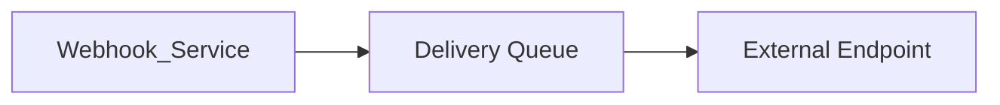

# Webhooks

> AI Social OS API Layer

Version: 2.0.0

Status: Stable

Last Updated: 2026-07-25

---

# Table of Contents

- Overview
- Objectives
- Webhook Architecture
- Event Model
- Registration
- Delivery
- Retry Strategy
- Security
- Monitoring
- Best Practices
- Summary

---

# Overview

Webhooks cho phép AI Social OS chủ động gửi sự kiện tới các hệ thống bên ngoài ngay khi sự kiện xảy ra.

Webhooks được sử dụng để tích hợp theo mô hình Event-Driven.

---

# Objectives

Webhook hướng tới.

- Near Realtime Integration
- Loose Coupling
- Reliable Delivery
- Easy Integration

---

# Webhook Architecture



---

# Event Model

Ví dụ.

- user.created
- workspace.created
- post.published
- workflow.completed
- ai.job.finished
- plugin.installed
- payment.completed

---

# Registration

Mỗi Webhook bao gồm.

- Endpoint URL
- Event Types
- Secret
- Status
- Retry Policy

---

# Delivery

Payload.

```json
{
  "id":"evt_xxx",
  "type":"workflow.completed",
  "timestamp":"...",
  "data":{}
}
```

Header.

```text
X-Webhook-ID
X-Signature
X-Timestamp
```

---

# Retry Strategy

Nếu Delivery thất bại.

```mermaid
flowchart LR
```

---

# Security

Áp dụng.

- HTTPS Only
- HMAC Signature
- Replay Protection
- IP Allowlist
- Timestamp Validation

---

# Monitoring

Theo dõi.

- Delivery Success Rate
- Retry Count
- Endpoint Latency
- Failed Deliveries

---

# Best Practices

- Idempotent Receiver
- Verify Signature
- Fast Response (<5s)
- Queue Processing
- Retry Support

---

# Summary

Webhook cung cấp cơ chế tích hợp hướng sự kiện giữa AI Social OS và các hệ thống bên ngoài, đảm bảo truyền tải đáng tin cậy, có xác thực và khả năng tự phục hồi khi xảy ra lỗi.