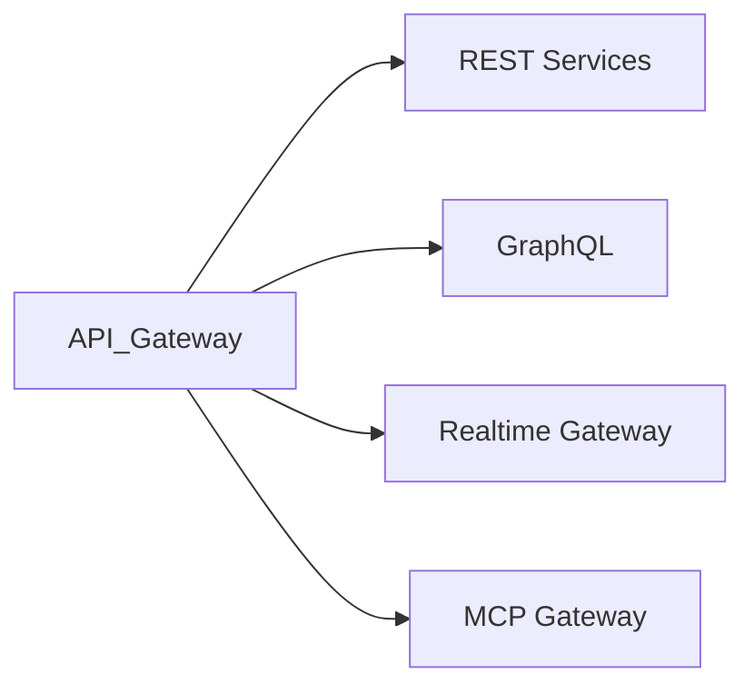

# API Gateway

> AI Social OS API Layer

Version: 2.0.0

Status: Stable

Last Updated: 2026-07-25

---

# Table of Contents

- Overview
- Objectives
- Gateway Architecture
- Routing
- Authentication
- Authorization
- Traffic Management
- Rate Limiting
- Observability
- Service Discovery
- High Availability
- Summary

---

# Overview

API Gateway là điểm vào duy nhất (Single Entry Point) cho toàn bộ API của AI Social OS.

Gateway chịu trách nhiệm xử lý các yêu cầu trước khi chuyển tới Services.

---

# Objectives

API Gateway hướng tới.

- Unified Access
- Secure Access
- Traffic Control
- API Governance
- Observability

---

# Gateway Architecture

---

# Routing

Gateway thực hiện.

- Path Routing
- Host Routing
- Header Routing
- Version Routing

---

# Authentication

Gateway hỗ trợ.

- JWT
- OAuth 2.1
- API Key
- mTLS

---

# Authorization

Gateway tích hợp với.

- IAM
- Policy Engine
- RBAC
- ABAC

---

# Traffic Management

Hỗ trợ.

- Load Balancing
- Circuit Breaker
- Retry
- Timeout
- Request Queue

---

# Rate Limiting

Ví dụ.

| API Type | Limit |
|----------|-------|
| Public API | 100 req/min |
| Authenticated User | 1000 req/min |
| Internal Service | Unlimited (Policy Controlled) |

---

# Observability

Theo dõi.

- Request Count
- Error Rate
- Latency
- Throughput
- Response Size

---

# Service Discovery

Gateway tích hợp.

- Kubernetes Service Discovery
- Service Mesh
- DNS

---

# High Availability

Gateway hỗ trợ.

- Horizontal Scaling
- Health Checks
- Auto Recovery
- Multi-region Deployment

---

# Summary

API Gateway là lớp điều phối trung tâm của AI Social OS, cung cấp khả năng định tuyến, xác thực, phân quyền, quản lý lưu lượng và quan sát toàn bộ hệ thống API.