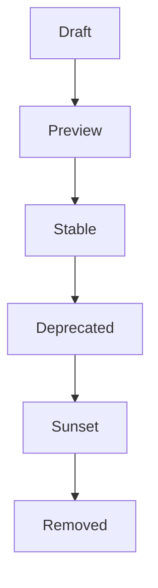
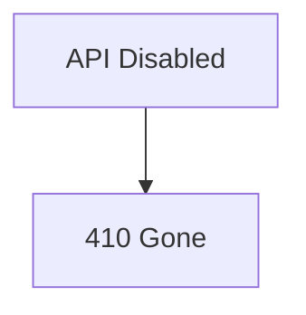
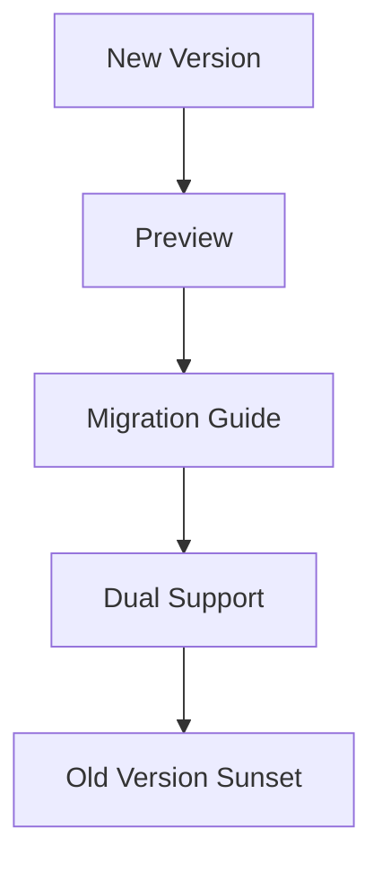

# API Versioning

> AI Social OS API Layer

Version: 2.0.0

Status: Stable

Last Updated: 2026-07-25

---

# Table of Contents

- Overview
- Objectives
- Versioning Strategy
- Version Lifecycle
- Backward Compatibility
- Breaking Changes
- Deprecation Policy
- Sunset Policy
- Migration Strategy
- Monitoring
- Design Principles
- Summary

---

# Overview

API Versioning đảm bảo AI Social OS có thể phát triển API mà không làm gián đoạn các ứng dụng đang sử dụng.

Versioning giúp duy trì tính tương thích và hỗ trợ quá trình nâng cấp dần dần.

---

# Objectives

API Versioning hướng tới.

- Backward Compatibility
- Predictable Evolution
- Safe Migration
- Long-term Support
- Stable Integrations

---

# Versioning Strategy

REST API sử dụng URL Versioning.

```text
/v1/users

/v2/users
```

GraphQL sử dụng.

- Schema Evolution
- Field Deprecation

MCP Protocol sử dụng.

- Protocol Version
- Capability Negotiation

---

# Version Lifecycle



---

# Backward Compatibility

Nguyên tắc.

Không phá vỡ Client cũ.

Cho phép.

- Add New Fields
- Add Optional Parameters
- Add New Endpoints

Không cho phép.

- Remove Fields
- Rename Fields
- Change Response Structure
- Change Business Meaning

---

# Breaking Changes

Breaking Changes chỉ được thực hiện khi.

- Major Version
- Public Announcement
- Migration Guide
- Deprecation Period

---

# Deprecation Policy

Ví dụ.

```http
Deprecation: true

Sunset: 2027-06-30
```

Documentation phải ghi rõ.

- Alternative API
- Migration Steps
- Removal Date

---

# Sunset Policy

Sau thời gian Sunset.



---

# Migration Strategy

Quy trình.



---

# Monitoring

Theo dõi.

- Version Adoption
- Deprecated API Usage
- Migration Progress
- Error Rate

---

# Design Principles

- Backward Compatible
- Explicit Versioning
- Long Deprecation Window
- Clear Migration
- Stable Contracts

---

# Summary

API Versioning giúp AI Social OS phát triển API một cách an toàn, đảm bảo khả năng tương thích ngược và cung cấp lộ trình nâng cấp rõ ràng cho các ứng dụng tích hợp.