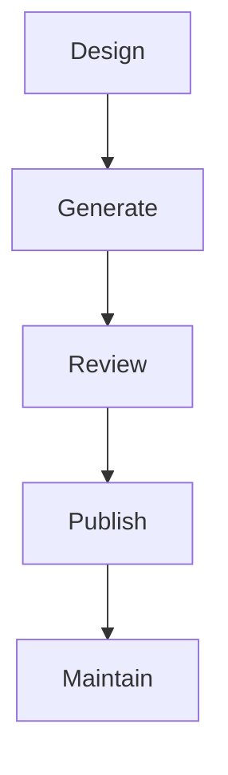

# API Documentation

> AI Social OS API Layer

Version: 2.0.0

Status: Stable

Last Updated: 2026-07-25

---

# Table of Contents

- Overview
- Objectives
- Documentation Standards
- OpenAPI
- AsyncAPI
- GraphQL Documentation
- MCP Documentation
- SDK Generation
- API Explorer
- Examples
- Documentation Lifecycle
- Summary

---

# Overview

API Documentation là nguồn tài liệu chính thức cho mọi API của AI Social OS.

Documentation luôn đồng bộ với Source Code.

---

# Objectives

Documentation hướng tới.

- Discoverability
- Developer Experience
- Accuracy
- Consistency
- Automation

---

# Documentation Standards

Mỗi API phải có.

- Description
- Request
- Response
- Authentication
- Error Codes
- Examples
- Rate Limits
- Changelog

---

# OpenAPI

REST API được mô tả bằng.

```text
OpenAPI 3.1
```

Bao gồm.

- Paths
- Schemas
- Components
- Security
- Examples

---

# AsyncAPI

Realtime API được mô tả bằng.

```text
AsyncAPI
```

Bao gồm.

- Channels
- Events
- Payload Schemas

---

# GraphQL Documentation

Schema tự mô tả.

Bao gồm.

- Types
- Queries
- Mutations
- Subscriptions
- Directives

---

# MCP Documentation

Mỗi MCP Server công bố.

- Capabilities
- Tools
- Resources
- Prompt Templates
- Authentication

---

# SDK Generation

Tự động sinh.

- TypeScript SDK
- Python SDK
- Go SDK
- Java SDK
- C# SDK

Từ OpenAPI Specification.

---

# API Explorer

Developer Portal cung cấp.

- Interactive Playground
- Authentication Testing
- Example Requests
- Example Responses

---

# Examples

Ví dụ phải bao gồm.

- cURL
- JavaScript
- Python
- Go

---

# Documentation Lifecycle



---

# Summary

API Documentation cung cấp tài liệu đầy đủ, chính xác và có thể sinh tự động, giúp lập trình viên tích hợp AI Social OS nhanh chóng và nhất quán.