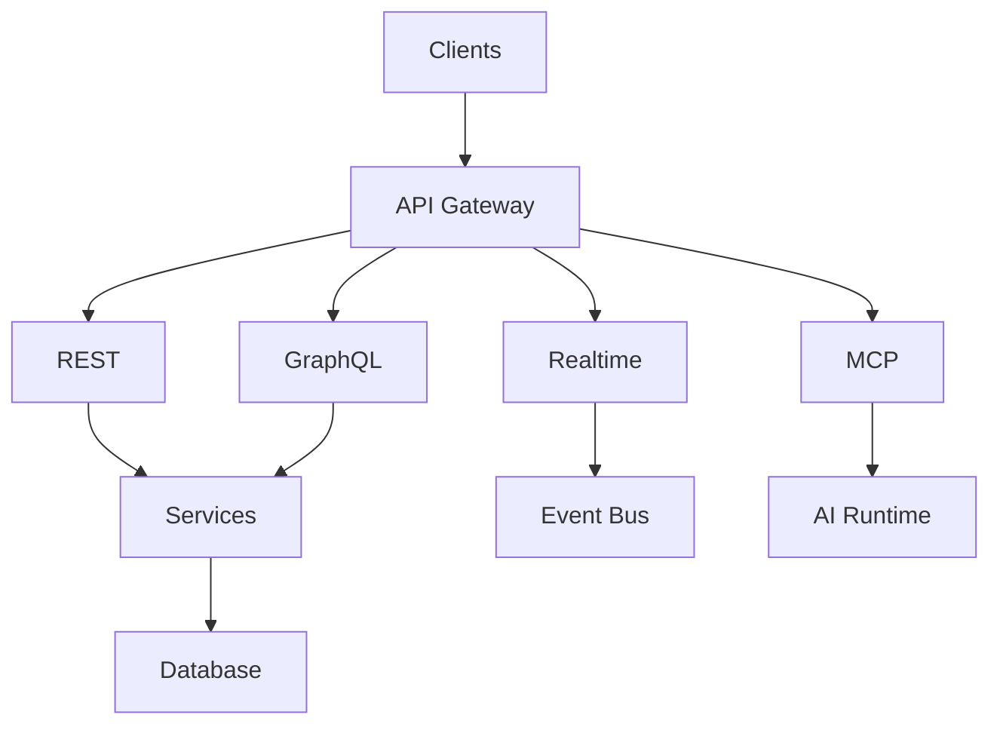
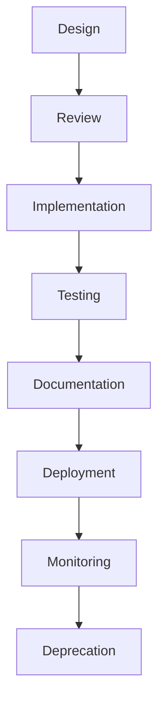

# API Layer Summary

> AI Social OS API Layer

Version: 2.0.0

Status: Stable

Last Updated: 2026-07-25

---

# API Categories

## Synchronous APIs

- REST API
- GraphQL API
- Internal gRPC

---

## Realtime APIs

- WebSocket
- Server-Sent Events
- Streaming APIs

---

## Integration APIs

- MCP API
- Webhooks
- Third-party APIs

---

# High-Level Architecture

---

# API Lifecycle

---

# Core Components

| Component | Responsibility |
|------------|----------------|
| API Gateway | Routing & Traffic Management |
| REST API | CRUD & Business Services |
| GraphQL API | Flexible Data Queries |
| Realtime API | Streaming & Notifications |
| MCP API | AI Tool & Resource Integration |
| Webhooks | Event Delivery |
| Documentation | Developer Portal |

---

# Security Controls

Toàn bộ API áp dụng.

- OAuth 2.1
- JWT
- OpenID Connect
- RBAC
- ABAC
- Rate Limiting
- Audit Logging
- TLS 1.3

---

# API Standards

| Standard | Purpose |
|-----------|---------|
| OpenAPI 3.1 | REST Documentation |
| AsyncAPI | Event APIs |
| GraphQL Spec | GraphQL |
| JSON Schema | Validation |
| MCP | AI Tool Integration |

---

# Monitoring Metrics

Theo dõi.

- Request Rate
- Error Rate
- Response Time
- Availability
- Throughput
- Active Connections
- API Version Adoption

---

# Design Principles

- API First
- Contract First
- Consumer Driven
- Secure by Default
- Observable
- Backward Compatible

---

# Future Evolution

API Layer có thể mở rộng thêm.

- AI-generated SDKs
- Semantic API Discovery
- GraphQL Federation 2
- Multi-region API Gateway
- AI-native APIs
- Autonomous API Governance

---

# Summary

API Layer là nền tảng giao tiếp thống nhất của AI Social OS, kết nối người dùng, AI Agents, Plugins và các hệ thống bên ngoài thông qua REST, GraphQL, Realtime, MCP và Webhooks. Kiến trúc này đảm bảo khả năng mở rộng, bảo mật, quan sát và tích hợp ở quy mô doanh nghiệp.