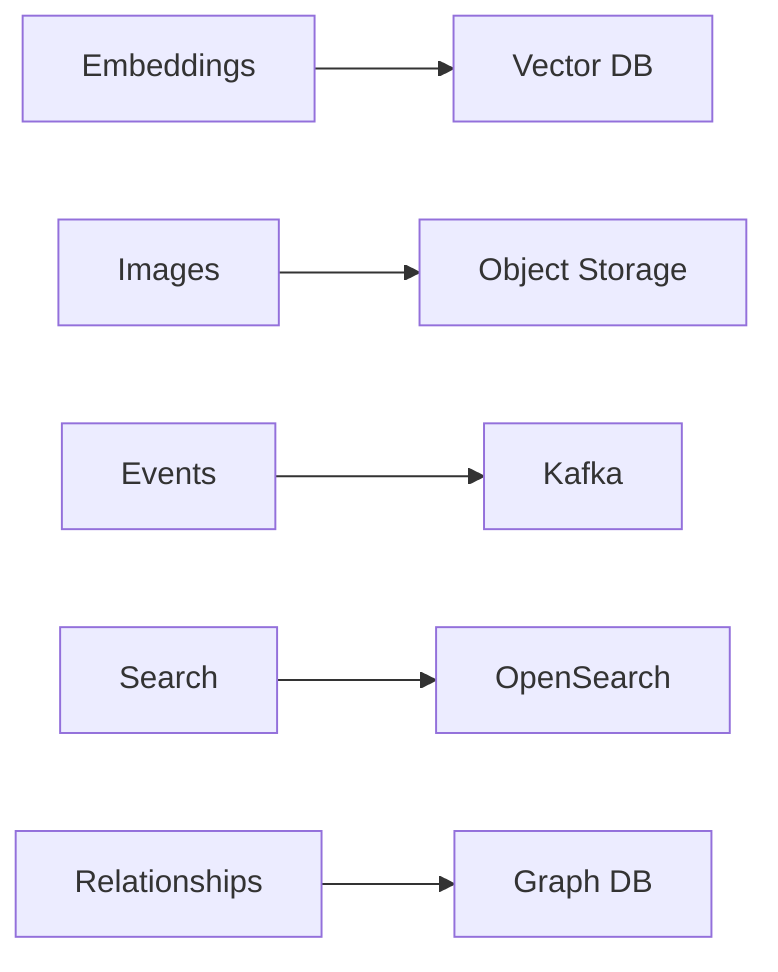
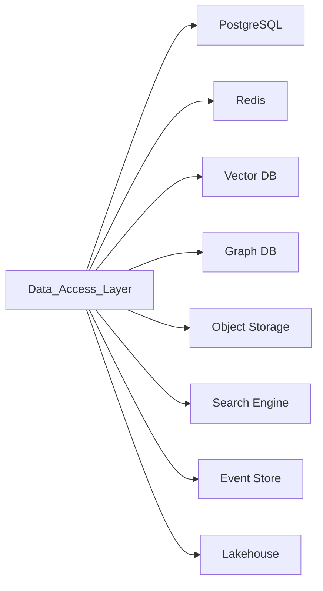
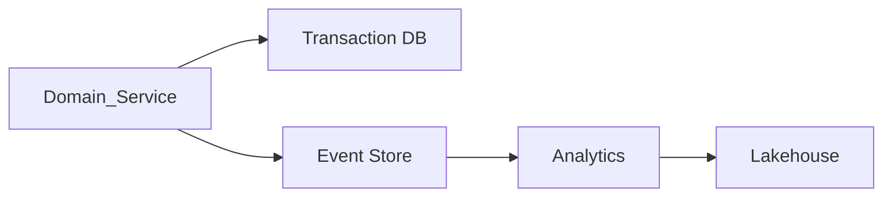
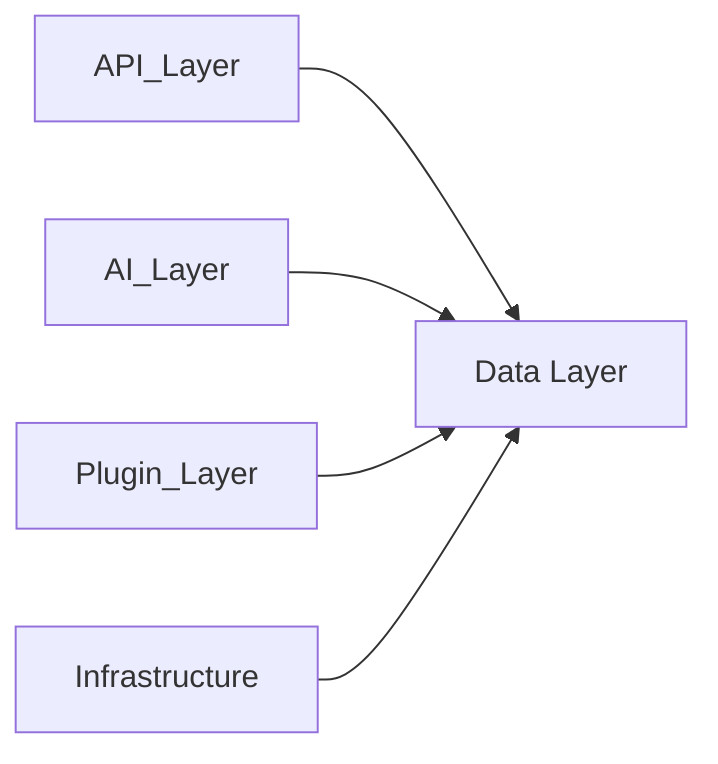

# Data Architecture

> AI Social OS Data Layer

Version: 2.0.0

Status: Stable

Last Updated: 2026-07-25

---

# Table of Contents

- Overview
- Objectives
- Why Data Layer
- Design Principles
- High-Level Architecture
- Storage Types
- Data Domains
- Data Flow
- Integration with Other Layers
- Scalability
- Design Decisions
- Summary

---

# Overview

Data Layer là nền tảng lưu trữ và quản lý toàn bộ dữ liệu trong AI Social OS.

Khác với các hệ thống truyền thống chỉ sử dụng một cơ sở dữ liệu, AI Social OS áp dụng Polyglot Persistence, kết hợp nhiều loại Storage để tối ưu cho từng bài toán.

Data Layer cung cấp.

- Transaction Storage
- Object Storage
- Cache
- Vector Database
- Graph Database
- Search Index
- Event Store
- Lakehouse

---

# Objectives

Data Layer hướng tới.

- High Availability
- Horizontal Scalability
- Strong Consistency
- Event Driven
- AI Native
- Analytics Ready
- Enterprise Ready
- Multi-Tenant

---

# Why Data Layer

Không có một loại Database nào phù hợp cho mọi nhu cầu.

Ví dụ.

Data Layer kết hợp các công nghệ này dưới một kiến trúc thống nhất.

---

# Design Principles

Data Layer được xây dựng theo.

- Polyglot Persistence
- Domain Driven
- Event Sourcing
- CQRS Ready
- Immutable Events
- Scalable
- Observable
- Secure

---

# High-Level Architecture

---

# Storage Types

## Relational Database

Lưu.

- Users
- Profiles
- Orders
- Billing
- Permissions

---

## Object Storage

Lưu.

- Images
- Videos
- Documents
- AI Models
- Attachments

---

## Cache

Lưu.

- Sessions
- Feed Cache
- Query Cache
- AI Context

---

## Vector Database

Lưu.

- Embeddings
- Semantic Memory
- Documents
- AI Retrieval

---

## Graph Database

Lưu.

- Social Graph
- Knowledge Graph
- Entity Relations

---

## Search Engine

Lưu.

- Search Index
- Full Text
- Hybrid Search

---

## Event Store

Lưu.

- Domain Events
- Audit Events
- Workflow Events

---

## Lakehouse

Lưu.

- Historical Data
- Analytics
- AI Training
- Business Intelligence

---

# Data Domains

Data Layer được chia thành.

- Identity
- Social
- AI
- Workflow
- Plugin
- Analytics
- Billing
- Security

Mỗi Domain sở hữu dữ liệu riêng.

---

# Data Flow

---

# Integration with Other Layers

---

# Scalability

Data Layer hỗ trợ.

- Read Replicas
- Sharding
- Partitioning
- Multi-region
- Backup
- Failover

---

# Design Decisions

| Decision | Reason |
|----------|--------|
| Polyglot Persistence | Tối ưu từng loại dữ liệu |
| Event Store riêng | Audit và Replay |
| Vector DB riêng | AI Retrieval |
| Graph DB riêng | Social Graph |
| Lakehouse riêng | Analytics |
| Object Storage | Media và Models |
| Cache Layer | Hiệu năng |

---

# Summary

Data Layer là nền tảng lưu trữ trung tâm của AI Social OS.

Thông qua kiến trúc Polyglot Persistence, Event Sourcing và Domain-driven Design, Data Layer cung cấp khả năng lưu trữ linh hoạt, mở rộng và tối ưu cho cả giao dịch thời gian thực, AI Retrieval, phân tích dữ liệu và xử lý quy mô doanh nghiệp.