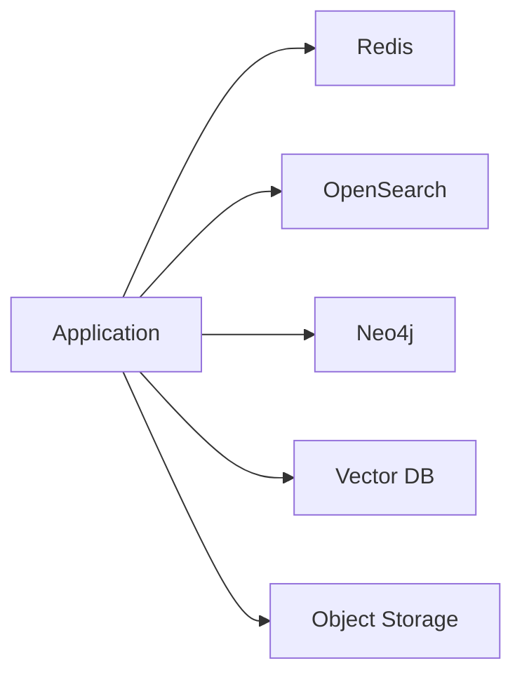

# Database Strategy

> AI Social OS Data Layer

Version: 2.0.0

Status: Stable

Last Updated: 2026-07-25

---

> **Giai đoạn áp dụng:** MVP — dùng ngay từ Phase 0-2 (trọng tâm PostgreSQL làm OLTP chính). Lý do: PostgreSQL + Redis + Object Storage + Qdrant là 4 kho dữ liệu tối thiểu đủ vận hành Foundation → AI Runtime → AI Platform; các mảnh còn lại của Polyglot Persistence mô tả trong tài liệu này (Graph DB, Search Engine, Event Store riêng, Data Lakehouse) thuộc Giai đoạn sau — xem banner phasing riêng trong docs/data/09_KNOWLEDGE_GRAPH.md, docs/data/10_SEARCH_ENGINE.md, docs/data/05_EVENT_STORE.md, docs/data/12_DATA_LAKEHOUSE.md.

---

# Table of Contents

- Overview
- Objectives
- Polyglot Persistence
- Storage Selection
- Database Matrix
- Read/Write Strategy
- Replication
- Partitioning
- Multi-region
- Consistency
- Technology Recommendations
- Design Decisions
- Summary

---

# Overview

AI Social OS không sử dụng một Database duy nhất.

Mỗi loại dữ liệu được lưu trên hệ thống tối ưu nhất.

Đây là chiến lược Polyglot Persistence.

---

# Objectives

Database Strategy hướng tới.

- Performance
- Reliability
- Scalability
- Cost Optimization
- AI Readiness
- Vendor Independence

---

# Polyglot Persistence



---

# Database Selection

## PostgreSQL

Lưu.

- Users
- Billing
- Organizations
- Workspaces
- Transactions
- Permissions

Đặc điểm.

- ACID
- Strong Consistency
- SQL

---

## Redis

Lưu.

- Cache
- Sessions
- Feed Cache
- Rate Limit
- Temporary Context

Đặc điểm.

- In-memory
- Millisecond Latency

---

## Vector Database

Lưu.

- Embeddings
- AI Memory
- Documents
- Semantic Search

Ví dụ.

- Qdrant
- Milvus
- Weaviate
- pgvector

---

## Graph Database

Lưu.

- Social Graph
- Knowledge Graph
- Relationships

Ví dụ.

- Neo4j
- Memgraph

---

## Search Engine

Lưu.

- Full-text Index
- Hybrid Search
- Autocomplete

Ví dụ.

- OpenSearch
- Elasticsearch

---

## Object Storage

Lưu.

- Images
- Videos
- Documents
- AI Models

Ví dụ.

- S3
- MinIO

---

# Database Matrix

| Data Type | Storage |
|------------|---------|
| User | PostgreSQL |
| Post | PostgreSQL |
| Images | Object Storage |
| Embeddings | Vector DB |
| Relationships | Graph DB |
| Search | OpenSearch |
| Cache | Redis |
| Events | Event Store |

---

# Read / Write Strategy

```mermaid
flowchart LR
```

CQRS có thể được áp dụng ở các Domain lớn.

---

# Replication

Hỗ trợ.

- Primary
- Read Replica
- Multi-region Replica

---

# Partitioning

Dữ liệu lớn được Partition theo.

- Tenant
- Time
- Workspace
- Region

---

# Consistency

Áp dụng.

- Strong Consistency cho Transaction
- Eventual Consistency cho Analytics
- Near Real-time cho Search

---

# Technology Recommendations

| Layer | Recommendation |
|--------|----------------|
| Relational | PostgreSQL |
| Cache | Redis |
| Search | OpenSearch |
| Vector | Qdrant |
| Graph | Neo4j |
| Object | S3 / MinIO |
| Event | Kafka + Event Store |

---

# Design Decisions

| Decision | Reason |
|----------|--------|
| Polyglot Persistence | Hiệu năng tối ưu |
| PostgreSQL là Primary DB | Ổn định |
| Redis riêng | Cache tốc độ cao |
| Search độc lập | Không ảnh hưởng OLTP |
| Vector DB riêng | AI Native |
| Object Storage riêng | Media Scale |

---

# Summary

Database Strategy lựa chọn công nghệ lưu trữ phù hợp cho từng loại dữ liệu thay vì cố gắng sử dụng một cơ sở dữ liệu duy nhất.

Chiến lược này giúp AI Social OS đạt hiệu năng cao, khả năng mở rộng tốt và sẵn sàng cho các tác vụ AI, Social và Analytics ở quy mô lớn.