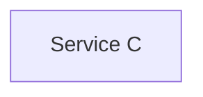
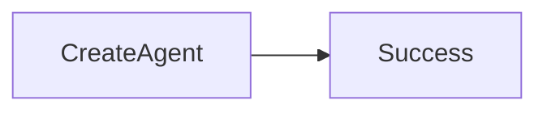

# Transaction Model

> AI Social OS Data Layer

Version: 2.0.0

Status: Stable

Last Updated: 2026-07-25

---

# Table of Contents

- Overview
- Objectives
- Transaction Principles
- Transaction Types
- Local Transactions
- Distributed Transactions
- Saga Pattern
- Outbox Pattern
- Idempotency
- Concurrency Control
- Isolation Levels
- Retry Strategy
- Failure Recovery
- Design Principles
- Summary

---

# Overview

Transaction Model định nghĩa cách dữ liệu được ghi và đồng bộ trong AI Social OS.

Hệ thống ưu tiên.

- Strong Consistency trong Domain
- Eventual Consistency giữa các Domain

Không sử dụng Distributed ACID Transaction giữa Microservices.

---

# Objectives

Transaction Model hướng tới.

- Reliability
- Consistency
- Scalability
- Recoverability
- High Throughput
- Event Driven

---

# Transaction Principles

Một Transaction chỉ nên nằm trong một Domain.

```mermaid
flowchart LR
```

Không thực hiện Transaction xuyên nhiều Database.

---

# Transaction Types

## Local Transaction

```mermaid
flowchart LR
```

Được sử dụng cho.

- CRUD
- Billing
- Identity
- Configuration

---

## Distributed Workflow

Nếu nhiều Service tham gia.



Không sử dụng XA Transaction.

---

# Saga Pattern

Saga điều phối các bước.



Nếu lỗi.

```mermaid
flowchart LR
```

---

# Compensation

Ví dụ.

```mermaid
flowchart LR
```

Mỗi Service tự định nghĩa Compensation Logic.

---

# Outbox Pattern

Sau khi Commit.

```mermaid
flowchart LR
```

Giúp tránh mất Event.

---

# Idempotency

Mỗi Request có.

```yaml
idempotencyKey:
```

Nếu Request được gửi lại.

```mermaid
flowchart LR
```

---

# Concurrency Control

Sử dụng.

- Optimistic Locking
- Version Number
- Compare-and-Swap

Ví dụ.

```yaml
version:
5
```

---

# Isolation Levels

Khuyến nghị.

| Use Case | Isolation |
|----------|-----------|
| CRUD | Read Committed |
| Billing | Repeatable Read |
| Financial | Serializable |

---

# Retry Strategy

Có thể Retry.

- Network Error
- Timeout
- Temporary Failure

Không Retry.

- Validation Error
- Business Rule Error

---

# Failure Recovery

```mermaid
flowchart LR
```

---

# Events

```text
TransactionStarted

TransactionCommitted

TransactionRolledBack

TransactionFailed
```

---

# Design Principles

- Local First
- Event Driven
- Idempotent
- Retryable
- Observable
- Recoverable

---

# Summary

Transaction Model giúp AI Social OS duy trì tính nhất quán của dữ liệu thông qua Local Transaction, Saga Pattern và Outbox Pattern, đồng thời tránh các Distributed Transaction phức tạp và khó mở rộng.