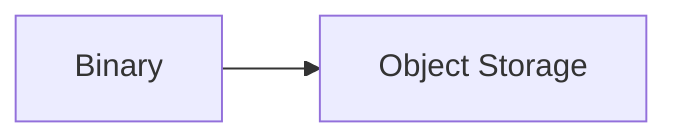
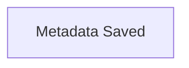
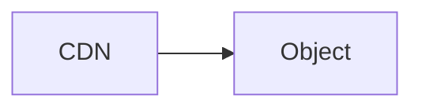
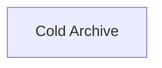

# Object Storage

> AI Social OS Data Layer

Version: 2.0.0

Status: Stable

Last Updated: 2026-07-25

---

# Table of Contents

- Overview
- Objectives
- Why Object Storage
- Architecture
- Storage Classes
- Object Model
- Metadata
- Upload Workflow
- Download Workflow
- Versioning
- Lifecycle Management
- CDN Integration
- Security
- Backup
- Design Principles
- Summary

---

# Overview

Object Storage chịu trách nhiệm lưu trữ toàn bộ dữ liệu phi cấu trúc trong AI Social OS.

Bao gồm.

- Images
- Videos
- Audio
- Documents
- AI Models
- Dataset
- Plugin Packages
- Logs
- Backups

Object Storage không lưu Business Data.

---

# Objectives

Object Storage hướng tới.

- Unlimited Scalability
- High Availability
- Low Cost
- CDN Ready
- Immutable Objects
- Versioning
- Multi-region

---

# Why Object Storage

Không nên lưu Binary trong Database.

```mermaid
flowchart LR
```

Thay vào đó.



---

# Architecture


---

# Storage Classes

## Hot Storage

- Images
- Avatar
- Attachments

---

## Warm Storage

- AI Dataset
- Reports
- Exports

---

## Cold Storage

- Archive
- Backup
- Historical Files

---

# Object Model

Mỗi Object gồm.

```yaml
objectId:

bucket:

key:

mimeType:

size:

checksum:

createdAt:

owner:

tenantId:
```

---

# Bucket Structure

Ví dụ.

```text
avatars/

posts/

videos/

documents/

datasets/

plugins/

models/

logs/

backups/
```

---

# Metadata

Metadata lưu trong PostgreSQL.

Ví dụ.

```yaml
filename:

extension:

contentType:

storageProvider:

region:

visibility:
```

---

# Upload Workflow



---

# Download Workflow



---

# Versioning

Object hỗ trợ.

```mermaid
flowchart LR
```

Cho phép Rollback.

---

# Lifecycle Management

Ví dụ.



---

# CDN Integration

Static Assets được phục vụ qua CDN.

Ví dụ.

- CloudFront
- Cloudflare
- Fastly

---

# Security

Object Storage hỗ trợ.

- Signed URL
- Encryption
- IAM Policy
- Bucket Policy
- Tenant Isolation

---

# Backup

Object được sao lưu.

- Multi-region
- Versioning
- Snapshot

---

# Recommended Technologies

| Component | Recommendation |
|-----------|----------------|
| Cloud | Amazon S3 |
| Self-hosted | MinIO |
| CDN | CloudFront / Cloudflare |

---

# Design Principles

- Immutable Objects
- Metadata Separation
- Versioned
- Multi-region
- CDN First

---

# Summary

Object Storage cung cấp nền tảng lưu trữ dữ liệu phi cấu trúc với khả năng mở rộng gần như vô hạn, tích hợp CDN, Versioning và Lifecycle Management, đáp ứng nhu cầu lưu trữ media, AI models và tài liệu của AI Social OS.