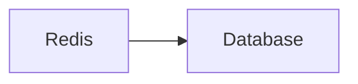
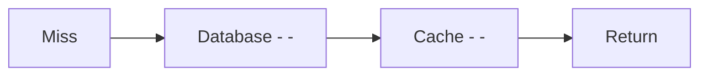

    # Cache Layer

> AI Social OS Data Layer

Version: 2.0.0

Status: Stable

Last Updated: 2026-07-25

---

> **Giai đoạn áp dụng:** MVP — dùng ngay từ Phase 0-2. Lý do: Redis nằm trong Deliverables của Phase 0 (docs/ROADMAP.md) và cần thiết ngay để giảm tải PostgreSQL cho Session Cache, Feed Cache, Rate Limit và AI Cache từ những phase đầu tiên.

---

# Table of Contents

- Overview
- Objectives
- Cache Architecture
- Cache Types
- Cache Strategy
- Cache Invalidation
- Distributed Cache
- Session Cache
- Feed Cache
- AI Cache
- Metrics
- Design Principles
- Summary

---

# Overview

Cache Layer giảm tải Database và cải thiện tốc độ phản hồi của hệ thống.

Cache chỉ lưu dữ liệu tạm thời.

Cache không phải nguồn dữ liệu chính.

---

# Objectives

Cache Layer hướng tới.

- Low Latency
- High Throughput
- Reduced Database Load
- Horizontal Scalability
- Distributed Cache

---

# Architecture

---

# Cache Types

## Session Cache

- Login Session
- JWT Metadata
- OAuth Session

---

## Feed Cache

- Home Feed
- Trending Feed
- Community Feed

---

## API Cache

- Configuration
- Metadata
- Settings

---

## AI Cache

- Embeddings
- Prompt Cache
- Context Cache
- Tool Results

---

## Query Cache

- Frequently Accessed Data
- Lookup Tables

---

# Cache Strategy

Áp dụng.

- Cache Aside
- Read Through
- Write Through
- Write Behind

Mặc định sử dụng Cache Aside.

---

# Cache Flow

---

# Cache Invalidation

Cache bị xóa khi.

- Update
- Delete
- TTL Expired
- Manual Flush

---

# Distributed Cache

Redis Cluster hỗ trợ.

- Replication
- Failover
- Sharding

---

# TTL

Ví dụ.

| Data | TTL |
|------|-----|
| Session | 24 Hours |
| Feed | 5 Minutes |
| Settings | 1 Hour |
| Prompt Cache | 30 Minutes |

---

# Monitoring

Theo dõi.

- Hit Rate
- Miss Rate
- Memory Usage
- Eviction
- Latency

---

# Recommended Technologies

- Redis
- Valkey
- DragonflyDB

---

# Design Principles

- Cache Aside
- Distributed
- Ephemeral
- Observable
- Fast Recovery

---

# Summary

Cache Layer giúp AI Social OS đạt độ trễ thấp và khả năng phục vụ hàng triệu yêu cầu bằng cách lưu trữ dữ liệu tạm thời trong bộ nhớ, đồng thời giảm đáng kể tải lên hệ thống lưu trữ chính.