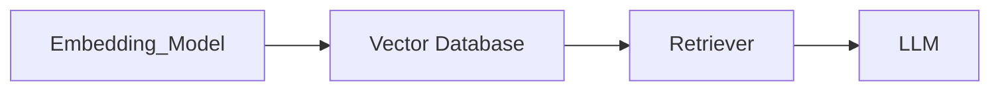
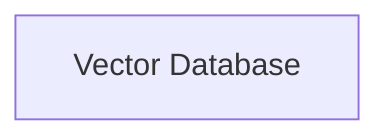
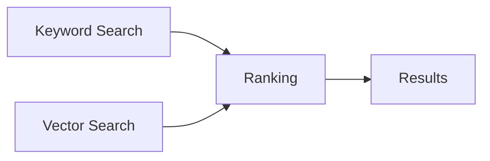

# Vector Database

> AI Social OS Data Layer

Version: 2.0.0

Status: Stable

Last Updated: 2026-07-25

---

# Table of Contents

- Overview
- Objectives
- Why Vector Database
- Architecture
- Embedding Pipeline
- Collection Design
- Similarity Search
- Indexing
- Metadata Filtering
- Hybrid Search
- Update Strategy
- Performance
- Security
- Design Principles
- Summary

---

# Overview

Vector Database là nền tảng lưu trữ Embeddings phục vụ AI.

Đây là thành phần cốt lõi cho.

- Semantic Search
- RAG
- AI Memory
- Recommendation
- Similarity Matching
- Knowledge Retrieval

---

# Objectives

Vector Database hướng tới.

- Low Latency
- High Recall
- Billion-scale Vectors
- Metadata Filtering
- Horizontal Scaling

---

# Why Vector Database

Database truyền thống.

```text
SELECT *

WHERE title LIKE '%AI%'
```

Vector Database.

```mermaid
flowchart LR
```

---

# Architecture



---

# Embedding Pipeline



---

# Collection Design

Ví dụ.

```text
users

posts

documents

knowledge

memory

plugins

workflows
```

Mỗi Collection có Schema riêng.

---

# Vector Structure

```yaml
id:

embedding:

metadata:

tenantId:

workspaceId:

createdAt:
```

---

# Similarity Search

Hỗ trợ.

- Cosine Similarity
- Dot Product
- Euclidean Distance

---

# Metadata Filtering

Ví dụ.

```yaml
tenantId

language

category

visibility

author

createdAt
```

---

# Hybrid Search



---

# Indexing

Các thuật toán.

- HNSW
- IVF
- PQ
- DiskANN

Lựa chọn tùy theo quy mô.

---

# Update Strategy

Vector được cập nhật khi.

- Document Changed
- Memory Updated
- Embedding Model Changed

---

# Performance

Theo dõi.

- Recall
- Precision
- Query Latency
- Index Size
- Storage Usage

---

# Recommended Technologies

- Qdrant
- Milvus
- Weaviate
- pgvector

---

# Design Principles

- AI Native
- Metadata Aware
- Multi-Tenant
- Hybrid Search
- Horizontal Scaling

---

# Summary

Vector Database là nền tảng Semantic Retrieval của AI Social OS, cho phép AI Agent tìm kiếm thông tin theo ngữ nghĩa thay vì từ khóa, đồng thời hỗ trợ RAG, AI Memory và Recommendation ở quy mô lớn.