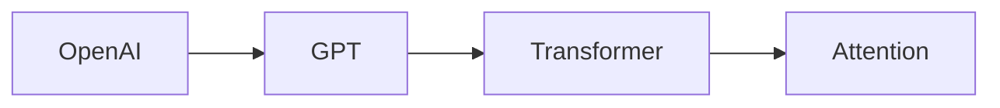
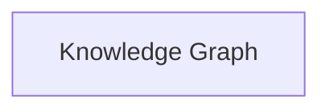

# Knowledge Graph

> AI Social OS Data Layer

Version: 2.0.0

Status: Stable

Last Updated: 2026-07-25

---

# Table of Contents

- Overview
- Objectives
- Why Knowledge Graph
- Graph Model
- Nodes
- Relationships
- Ontology
- Knowledge Ingestion
- Graph Queries
- AI Integration
- Synchronization
- Security
- Design Principles
- Summary

---

# Overview

Knowledge Graph biểu diễn tri thức dưới dạng Node và Relationship.

Khác với Social Graph, Knowledge Graph mô hình hóa.

- Concepts
- Facts
- Documents
- Organizations
- Products
- AI Knowledge
- Ontologies

---

# Objectives

Knowledge Graph hướng tới.

- Explainability
- Reasoning
- Knowledge Reuse
- AI Retrieval
- Entity Linking

---

# Why Knowledge Graph

Ví dụ.

Tri thức được biểu diễn dưới dạng đồ thị thay vì bảng.

---

# Graph Model

---

# Node Types

- Person
- Organization
- Product
- AI Model
- Document
- Concept
- Dataset
- Event

---

# Relationship Types

- CREATED_BY
- BELONGS_TO
- DEPENDS_ON
- REFERENCES
- RELATED_TO
- USES
- PART_OF

---

# Ontology

Ontology định nghĩa.

- Entity Types
- Relationship Types
- Constraints
- Taxonomy

---

# Knowledge Ingestion

---

# Query

Ví dụ.

- Cypher
- Gremlin
- GraphQL

---

# AI Integration

AI sử dụng Knowledge Graph cho.

- Explainable AI
- Multi-hop Reasoning
- Fact Verification
- Knowledge Retrieval

---

# Synchronization

Knowledge Graph đồng bộ từ.

- PostgreSQL
- Event Store
- Document Pipeline

---

# Security

Mỗi Node có.

- Tenant
- Workspace
- Visibility

---

# Recommended Technologies

- Neo4j
- Memgraph
- Amazon Neptune

---

# Design Principles

- Graph Native
- Explainable
- AI Ready
- Versioned
- Multi-Tenant

---

# Summary

Knowledge Graph cung cấp lớp tri thức có cấu trúc cho AI Social OS, hỗ trợ suy luận đa bước, truy xuất tri thức và khả năng giải thích quyết định của AI thông qua mô hình đồ thị.