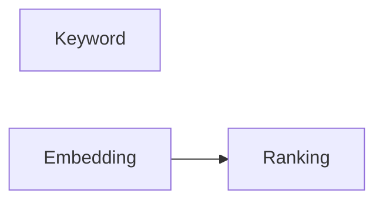

# Search Engine

> AI Social OS Data Layer

Version: 2.0.0

Status: Stable

Last Updated: 2026-07-25

---

> **Giai đoạn áp dụng:** Giai đoạn sau — cân nhắc khi có nhu cầu scale thực tế, dự kiến Phase 3+/Enterprise. Lý do: PostgreSQL Full-text Search (tsvector + GIN index) đáp ứng đủ nhu cầu tìm kiếm Post/Comment/User/Community ở MVP; OpenSearch/Elasticsearch là nâng cấp khi cần Hybrid Search, Faceted Search và Near Real-time Index ở quy mô lớn.

---

# Table of Contents

- Overview
- Objectives
- Why Search Engine
- Search Architecture
- Index Types
- Index Pipeline
- Search Modes
- Ranking
- Suggestions
- Faceted Search
- Synchronization
- Monitoring
- Design Principles
- Summary

---

# Overview

Search Engine cung cấp khả năng tìm kiếm thời gian thực trên toàn bộ AI Social OS.

Search Engine không phải là nguồn dữ liệu chính.

Nó chỉ lưu Search Index được xây dựng từ các nguồn dữ liệu khác.

---

# Objectives

Search Engine hướng tới.

- Full-text Search
- Near Real-time
- Hybrid Search
- High Availability
- Horizontal Scaling
- AI Integration

---

# Why Search Engine

Database.

```text
LIKE '%hello%'
```

Search Engine.

```mermaid
flowchart LR
```

---

# High-Level Architecture


---

# Search Domains

Search hỗ trợ.

- Users
- Posts
- Communities
- Documents
- Plugins
- Workflows
- AI Memory
- Knowledge Base

---

# Index Types

## Full-text Index

Cho.

- Post
- Comment
- Message
- Article

---

## Keyword Index

Cho.

- ID
- Email
- Username
- Tags

---

## Hybrid Index

Kết hợp.



---

# Index Pipeline

```mermaid
flowchart LR
```

Search Index luôn được cập nhật từ Event.

---

# Search Modes

## Exact Search

```text
hello world
```

---

## Fuzzy Search

```mermaid
flowchart LR
```

---

## Prefix Search


---

## Semantic Search

Kết hợp Vector Database.

---

# Ranking

Các yếu tố.

- BM25
- TF-IDF
- Semantic Score
- Popularity
- Freshness
- Personalization

---

# Suggestions

Search Engine hỗ trợ.

- Auto Complete
- Auto Suggest
- Query Recommendation

---

# Faceted Search

Ví dụ.

```text
Category

Author

Date

Language

Workspace

Tags
```

---

# Synchronization

Index được đồng bộ.

```mermaid
flowchart LR
```

Không đồng bộ trực tiếp từ Database.

---

# Monitoring

Theo dõi.

- Index Size
- Query Latency
- Search Accuracy
- Failed Index
- Rebuild Time

---

# Recommended Technologies

- OpenSearch
- Elasticsearch

---

# Design Principles

- Event Driven
- Read Optimized
- Near Real-time
- Horizontally Scalable
- AI Ready

---

# Summary

Search Engine cung cấp khả năng tìm kiếm hiệu năng cao cho AI Social OS thông qua Full-text Search, Hybrid Search và Semantic Search, đồng thời đồng bộ dữ liệu từ Event Store thay vì truy cập trực tiếp Database.