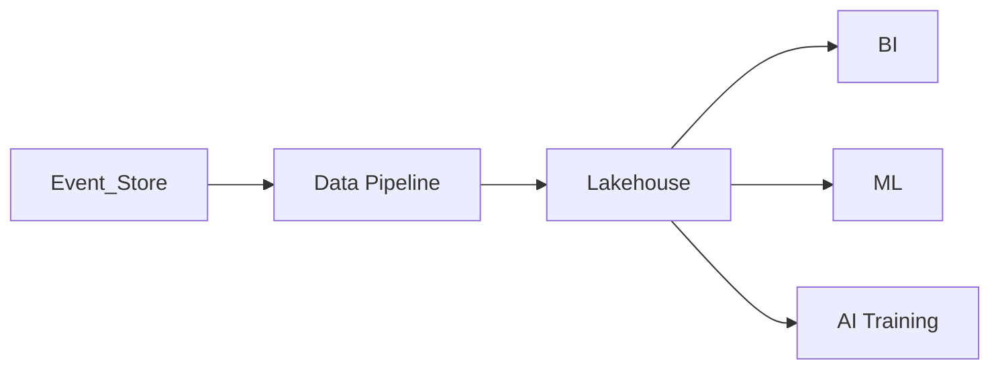
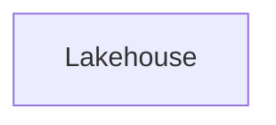

# Data Lakehouse

> AI Social OS Data Layer

Version: 2.0.0

Status: Stable

Last Updated: 2026-07-25

---

> **Giai đoạn áp dụng:** Giai đoạn sau — cân nhắc khi có nhu cầu scale thực tế, dự kiến Phase 3+/Enterprise. Lý do: ở MVP chưa có đủ khối lượng dữ liệu lịch sử để cần tách Bronze/Silver/Gold; Dashboard/BI có thể truy vấn trực tiếp PostgreSQL, Lakehouse (Iceberg/Delta Lake + Spark/Trino) chỉ cần khi có nhu cầu AI Training và Analytics ở quy mô lớn.

---

# Table of Contents

- Overview
- Objectives
- Why Lakehouse
- Architecture
- Data Sources
- Bronze Layer
- Silver Layer
- Gold Layer
- ETL / ELT
- AI Integration
- Analytics
- Governance
- Design Principles
- Summary

---

# Overview

Data Lakehouse là nền tảng lưu trữ dữ liệu phân tích của AI Social OS.

Lakehouse kết hợp ưu điểm của.

- Data Warehouse
- Data Lake

để phục vụ.

- BI
- AI Training
- Analytics
- Reporting
- Machine Learning

---

# Objectives

Lakehouse hướng tới.

- Unified Analytics
- Massive Scalability
- Cost Efficiency
- AI Ready
- Historical Storage
- Open Formats

---

# Why Lakehouse

OLTP Database không phù hợp cho Analytics.

```mermaid
flowchart LR
```

Lakehouse tách hoàn toàn dữ liệu phân tích.

---

# High-Level Architecture



---

# Data Sources

Lakehouse nhận dữ liệu từ.

- PostgreSQL
- Event Store
- Search Engine
- Vector Database
- Graph Database
- Object Storage
- External Connectors

---

# Bronze Layer

Lưu dữ liệu gốc.

Ví dụ.

```text
Raw Events

Raw Logs

Raw CSV

Raw JSON
```

Không chỉnh sửa.

---

# Silver Layer

Dữ liệu đã.

- Validate
- Clean
- Normalize
- Deduplicate

Có thể sử dụng trực tiếp cho Analytics.

---

# Gold Layer

Dữ liệu đã tổng hợp.

Ví dụ.

- KPI
- Reports
- AI Features
- Dashboards
- Business Metrics

---

# ETL / ELT

Pipeline.



---

# AI Integration

Lakehouse cung cấp.

- Feature Store
- Training Dataset
- Historical Events
- Model Evaluation Dataset

---

# Analytics

Lakehouse phục vụ.

- Dashboard
- Data Science
- Forecasting
- Recommendation
- Business Intelligence

---

# Storage Format

Khuyến nghị.

- Parquet
- ORC
- Iceberg
- Delta Lake

---

# Recommended Technologies

- Apache Iceberg
- Delta Lake
- Apache Spark
- Trino
- DuckDB

---

# Design Principles

- Immutable Data
- Open Table Format
- Columnar Storage
- Batch + Streaming
- AI Ready

---

# Summary

Data Lakehouse là nền tảng phân tích dữ liệu quy mô lớn của AI Social OS, cung cấp dữ liệu lịch sử chất lượng cao cho Business Intelligence, Machine Learning và AI Training mà không ảnh hưởng đến hệ thống giao dịch.