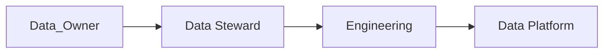
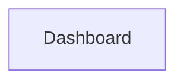

# Data Governance

> AI Social OS Data Layer

Version: 2.0.0

Status: Stable

Last Updated: 2026-07-25

---

# Table of Contents

- Overview
- Objectives
- Governance Model
- Data Ownership
- Data Classification
- Data Catalog
- Data Lineage
- Data Quality
- Data Policies
- Compliance
- Stewardship
- Monitoring
- Design Principles
- Summary

---

# Overview

Data Governance định nghĩa cách dữ liệu được quản lý, kiểm soát và sử dụng trong AI Social OS.

Governance đảm bảo dữ liệu luôn.

- Chính xác
- Nhất quán
- An toàn
- Có thể truy vết
- Tuân thủ quy định

---

# Objectives

Data Governance hướng tới.

- Data Ownership
- Data Quality
- Compliance
- Auditability
- Transparency
- Standardization

---

# Governance Model



---

# Data Ownership

Mỗi Domain phải có Data Owner.

Ví dụ.

| Domain | Owner |
|---------|-------|
| Identity | Identity Team |
| Social | Social Team |
| AI | AI Platform Team |
| Billing | Finance Team |
| Security | Security Team |

Data Owner chịu trách nhiệm.

- Schema
- Quality
- Access Policy
- Lifecycle

---

# Data Classification

Dữ liệu được phân loại.

## Public

Có thể công khai.

Ví dụ.

- Public Posts
- Public Profiles

---

## Internal

Chỉ nội bộ hệ thống.

Ví dụ.

- Internal Logs
- Metrics

---

## Confidential

Dữ liệu doanh nghiệp.

Ví dụ.

- Customer Data
- Business Reports

---

## Restricted

Dữ liệu nhạy cảm.

Ví dụ.

- Access Tokens
- API Keys
- Payment Information

---

# Data Catalog

Mọi Dataset đều được đăng ký.

Ví dụ.

```yaml
dataset:

owner:

description:

schema:

retention:

classification:

lineage:
```

---

# Data Lineage

Theo dõi.



Biết chính xác dữ liệu được sinh ra từ đâu.

---

# Data Quality

Đánh giá.

- Completeness
- Accuracy
- Consistency
- Freshness
- Validity
- Uniqueness

---

# Data Policies

Ví dụ.

- Naming Convention
- Retention Policy
- Backup Policy
- Access Policy
- Encryption Policy

---

# Compliance

Hỗ trợ.

- GDPR
- CCPA
- ISO 27001
- SOC 2

Có thể mở rộng thêm các tiêu chuẩn khác.

---

# Stewardship

Data Steward chịu trách nhiệm.

- Schema Review
- Data Validation
- Issue Resolution
- Metadata Maintenance

---

# Monitoring

Theo dõi.

- Quality Score
- Missing Data
- Invalid Records
- Schema Drift
- Lineage Errors

---

# Design Principles

- Ownership
- Transparency
- Traceability
- Standardization
- Compliance

---

# Summary

Data Governance đảm bảo toàn bộ dữ liệu trong AI Social OS được quản lý có tổ chức, có chủ sở hữu rõ ràng, có khả năng truy vết và đáp ứng các yêu cầu về chất lượng cũng như tuân thủ.