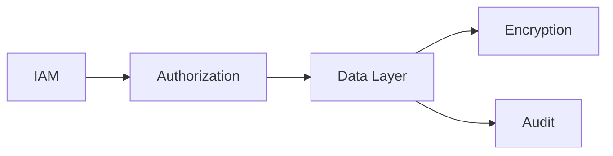
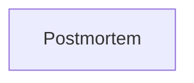

# Data Security

> AI Social OS Data Layer

Version: 2.0.0

Status: Stable

Last Updated: 2026-07-25

---

# Table of Contents

- Overview
- Objectives
- Security Architecture
- Encryption
- Access Control
- Authentication
- Authorization
- Data Masking
- Key Management
- Secret Management
- Audit Logging
- Incident Response
- Design Principles
- Summary

---

# Overview

Data Security bảo vệ toàn bộ dữ liệu của AI Social OS trước các rủi ro.

Bao gồm.

- Truy cập trái phép
- Rò rỉ dữ liệu
- Mất dữ liệu
- Thay đổi trái phép

---

# Objectives

Data Security hướng tới.

- Confidentiality
- Integrity
- Availability
- Non-repudiation
- Least Privilege

---

# Security Architecture



---

# Encryption

## At Rest

- AES-256

---

## In Transit

- TLS 1.3

---

## Backup Encryption

- AES-256

---

# Access Control

Sử dụng.

- RBAC
- ABAC
- Workspace Policy
- Tenant Isolation

---

# Authentication

Hỗ trợ.

- OAuth2
- OpenID Connect
- SAML
- MFA
- Service Accounts

---

# Authorization

Mỗi Request đều kiểm tra.

- User
- Role
- Tenant
- Workspace
- Resource

---

# Data Masking

Áp dụng cho.

- Email
- Phone
- Payment Data
- Secrets

Ví dụ.

```text
bang***@company.com
```

---

# Key Management

Khóa mã hóa được quản lý bởi.

- AWS KMS
- HashiCorp Vault
- Azure Key Vault

---

# Secret Management

Không lưu Secret trong.

- Source Code
- Config File
- Plugin

Secret được lấy từ Secret Manager.

---

# Audit Logging

Theo dõi.

- Read
- Write
- Delete
- Export
- Permission Change

---

# Incident Response



---

# Design Principles

- Zero Trust
- Encryption Everywhere
- Least Privilege
- Defense in Depth
- Audit First

---

# Summary

Data Security cung cấp nhiều lớp bảo vệ dữ liệu thông qua mã hóa, kiểm soát truy cập, quản lý khóa, kiểm toán và chính sách Zero Trust nhằm đảm bảo tính bảo mật và toàn vẹn của dữ liệu.